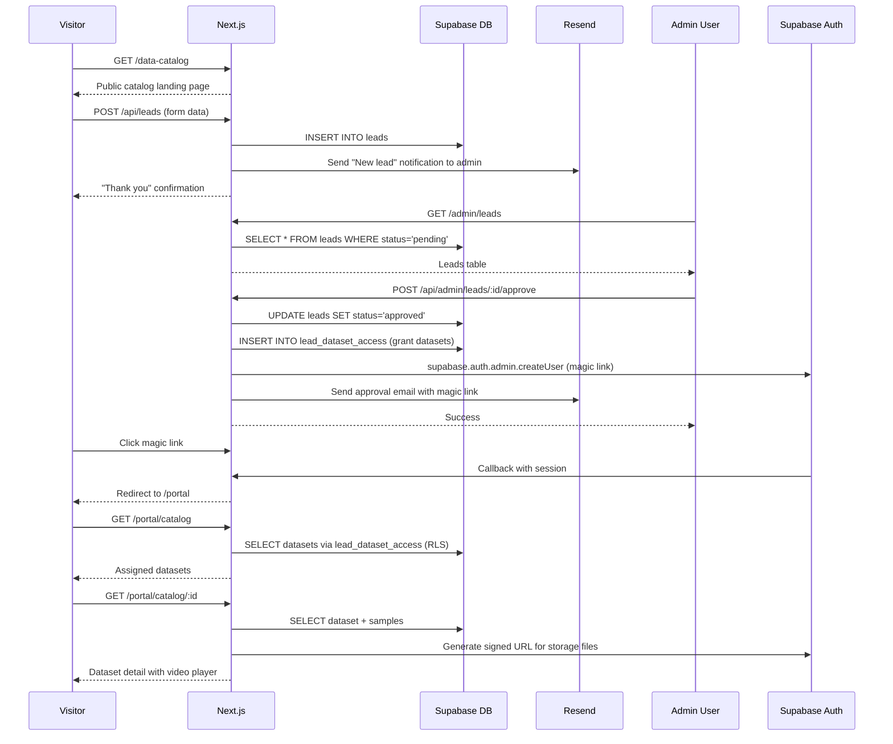
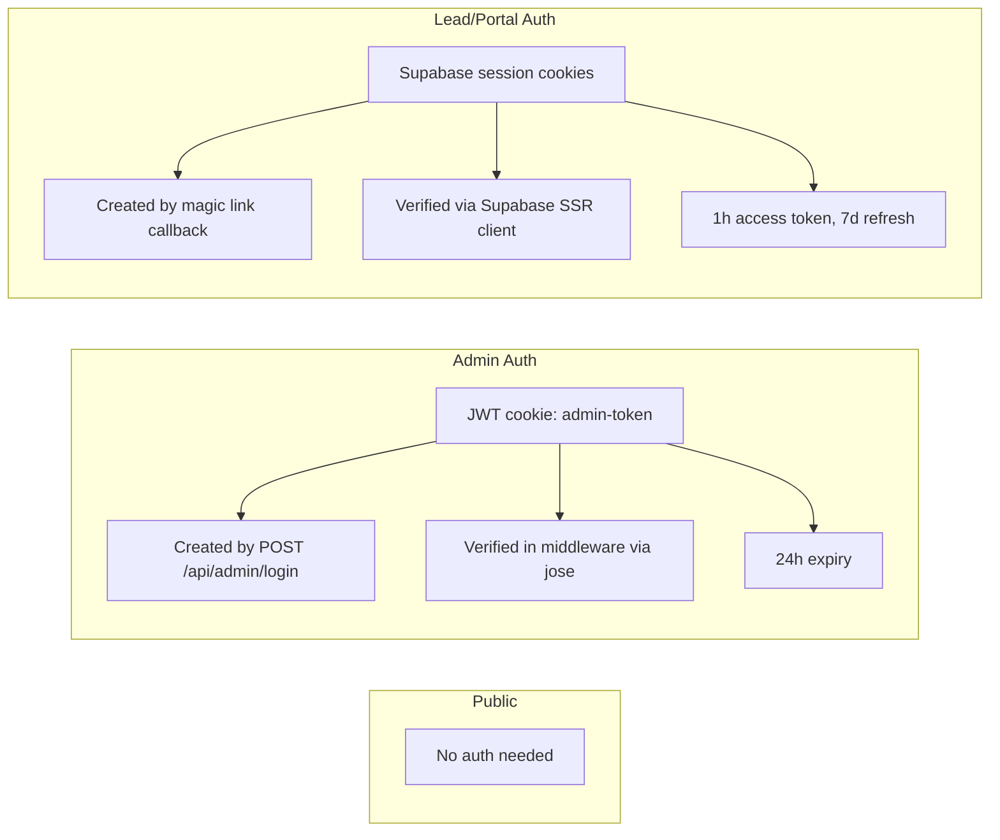

# Data Catalog Portal -- Design Document

**Feature:** Gated Data Catalog Portal
**Status:** Draft
**Date:** 2026-02-20
**Author:** Design Architect

---

## Table of Contents

1. [Overview](#1-overview)
2. [Architecture](#2-architecture)
3. [Components and Interfaces](#3-components-and-interfaces)
4. [Data Models](#4-data-models)
5. [API Design](#5-api-design)
6. [Page Architecture](#6-page-architecture)
7. [Auth Flow Design](#7-auth-flow-design)
8. [Supabase Storage Design](#8-supabase-storage-design)
9. [Email Notification Design](#9-email-notification-design)
10. [Error Handling](#10-error-handling)
11. [Testing Strategy](#11-testing-strategy)
12. [Migration Strategy](#12-migration-strategy)
13. [Risk Assessment](#13-risk-assessment)

---

## 1. Overview

### 1.1 Purpose

The Data Catalog Portal gives prospective AI lab clients a gated, self-service way to browse Claru's dataset offerings. It replaces ad-hoc PDF/Notion sharing with a polished portal that reinforces Claru's brand as a premium data partner. The portal supports three user personas:

| Persona | Surface | Goal |
|---------|---------|------|
| **Public visitor** | `/data-catalog` landing | Discover dataset categories and stats (no dataset browsing), submit an access request |
| **Admin (Claru team)** | `/admin/leads`, `/admin/catalog`, `/admin/settings` | Review access requests, manage datasets, grant per-lead access, configure settings |
| **Approved lead** | `/portal/*` | Browse assigned datasets, watch sample videos, download metadata |

### 1.2 Business Value

- Converts inbound interest into qualified leads with structured intake
- Demonstrates data quality through interactive sample viewers (reusing the existing `SampleDataViewer` pattern from case studies)
- Reduces manual work: admins approve/reject from a dashboard instead of email threads
- Creates a moat: the portal itself signals operational maturity to frontier AI labs

### 1.3 Key Architectural Decisions

| Decision | Choice | Rationale |
|----------|--------|-----------|
| Backend | **Supabase** (Auth + Postgres + Storage) | Managed infrastructure, RLS for row-level security, magic-link auth built in, generous free tier |
| Auth for leads | **Supabase magic link** | No passwords to manage; leads get a link in their approval email |
| Auth for admins | **Keep existing JWT cookie auth** | The admin system already works; migrating to Supabase Auth adds risk for no benefit |
| Data fetching | **Server Components + Supabase JS client** | Keeps secrets server-side, leverages Next.js 16 streaming |
| File storage | **Supabase Storage** with signed URLs | Time-limited access, no public bucket exposure |
| Email | **Resend** (via Supabase Auth hooks or direct API) | Simple transactional email, good DX, free tier sufficient |

---

## 2. Architecture

### 2.1 High-Level System Diagram

```mermaid
graph TB
    subgraph "Public Web"
        V[Visitor Browser]
    end

    subgraph "Lead Portal"
        L[Approved Lead Browser]
    end

    subgraph "Admin"
        A[Admin Browser]
    end

    subgraph "Next.js App (Vercel)"
        PUB["/data-catalog pages<br/>(Server Components)"]
        API["/api/* Route Handlers"]
        PORTAL["/portal/* pages<br/>(Server Components)"]
        ADMIN["/admin/* pages<br/>(Server + Client)"]
        MW[Middleware<br/>(auth gate)]
    end

    subgraph "Supabase"
        AUTH[Supabase Auth<br/>(magic link)]
        DB[(Postgres<br/>+ RLS)]
        STORE[Storage<br/>(dataset-samples bucket)]
    end

    subgraph "External"
        RESEND[Resend API<br/>(email)]
    end

    V --> PUB
    V -->|"POST /api/leads"| API
    L --> MW -->|"valid session"| PORTAL
    A --> MW -->|"valid JWT"| ADMIN

    API --> DB
    API --> RESEND
    PORTAL --> DB
    PORTAL --> STORE
    ADMIN --> DB
    ADMIN --> STORE

    AUTH -->|"magic link callback"| MW
```

### 2.2 Data Flow: Visitor to Approved Lead



### 2.3 Integration with Existing System

The data catalog portal layers on top of the current Next.js app without modifying existing functionality:

- **Middleware** (`src/middleware.ts`): Extended to also protect `/portal/*` routes by checking Supabase session, while continuing to use JWT cookies for `/admin/*` routes.
- **Admin layout** (`src/app/admin/layout.tsx`): Unchanged; new admin pages (`/admin/leads`, `/admin/catalog`) are added as sibling routes to `/admin/jobs`.
- **Design system** (`globals.css`): All new UI uses existing CSS custom properties and component patterns. The terminal aesthetic from `SampleDataViewer` is reused in the portal's `MetadataViewer` and `VideoPlayer` components.

---

## 3. Components and Interfaces

### 3.1 Shared / Reusable Components

#### DatasetCard

Displays a dataset in grid/list views across both the public catalog landing and the lead portal.

```typescript
interface DatasetCardProps {
  dataset: {
    id: string;
    name: string;
    slug: string;
    description: string;
    category: string;
    thumbnailUrl: string | null;
    sampleCount: number;
    totalSize: string;        // e.g. "1.2 TB"
    modality: string;         // "video" | "image" | "multimodal" | "robotics"
  };
  variant: "public" | "portal"; // public hides sample count, shows "Request Access"
  href: string;
}
```

**Visual design:** Dark card (`var(--bg-secondary)`) with `var(--border-subtle)` border. Category badge uses the same pill style as case study badges (`bg-[var(--accent-primary)]/15 text-[var(--accent-primary)]`). Modality icon from Lucide (Video, Image, Layers, Bot). Hover lifts card by 4px with border glow, matching `RelatedCard` in `CaseStudyDetailClient.tsx`.

#### VideoPlayer

Wraps an HTML5 `<video>` element with terminal chrome and metadata overlay.

```typescript
interface VideoPlayerProps {
  src: string;              // Signed Supabase Storage URL
  poster?: string;          // Thumbnail signed URL
  filename: string;
  metadata?: {
    resolution: string;
    fps: number;
    duration: string;
    codec: string;
  };
  autoPlay?: boolean;
}
```

**Visual design:** Reuses the terminal title bar pattern from `SampleDataViewer` (three colored dots + filename). Video controls are native HTML5 with custom dark styling. Metadata bar sits below the video using the `DataField` layout from `SampleDataViewer`.

#### MetadataViewer

Renders JSON metadata in the terminal-aesthetic JSON viewer pattern already established in `SampleDataViewer`.

```typescript
interface MetadataViewerProps {
  title: string;            // Shown in terminal title bar
  data: Record<string, unknown>;
  copyable?: boolean;       // Show "Copy JSON" button
}
```

Reuses the `JsonLine`, `NumericJsonLine`, and `CopyButton` sub-components already in `SampleDataViewer.tsx`. These should be extracted to `src/app/components/ui/json-viewer/` for shared use.

#### AccessRequestForm

Multi-step form for the public `/data-catalog/request` page.

```typescript
interface AccessRequestFormProps {
  categories: Array<{ id: string; name: string }>;  // Pre-fetched categories
  onSuccess: () => void;
}
```

**Steps:**
1. Contact info (name, email, company, role)
2. Use case (free text + checkboxes for modalities of interest)
3. Dataset interests (multi-select from categories)
4. Volume/timeline expectations
5. Confirmation/submit

Uses React Hook Form + Zod validation (already in the project). Terminal-style progressive disclosure matching the existing `ContactForm` pattern.

#### LeadStatusBadge

```typescript
interface LeadStatusBadgeProps {
  status: "pending" | "approved" | "rejected";
}
```

Color mapping:
- `pending` -- `var(--warning)` background/border
- `approved` -- `var(--accent-primary)` (sage green)
- `rejected` -- `var(--error)`

Uses the same badge pattern as the "SAFE" / "BLOCKED" indicators in `SampleDataViewer`.

#### DatasetUploader (Admin)

```typescript
interface DatasetUploaderProps {
  datasetId: string;
  onUploadComplete: (sample: DatasetSample) => void;
}
```

Supports drag-and-drop or file picker. Shows upload progress with a terminal-style progress bar. Uploads to Supabase Storage via a signed upload URL generated by an API route. Accepted file types: `.mp4`, `.mov`, `.webm`, `.jpg`, `.png`, `.json`.

### 3.2 Page-Level Components

Detailed in [Section 6: Page Architecture](#6-page-architecture).

---

## 4. Data Models

### 4.1 Database Schema (Supabase Postgres)

#### `dataset_categories`

| Column | Type | Constraints | Description |
|--------|------|-------------|-------------|
| `id` | `uuid` | PK, default `gen_random_uuid()` | |
| `name` | `text` | NOT NULL, UNIQUE | e.g. "Egocentric Video", "Game Capture" |
| `slug` | `text` | NOT NULL, UNIQUE | URL-safe identifier |
| `description` | `text` | | Short description for UI |
| `sort_order` | `integer` | NOT NULL, default 0 | Display ordering |
| `created_at` | `timestamptz` | NOT NULL, default `now()` | |

#### `datasets`

| Column | Type | Constraints | Description |
|--------|------|-------------|-------------|
| `id` | `uuid` | PK, default `gen_random_uuid()` | |
| `name` | `text` | NOT NULL | Display name |
| `slug` | `text` | NOT NULL, UNIQUE | URL-safe identifier |
| `description` | `text` | NOT NULL | Rich description (markdown supported) |
| `category_id` | `uuid` | FK -> `dataset_categories.id`, NOT NULL | |
| `modality` | `text` | NOT NULL, CHECK in ('video','image','multimodal','robotics') | |
| `thumbnail_path` | `text` | | Path in Supabase Storage |
| `total_size` | `text` | | Human-readable, e.g. "1.2 TB" |
| `sample_count` | `integer` | NOT NULL, default 0 | Denormalized count of samples |
| `metadata` | `jsonb` | default '{}' | Flexible metadata (resolution, fps ranges, etc.) |
| `is_public` | `boolean` | NOT NULL, default false | Whether to show on public catalog landing |
| `is_archived` | `boolean` | NOT NULL, default false | Soft delete |
| `created_at` | `timestamptz` | NOT NULL, default `now()` | |
| `updated_at` | `timestamptz` | NOT NULL, default `now()` | |

#### `dataset_samples`

| Column | Type | Constraints | Description |
|--------|------|-------------|-------------|
| `id` | `uuid` | PK, default `gen_random_uuid()` | |
| `dataset_id` | `uuid` | FK -> `datasets.id` ON DELETE CASCADE, NOT NULL | |
| `name` | `text` | NOT NULL | Display filename |
| `storage_path` | `text` | NOT NULL | Path in Supabase Storage bucket |
| `file_type` | `text` | NOT NULL | MIME type |
| `file_size` | `bigint` | | Bytes |
| `metadata` | `jsonb` | default '{}' | Per-sample metadata (resolution, fps, duration, etc.) |
| `sort_order` | `integer` | NOT NULL, default 0 | |
| `created_at` | `timestamptz` | NOT NULL, default `now()` | |

#### `leads`

| Column | Type | Constraints | Description |
|--------|------|-------------|-------------|
| `id` | `uuid` | PK, default `gen_random_uuid()` | |
| `email` | `text` | NOT NULL, UNIQUE | |
| `name` | `text` | NOT NULL | |
| `company` | `text` | NOT NULL | |
| `role` | `text` | | Job title |
| `use_case` | `text` | | Free-text description |
| `modalities_of_interest` | `text[]` | default '{}' | Array of modality strings |
| `category_ids_of_interest` | `uuid[]` | default '{}' | Array of category IDs |
| `volume_notes` | `text` | | Timeline/volume expectations |
| `status` | `text` | NOT NULL, default 'pending', CHECK in ('pending','approved','rejected') | |
| `admin_notes` | `text` | | Internal notes |
| `rejection_reason` | `text` | | Shown to lead if rejected |
| `supabase_user_id` | `uuid` | UNIQUE, nullable | Populated on approval when Supabase Auth user is created |
| `created_at` | `timestamptz` | NOT NULL, default `now()` | |
| `updated_at` | `timestamptz` | NOT NULL, default `now()` | |

#### `lead_dataset_access`

| Column | Type | Constraints | Description |
|--------|------|-------------|-------------|
| `id` | `uuid` | PK, default `gen_random_uuid()` | |
| `lead_id` | `uuid` | FK -> `leads.id` ON DELETE CASCADE, NOT NULL | |
| `dataset_id` | `uuid` | FK -> `datasets.id` ON DELETE CASCADE, NOT NULL | |
| `granted_at` | `timestamptz` | NOT NULL, default `now()` | |
| `granted_by` | `text` | | Admin email or identifier |
| UNIQUE | | `(lead_id, dataset_id)` | Prevent duplicate grants |

### 4.2 Row-Level Security Policies

```sql
-- dataset_categories: public read, admin write
ALTER TABLE dataset_categories ENABLE ROW LEVEL SECURITY;

CREATE POLICY "Public can read categories"
  ON dataset_categories FOR SELECT
  USING (true);

CREATE POLICY "Only service role can modify categories"
  ON dataset_categories FOR ALL
  USING (auth.role() = 'service_role');

-- datasets: public reads only is_public=true; leads read their granted datasets
ALTER TABLE datasets ENABLE ROW LEVEL SECURITY;

CREATE POLICY "Public can read public datasets"
  ON datasets FOR SELECT
  USING (is_public = true AND is_archived = false);

CREATE POLICY "Leads can read their granted datasets"
  ON datasets FOR SELECT
  USING (
    EXISTS (
      SELECT 1 FROM lead_dataset_access lda
      JOIN leads l ON l.id = lda.lead_id
      WHERE lda.dataset_id = datasets.id
        AND l.supabase_user_id = auth.uid()
    )
  );

CREATE POLICY "Service role full access to datasets"
  ON datasets FOR ALL
  USING (auth.role() = 'service_role');

-- dataset_samples: leads can read samples of their granted datasets
ALTER TABLE dataset_samples ENABLE ROW LEVEL SECURITY;

CREATE POLICY "Leads can read samples of granted datasets"
  ON dataset_samples FOR SELECT
  USING (
    EXISTS (
      SELECT 1 FROM lead_dataset_access lda
      JOIN leads l ON l.id = lda.lead_id
      WHERE lda.dataset_id = dataset_samples.dataset_id
        AND l.supabase_user_id = auth.uid()
    )
  );

CREATE POLICY "Service role full access to samples"
  ON dataset_samples FOR ALL
  USING (auth.role() = 'service_role');

-- leads: only service role (admin API routes use service_role key)
ALTER TABLE leads ENABLE ROW LEVEL SECURITY;

CREATE POLICY "Leads can read own record"
  ON leads FOR SELECT
  USING (supabase_user_id = auth.uid());

CREATE POLICY "Service role full access to leads"
  ON leads FOR ALL
  USING (auth.role() = 'service_role');

-- lead_dataset_access: leads can read own grants
ALTER TABLE lead_dataset_access ENABLE ROW LEVEL SECURITY;

CREATE POLICY "Leads can read own access grants"
  ON lead_dataset_access FOR SELECT
  USING (
    EXISTS (
      SELECT 1 FROM leads l
      WHERE l.id = lead_dataset_access.lead_id
        AND l.supabase_user_id = auth.uid()
    )
  );

CREATE POLICY "Service role full access to access grants"
  ON lead_dataset_access FOR ALL
  USING (auth.role() = 'service_role');
```

### 4.3 Indexes

```sql
CREATE INDEX idx_datasets_category ON datasets(category_id);
CREATE INDEX idx_datasets_slug ON datasets(slug);
CREATE INDEX idx_datasets_public ON datasets(is_public) WHERE is_public = true AND is_archived = false;
CREATE INDEX idx_dataset_samples_dataset ON dataset_samples(dataset_id);
CREATE INDEX idx_leads_status ON leads(status);
CREATE INDEX idx_leads_email ON leads(email);
CREATE INDEX idx_leads_supabase_user ON leads(supabase_user_id) WHERE supabase_user_id IS NOT NULL;
CREATE INDEX idx_lead_dataset_access_lead ON lead_dataset_access(lead_id);
CREATE INDEX idx_lead_dataset_access_dataset ON lead_dataset_access(dataset_id);
```

---

## 5. API Design

### 5.1 Supabase Client Setup

Two Supabase clients will be used:

```typescript
// src/lib/supabase/server.ts -- Server Component / Route Handler client
import { createServerClient } from "@supabase/ssr";
import { cookies } from "next/headers";

export function createSupabaseServerClient() {
  const cookieStore = cookies();
  return createServerClient(
    process.env.NEXT_PUBLIC_SUPABASE_URL!,
    process.env.NEXT_PUBLIC_SUPABASE_ANON_KEY!,
    {
      cookies: {
        getAll: () => cookieStore.getAll(),
        setAll: (cookiesToSet) => {
          cookiesToSet.forEach(({ name, value, options }) =>
            cookieStore.set(name, value, options)
          );
        },
      },
    }
  );
}

// src/lib/supabase/admin.ts -- Admin operations (uses service_role key, bypasses RLS)
import { createClient } from "@supabase/supabase-js";

export function createSupabaseAdminClient() {
  return createClient(
    process.env.NEXT_PUBLIC_SUPABASE_URL!,
    process.env.SUPABASE_SERVICE_ROLE_KEY!
  );
}
```

### 5.2 Public API Routes

#### `POST /api/leads` -- Submit access request

**Auth:** None (public)
**Body:**
```typescript
{
  name: string;
  email: string;
  company: string;
  role?: string;
  useCase?: string;
  modalitiesOfInterest: string[];
  categoryIdsOfInterest: string[];
  volumeNotes?: string;
}
```
**Response:** `201 { success: true, message: "Request submitted" }`
**Side effects:**
- Insert row into `leads` table (via service_role client)
- Send admin notification email via Resend

#### `GET /api/catalog/categories` -- Public categories list

**Auth:** None
**Response:** `200 { categories: DatasetCategory[] }`
**Notes:** Used by the access request form for the category multi-select.

### 5.3 Admin API Routes

All admin routes are protected by the existing JWT middleware. They use the `createSupabaseAdminClient` (service_role) to bypass RLS.

#### `GET /api/admin/leads` -- List all leads

**Query params:** `?status=pending|approved|rejected&page=1&limit=25`
**Response:** `200 { leads: Lead[], total: number }`

#### `GET /api/admin/leads/:id` -- Lead detail

**Response:** `200 { lead: Lead, accessGrants: LeadDatasetAccess[] }`

#### `POST /api/admin/leads/:id/approve` -- Approve lead

**Body:**
```typescript
{
  datasetIds: string[];     // IDs to grant access to
  adminNotes?: string;
}
```
**Side effects:**
1. Update `leads.status` to `'approved'`
2. Create Supabase Auth user with `supabase.auth.admin.createUser({ email, email_confirm: true })`
3. Store `supabase_user_id` on the lead record
4. Insert rows into `lead_dataset_access`
5. Send approval email with magic link via `supabase.auth.admin.generateLink({ type: 'magiclink', email })`

#### `POST /api/admin/leads/:id/reject` -- Reject lead

**Body:**
```typescript
{
  rejectionReason?: string;
  adminNotes?: string;
}
```
**Side effects:**
1. Update `leads.status` to `'rejected'`
2. Send rejection email via Resend

#### `POST /api/admin/leads/:id/grant` -- Grant additional dataset access

**Body:** `{ datasetIds: string[] }`
**Side effects:** Insert into `lead_dataset_access`, send notification email

#### `DELETE /api/admin/leads/:id/grant/:datasetId` -- Revoke dataset access

**Side effects:** Delete from `lead_dataset_access`

#### `GET /api/admin/catalog` -- List all datasets (including archived)

**Query params:** `?category=uuid&page=1&limit=25`
**Response:** `200 { datasets: Dataset[], total: number }`

#### `POST /api/admin/catalog` -- Create dataset

**Body:** Dataset creation payload (name, slug, description, categoryId, modality, metadata, isPublic)
**Response:** `201 { dataset: Dataset }`

#### `PUT /api/admin/catalog/:id` -- Update dataset

#### `DELETE /api/admin/catalog/:id` -- Archive dataset (soft delete)

#### `POST /api/admin/catalog/:id/samples/upload-url` -- Generate signed upload URL

**Body:** `{ filename: string, contentType: string }`
**Response:** `200 { signedUrl: string, storagePath: string }`
**Notes:** Admin uploads directly to Supabase Storage using the signed URL, then calls the create sample endpoint.

#### `POST /api/admin/catalog/:id/samples` -- Create sample record after upload

**Body:** `{ name, storagePath, fileType, fileSize, metadata }`

#### `DELETE /api/admin/catalog/:id/samples/:sampleId` -- Delete sample

**Side effects:** Delete from Storage + database

### 5.4 Portal API Routes

Portal routes are protected by Supabase session middleware. Data fetching uses the anon client so RLS applies.

#### `GET /api/portal/datasets` -- Lead's accessible datasets

**Auth:** Supabase session
**Notes:** Could also be done entirely via Server Component data fetching (no API route needed). RLS ensures leads only see their granted datasets.

#### `GET /api/portal/datasets/:id/signed-url/:sampleId` -- Generate signed URL for sample file

**Auth:** Supabase session
**Response:** `200 { url: string, expiresAt: string }`
**Notes:** Generates a 1-hour signed URL for the sample file in Supabase Storage. RLS on `dataset_samples` ensures the lead has access.

#### `POST /api/portal/request` -- Submit custom data request from portal

**Auth:** Supabase session
**Body:** `{ description: string, modalities: string[], notes: string }`
**Side effects:** Sends email to admin

---

## 6. Page Architecture

### 6.1 `/data-catalog` -- Public Catalog Landing

| Property | Value |
|----------|-------|
| **Route** | `src/app/data-catalog/page.tsx` |
| **Rendering** | Server Component |
| **Data** | Fetch public datasets grouped by category (service_role client, `is_public=true`) |
| **Auth** | None |

**Layout:**
- Uses shared `Header` (with `opaque` prop) and `Footer` components
- Hero section: headline "Explore Our Data Catalog", subtitle describing dataset offerings, CTA button to `/data-catalog/request`
- **Category overview grid** (no dataset browsing): each category rendered as a card showing category name, aggregate stats (dataset count, total hours/clips), and a representative thumbnail. **No individual dataset cards, no sample previews, no dataset detail links.** Actual data browsing requires authentication via the lead portal.
- Clicking a category card smooth-scrolls to a section with high-level category stats and data types
- Bottom CTA: "Request Access" linking to the form

### 6.2 `/data-catalog/request` -- Access Request Form

| Property | Value |
|----------|-------|
| **Route** | `src/app/data-catalog/request/page.tsx` (Server) wrapping `RequestFormClient.tsx` (Client) |
| **Rendering** | Client Component (for form interactivity) |
| **Data** | Categories pre-fetched in Server Component, passed as props |
| **Auth** | None |

**Layout:**
- Terminal-style progressive form matching `ContactForm` pattern
- Multi-step with validation per step
- Success state: confirmation message with estimated response time

### 6.3 `/admin/leads` -- Lead Management List

| Property | Value |
|----------|-------|
| **Route** | `src/app/admin/leads/page.tsx` |
| **Rendering** | Server Component (data fetch) + Client Component (interactive table) |
| **Data** | All leads from Supabase via service_role |
| **Auth** | Existing JWT cookie middleware |

**Layout:**
- Table with columns: Name, Company, Email, Status, Date, Actions
- Status filter tabs (All / Pending / Approved / Rejected)
- Search by name/company/email
- Click row to navigate to detail page
- Matches existing `AdminJobsTable` pattern

### 6.4 `/admin/leads/[id]` -- Lead Detail + Access Management

| Property | Value |
|----------|-------|
| **Route** | `src/app/admin/leads/[id]/page.tsx` |
| **Rendering** | Server Component + Client sub-components |
| **Data** | Lead record + access grants + all datasets (for granting) |
| **Auth** | JWT cookie |

**Layout:**
- Lead info card (name, company, email, use case, submitted date)
- Status badge + action buttons (Approve / Reject)
- On approve: modal to select which datasets to grant access to (multi-select from all datasets)
- "Current Access" table: shows granted datasets with revoke button
- "Grant Additional Access" button to add more datasets
- Admin notes textarea

### 6.5 `/admin/catalog` -- Dataset Management List

| Property | Value |
|----------|-------|
| **Route** | `src/app/admin/catalog/page.tsx` |
| **Rendering** | Server Component + Client table |
| **Data** | All datasets including archived |
| **Auth** | JWT cookie |

**Layout:**
- Table: Name, Category, Modality, Samples, Public?, Actions
- "New Dataset" button in header
- Filter by category, modality
- Click row to edit

### 6.6 `/admin/catalog/new` -- Create Dataset

| Property | Value |
|----------|-------|
| **Route** | `src/app/admin/catalog/new/page.tsx` |
| **Rendering** | Client Component |
| **Auth** | JWT cookie |

**Layout:**
- Form: name, slug (auto-generated from name), description (markdown textarea), category (select), modality (select), metadata (JSON editor), isPublic toggle
- Thumbnail upload
- Save button creates the dataset, then redirects to edit page for sample uploads

### 6.7 `/admin/catalog/[id]` -- Edit Dataset + Manage Samples

| Property | Value |
|----------|-------|
| **Route** | `src/app/admin/catalog/[id]/page.tsx` |
| **Rendering** | Server Component (initial data) + Client sub-components |
| **Auth** | JWT cookie |

**Layout:**
- Edit form for dataset metadata (same fields as create)
- Samples section: grid of uploaded samples with thumbnails, file info, delete button
- `DatasetUploader` component for adding new samples
- Preview section: shows how the dataset will appear in the portal

### 6.8 `/portal` -- Lead Dashboard

| Property | Value |
|----------|-------|
| **Route** | `src/app/portal/page.tsx` |
| **Rendering** | Server Component |
| **Data** | Lead profile + granted dataset count |
| **Auth** | Supabase session |

**Layout:**
- Welcome message with lead name
- Quick stats: datasets available, new since last login
- Recent datasets grid (latest 6)
- Link to full catalog and custom request form
- Portal-specific header with logo, "Catalog" nav link, and sign-out

### 6.9 `/portal/catalog` -- Browse Assigned Datasets

| Property | Value |
|----------|-------|
| **Route** | `src/app/portal/catalog/page.tsx` |
| **Rendering** | Server Component |
| **Data** | Datasets granted to current lead (via RLS) |
| **Auth** | Supabase session |

**Layout:**
- Category filter sidebar or tabs
- Modality filter
- Grid of `DatasetCard` components (`variant="portal"`)
- Each card links to `/portal/catalog/[id]`

### 6.10 `/portal/catalog/[id]` -- Dataset Detail with Viewer

| Property | Value |
|----------|-------|
| **Route** | `src/app/portal/catalog/[id]/page.tsx` (Server) + `DatasetDetailClient.tsx` (Client) |
| **Rendering** | Server fetches dataset + samples, Client handles video playback and interactions |
| **Data** | Dataset record + samples with signed URLs |
| **Auth** | Supabase session |

**Layout:**
- Dataset header: name, category badge, modality icon, description
- Metadata card (using `MetadataViewer`)
- Samples grid/list with `VideoPlayer` for video samples, image viewer for images
- JSON metadata viewer per sample
- Download button for metadata files (signed URL)
- Matches the terminal aesthetic of the existing case study `SampleDataViewer`

### 6.11 `/portal/request` -- Custom Data Request

| Property | Value |
|----------|-------|
| **Route** | `src/app/portal/request/page.tsx` |
| **Rendering** | Client Component |
| **Auth** | Supabase session |

**Note:** This is a simple CTA + form for leads who don't see the data they need — not a complex ticketing system.

**Layout:**
- Headline: "Can't find what you need?"
- Simple form: description of data needed (required textarea), preferred modality (select), optional notes
- Pre-fills lead info from session
- Submits via `POST /api/portal/request` (inserts into `custom_requests` table, sends admin notification email)
- Confirmation message: "We'll get back to you within 24 hours"
- "Book a Call" CTA button linking to the call booking URL configured in admin Settings (`/admin/settings`)
- Links to relevant case studies

### 6.12 Portal Layout

```typescript
// src/app/portal/layout.tsx
// Server Component -- checks Supabase session, redirects to /data-catalog if unauthenticated
// Renders portal-specific header (different from main site header and admin header)
```

The portal layout includes:
- Minimal header: Claru logo (links to `/portal`), "Catalog" link, "Request" link, user email display, "Sign Out" button
- Same dark background and design system as the rest of the site
- No footer (clean portal feel)

### 6.13 `/admin/settings` -- Admin Settings Page

| Property | Value |
|----------|-------|
| **Route** | `src/app/admin/settings/page.tsx` |
| **Rendering** | Server Component + Client sub-components |
| **Data** | Settings from Supabase `settings` table (or similar key-value store) |
| **Auth** | JWT cookie |

**Layout:**
- Tab or section-based layout within the admin layout
- Accessible from the admin nav alongside "Leads" and "Catalog"

**Section 1: Call Booking URL**
- Text input for the call booking URL (e.g., Calendly link)
- Save button persists to the `settings` table in Supabase
- This URL is used by `/portal/request` for the "Book a Call" CTA

**Section 2: Email Template Preview**
- List of all email templates: Admin Notification, Lead Approved, Lead Rejected, New Datasets Granted
- Clicking a template renders a live preview with sample data
- "Copy HTML" button copies the full HTML source to clipboard
- Preview uses the dark terminal aesthetic: dark background (`#0a0908`), sage green accents (`#92B090`), JetBrains Mono font for monospace elements

#### EmailTemplatePreview Component

```typescript
interface EmailTemplatePreviewProps {
  templateId: "admin-notification" | "lead-approved" | "lead-rejected" | "new-datasets-granted";
  sampleData: Record<string, string>;  // e.g., { leadName: "Jane Doe", company: "Acme AI" }
}
```

**Visual design:** Renders the email HTML inside an iframe or shadow DOM container to isolate email styles. Shows a toolbar above with template name, "Copy HTML" button, and responsive width toggles (desktop/mobile preview). The preview container has a subtle border matching `var(--border-subtle)`.

### 6.14 Admin Settings -- Data Model

#### `settings` Table (Key-Value Store)

| Column | Type | Constraints | Description |
|--------|------|-------------|-------------|
| `key` | `text` | PK, NOT NULL | Setting identifier, e.g. `call_booking_url` |
| `value` | `text` | | Setting value |
| `updated_at` | `timestamptz` | NOT NULL, default `now()` | |

RLS: Service role only (admin routes use service_role client).

---

## 7. Auth Flow Design

### 7.1 Three Auth Contexts

The application has three distinct auth contexts that must coexist:



### 7.2 Middleware Updates

The existing middleware at `src/middleware.ts` must be extended to handle portal routes:

```typescript
export async function middleware(request: NextRequest) {
  const { pathname } = request.nextUrl;

  // --- Admin routes (existing logic, unchanged) ---
  if (pathname.startsWith("/admin") || pathname.startsWith("/api/admin")) {
    if (pathname === "/admin" || pathname === "/api/admin/login") {
      return NextResponse.next();
    }
    // ... existing JWT verification ...
  }

  // --- Portal routes (new) ---
  if (pathname.startsWith("/portal") || pathname.startsWith("/api/portal")) {
    const supabase = createSupabaseServerClient(request);
    const { data: { session } } = await supabase.auth.getSession();

    if (!session) {
      // Redirect to data catalog with a message
      const url = new URL("/data-catalog", request.url);
      url.searchParams.set("auth", "required");
      return NextResponse.redirect(url);
    }

    return NextResponse.next();
  }

  return NextResponse.next();
}

export const config = {
  matcher: [
    "/admin/:path+",
    "/api/admin/:path+",
    "/portal/:path+",
    "/api/portal/:path+",
  ],
};
```

### 7.3 Magic Link Flow

1. Admin approves a lead at `/admin/leads/[id]`
2. API route creates a Supabase Auth user:
   ```typescript
   const { data: authUser } = await supabaseAdmin.auth.admin.createUser({
     email: lead.email,
     email_confirm: true,
   });
   ```
3. API route generates a magic link:
   ```typescript
   const { data: linkData } = await supabaseAdmin.auth.admin.generateLink({
     type: "magiclink",
     email: lead.email,
     options: {
       redirectTo: `${process.env.NEXT_PUBLIC_SITE_URL}/portal`,
     },
   });
   ```
4. The magic link URL is included in the approval email sent via Resend
5. When the lead clicks the link, Supabase Auth sets session cookies
6. The middleware sees a valid session and allows access to `/portal`

### 7.4 Session Expiry Handling

- **Access token:** 1 hour (Supabase default). The Supabase SSR client automatically refreshes using the refresh token.
- **Refresh token:** 7 days. After 7 days of inactivity, the lead must request a new magic link.
- **Re-authentication:** When a session is fully expired, the portal middleware redirects to `/data-catalog?auth=expired`. The data catalog page shows a banner: "Your session has expired. Request a new access link." with a form to enter their email. The backend verifies the email is an approved lead and sends a new magic link.

### 7.5 Unauthorized Access

- Unauthenticated visitors hitting `/portal/*` are redirected to `/data-catalog?auth=required`
- Authenticated leads trying to access datasets they are not granted will get empty results (RLS returns no rows) -- the UI shows "You do not have access to this dataset. Contact your account manager."
- Authenticated leads trying to access `/admin/*` will fail JWT verification and be redirected to `/admin` (the login page)

---

## 8. Supabase Storage Design

### 8.1 Bucket Structure

```
dataset-samples/                    (private bucket)
  ├── {dataset_id}/
  │   ├── thumbnail.jpg             (dataset thumbnail)
  │   ├── samples/
  │   │   ├── {sample_id}/
  │   │   │   ├── video.mp4         (main sample file)
  │   │   │   ├── metadata.json     (structured metadata)
  │   │   │   └── thumbnail.jpg     (auto-generated or uploaded)
```

### 8.2 Access Control

- Bucket is **private** (no public access)
- All file access is via **signed URLs** generated server-side
- Signed URLs expire after **1 hour**
- Server Components generate signed URLs at render time and pass them as props to Client Components

```typescript
// Generate signed URL for a sample file
const { data } = await supabaseAdmin.storage
  .from("dataset-samples")
  .createSignedUrl(sample.storagePath, 3600); // 1 hour
```

### 8.3 Admin Upload Flow

1. Admin selects files in the `DatasetUploader` component
2. Client requests a signed upload URL from `POST /api/admin/catalog/:id/samples/upload-url`
3. The API route generates a signed upload URL using the service_role client:
   ```typescript
   const { data } = await supabaseAdmin.storage
     .from("dataset-samples")
     .createSignedUploadUrl(`${datasetId}/samples/${sampleId}/${filename}`);
   ```
4. Client uploads directly to Supabase Storage using the signed URL (bypasses Next.js server, faster for large files)
5. On upload completion, client calls `POST /api/admin/catalog/:id/samples` to create the database record
6. The API route verifies the file exists in storage before creating the record

### 8.4 Storage Policies

```sql
-- Only service_role can manage files (all access via signed URLs)
CREATE POLICY "Service role full access"
  ON storage.objects FOR ALL
  USING (bucket_id = 'dataset-samples' AND auth.role() = 'service_role');
```

---

## 9. Email Notification Design

### 9.1 Email Provider

**Resend** is used for all transactional emails. It integrates with the `claru.ai` domain.

```typescript
// src/lib/email.ts
import { Resend } from "resend";

const resend = new Resend(process.env.RESEND_API_KEY);

export async function sendEmail(opts: {
  to: string;
  subject: string;
  html: string;
}) {
  return resend.emails.send({
    from: "Claru AI <team@claru.ai>",
    ...opts,
  });
}
```

### 9.2 Email Template Design System

All email templates use the **dark terminal aesthetic** matching the site's design system:

| Property | Value |
|----------|-------|
| **Background** | `#0a0908` (near-black) |
| **Card/container background** | `#121210` |
| **Text color** | `#e8e8e8` (off-white) |
| **Accent color** | `#92B090` (sage green — used for buttons, links, highlights) |
| **Font (headings/body)** | System sans-serif stack (email-safe fallback for Geist Sans) |
| **Font (code/monospace)** | `'JetBrains Mono', 'Courier New', monospace` |
| **Button style** | Sage green background (`#92B090`), dark text (`#0a0908`), rounded corners |
| **Border** | `1px solid #2a2a28` |

Email templates are previewable with sample data in the admin Settings page (`/admin/settings`). Admins can also copy the raw HTML for reference.

### 9.3 Email Templates

#### Admin Notification: New Access Request

**Trigger:** `POST /api/leads` (new lead submission)
**To:** `team@claru.ai` (admin notification address)
**Subject:** `[Claru] New data catalog request from {company}`
**Content:**
- Lead name, company, email
- Use case summary
- Modalities of interest
- Link to admin lead detail page: `{SITE_URL}/admin/leads/{id}`

#### Lead Notification: Approved

**Trigger:** `POST /api/admin/leads/:id/approve`
**To:** Lead email
**Subject:** `Your Claru data catalog access is ready`
**Content:**
- Welcome message
- List of datasets granted
- Magic link button: "Access Your Portal"
- Note: link expires in 24 hours, they can request a new one

#### Lead Notification: Rejected

**Trigger:** `POST /api/admin/leads/:id/reject`
**To:** Lead email
**Subject:** `Update on your Claru data catalog request`
**Content:**
- Professional rejection message
- Rejection reason (if provided by admin)
- Invitation to reach out directly for more information
- Link to main contact form

#### Lead Notification: New Datasets Granted

**Trigger:** `POST /api/admin/leads/:id/grant`
**To:** Lead email
**Subject:** `New datasets available in your Claru portal`
**Content:**
- List of newly granted datasets
- Magic link to portal

---

## 10. Error Handling

### 10.1 Client-Side Errors

| Scenario | Handling |
|----------|----------|
| Form validation failure | Inline field errors via React Hook Form + Zod. Red border + error text below field using `var(--error)` color. |
| Network error on form submit | Toast/banner at top of form: "Network error. Please try again." with retry button. |
| API returns 4xx/5xx | Parse error message from response body, display in terminal-style error block. |
| File upload failure | Show error state on the `DatasetUploader` with retry option. |

### 10.2 Server-Side Errors

| Scenario | Handling |
|----------|----------|
| Supabase connection failure | Log error, return 503 with "Service temporarily unavailable" message. |
| RLS denies access | Returns empty result set (by design). UI shows "No datasets found" or "Access denied." |
| Signed URL generation failure | Log error, return 500. UI shows placeholder instead of media. |
| Email send failure | Log error but do not fail the primary operation (e.g., lead is still approved even if email fails). Admin can resend manually. |
| Invalid lead status transition | Return 409 Conflict with message (e.g., "Lead is already approved"). |

### 10.3 Error Boundaries

```typescript
// src/app/portal/error.tsx
// src/app/admin/leads/error.tsx
// src/app/admin/catalog/error.tsx
```

Each route segment gets a `error.tsx` boundary that renders a terminal-style error screen:
- Error icon
- "Something went wrong" heading in monospace
- Error message (if safe to display)
- "Try Again" button that calls `reset()`
- Link back to the parent route

### 10.4 Loading States

```typescript
// src/app/portal/loading.tsx
// src/app/portal/catalog/loading.tsx
// etc.
```

Loading states use skeleton screens with the same card/table shapes as the loaded content, using `var(--bg-tertiary)` animated shimmer.

---

## 11. Testing Strategy

### 11.1 Unit Tests

**Framework:** Vitest (or Jest) + React Testing Library

| Area | Tests |
|------|-------|
| `AccessRequestForm` | Validates all steps, prevents submission with missing required fields, calls API on submit |
| `DatasetCard` | Renders correctly for both `public` and `portal` variants |
| `LeadStatusBadge` | Renders correct color/text for each status |
| `MetadataViewer` | Renders JSON correctly, copy button works |
| `VideoPlayer` | Renders video element with correct src, shows metadata overlay |
| Zod schemas | Validates lead submission schema, dataset creation schema |
| `createSupabaseServerClient` / `createSupabaseAdminClient` | Mocked -- verifies correct env vars are used |

### 11.2 Integration Tests

**Framework:** Vitest with MSW (Mock Service Worker) for Supabase mocking

| Area | Tests |
|------|-------|
| `POST /api/leads` | Happy path: creates lead, sends email. Validation: rejects invalid email. Duplicate: handles unique constraint. |
| `POST /api/admin/leads/:id/approve` | Creates Supabase user, generates magic link, inserts access grants, sends email. |
| `POST /api/admin/leads/:id/reject` | Updates status, sends rejection email. |
| `GET /api/portal/datasets` | Returns only datasets the lead has access to. |
| Signed URL generation | Returns valid URL with correct expiry. |

### 11.3 End-to-End Tests

**Framework:** Playwright (already configured in the project)

| Test | Description |
|------|-------------|
| Public catalog flow | Visit `/data-catalog`, verify dataset cards render, navigate to request form, complete all steps, verify success message. |
| Admin lead management | Login to admin, navigate to leads, verify pending lead appears, approve with dataset selection, verify status changes. |
| Portal access flow | Use test magic link (Supabase test helpers), verify portal loads, browse catalog, open dataset detail, verify video player renders. |
| Auth boundary tests | Verify unauthenticated users are redirected from `/portal`. Verify portal users cannot access `/admin`. |
| Responsive tests | Verify all pages render correctly at mobile (375px), tablet (768px), and desktop (1440px) breakpoints. |

### 11.4 Manual QA Checklist

- [ ] Magic link email is received and works
- [ ] Signed URLs expire correctly after 1 hour
- [ ] Video playback works across Chrome, Safari, Firefox
- [ ] Large file upload completes with progress indicator (no max file size limit)
- [ ] RLS correctly prevents cross-lead data access
- [ ] Admin can approve, reject, grant, and revoke without errors
- [ ] Form works with keyboard-only navigation
- [ ] All text is readable at WCAG AA contrast ratio

---

## 12. Migration Strategy

### 12.1 From File-Based Data to Supabase

The current codebase uses file-based JSON data (e.g., `src/data/jobs/*.json` read via `src/lib/jobs.ts`). The data catalog is a **new** feature that starts directly with Supabase -- there is no file-based data to migrate for datasets.

However, if Notion contains an existing catalog of datasets to seed:

1. Export Notion database to CSV
2. Create a seed script at `scripts/seed-datasets.ts`:
   ```typescript
   // Reads CSV, creates categories and datasets in Supabase
   // Run via: npx tsx scripts/seed-datasets.ts
   ```
3. Upload sample files to Supabase Storage manually or via a bulk upload script
4. Verify data via admin UI before making datasets public

### 12.2 Existing Admin Auth Coexistence

The existing admin auth (JWT cookie via `jose`) continues to work unchanged for `/admin/*` routes. Supabase Auth is used only for lead/portal auth. The middleware handles both:

- `/admin/*` routes check `admin-token` cookie (JWT)
- `/portal/*` routes check Supabase session cookies

There is no need to migrate admin auth to Supabase. If desired in the future, the admin login can be migrated to Supabase Auth with email/password, but this is out of scope.

### 12.3 Environment Variables

New env vars required:

```bash
# Supabase
NEXT_PUBLIC_SUPABASE_URL=https://xxx.supabase.co
NEXT_PUBLIC_SUPABASE_ANON_KEY=eyJ...
SUPABASE_SERVICE_ROLE_KEY=eyJ...

# Resend (email)
RESEND_API_KEY=re_xxx
ADMIN_NOTIFICATION_EMAIL=team@claru.ai

# Existing (unchanged)
JWT_SECRET=xxx
ADMIN_EMAIL=xxx
ADMIN_PASSWORD=xxx
```

### 12.4 Deployment

1. Create Supabase project
2. Run schema migrations (SQL from Section 4)
3. Create `dataset-samples` storage bucket (private)
4. Configure Supabase Auth: enable magic link, set site URL and redirect URLs
5. Add env vars to Vercel
6. Deploy
7. Seed initial datasets via script
8. Test end-to-end in staging before enabling public access

---

## 13. Risk Assessment

### 13.1 Technical Risks

| Risk | Likelihood | Impact | Mitigation |
|------|-----------|--------|------------|
| Supabase cold starts on serverless | Medium | Low | Supabase connection pooling is enabled by default. Use `supabase-js` v2 which handles retries. |
| Large video files slow to serve via signed URLs | Medium | Medium | Supabase Storage uses a CDN. For very large files (>1GB), consider chunked/streaming delivery. |
| Magic link emails go to spam | Medium | High | Configure SPF, DKIM, DMARC for `claru.ai` domain on Resend. Use a recognizable sender name. |
| RLS misconfiguration leaks data | Low | Critical | Write comprehensive RLS tests. Use the Supabase RLS debugger. Review policies in code review. |
| Middleware complexity with dual auth | Low | Medium | Clear separation in middleware with early returns. Integration tests for each auth path. |

### 13.2 Dependencies and Blockers

| Dependency | Owner | Risk |
|-----------|-------|------|
| Supabase project setup | DevOps | Low -- straightforward provisioning |
| Domain DNS for Resend | DevOps | Low -- one-time setup |
| Dataset content (videos, images, metadata) | Content/Operations | Medium -- portal is empty without seed data |
| Design approval for portal UI | Design | Medium -- could delay frontend work |

### 13.3 Performance Considerations

- **Signed URL generation:** Batch-generate signed URLs for all samples on a dataset detail page in a single server roundtrip, not one per sample.
- **Video loading:** Use `poster` attribute on `<video>` elements with a thumbnail signed URL to avoid loading full video on page load. Lazy-load videos below the fold.
- **Dataset list pagination:** Server-side pagination with cursor-based queries for large catalogs.
- **Image optimization:** Thumbnails should be served via Next.js `<Image>` with Supabase Storage URLs (configure `remotePatterns` in `next.config.js`).

### 13.4 Security Considerations

- **Service role key:** Never exposed to the client. Only used in server-side Route Handlers and Server Components.
- **Signed URLs:** Time-limited (1 hour). Cannot be guessed. Include the file path and expiry in the signature.
- **CSRF:** Supabase Auth uses SameSite cookies. API routes should validate the `Origin` header for state-changing requests.
- **Rate limiting:** Not implemented for v1. Can be added later if spam becomes an issue (consider Vercel's built-in rate limiting or a simple in-memory counter).
- **Input sanitization:** All user input is validated via Zod schemas before database insertion.

---

## Appendix A: New Dependencies

```bash
npm install @supabase/supabase-js @supabase/ssr resend
```

| Package | Purpose | Size |
|---------|---------|------|
| `@supabase/supabase-js` | Supabase client (DB, Auth, Storage) | ~50KB |
| `@supabase/ssr` | Server-side Supabase client with cookie handling for Next.js | ~5KB |
| `resend` | Transactional email API client | ~10KB |

## Appendix B: File Structure (New Files)

```
src/
├── app/
│   ├── data-catalog/
│   │   ├── page.tsx                          # Public catalog landing
│   │   └── request/
│   │       ├── page.tsx                      # Server wrapper
│   │       └── RequestFormClient.tsx          # Multi-step form
│   │
│   ├── portal/
│   │   ├── layout.tsx                        # Portal layout + auth check
│   │   ├── page.tsx                          # Lead dashboard
│   │   ├── loading.tsx                       # Skeleton loader
│   │   ├── error.tsx                         # Error boundary
│   │   ├── catalog/
│   │   │   ├── page.tsx                      # Browse datasets
│   │   │   └── [id]/
│   │   │       ├── page.tsx                  # Server wrapper
│   │   │       └── DatasetDetailClient.tsx   # Video player + metadata
│   │   └── request/
│   │       └── page.tsx                      # Custom request form
│   │
│   ├── admin/
│   │   ├── leads/
│   │   │   ├── page.tsx                      # Leads list
│   │   │   └── [id]/
│   │   │       └── page.tsx                  # Lead detail + access mgmt
│   │   ├── catalog/
│   │   │   ├── page.tsx                      # Datasets list
│   │   │   ├── new/
│   │   │   │   └── page.tsx                  # Create dataset
│   │   │   └── [id]/
│   │   │       └── page.tsx                  # Edit dataset + samples
│   │   └── settings/
│   │       └── page.tsx                      # Admin settings (call booking URL, email previews)
│   │
│   ├── api/
│   │   ├── leads/
│   │   │   └── route.ts                      # POST: submit access request
│   │   ├── catalog/
│   │   │   └── categories/
│   │   │       └── route.ts                  # GET: public categories
│   │   ├── admin/
│   │   │   ├── leads/
│   │   │   │   ├── route.ts                  # GET: list leads
│   │   │   │   └── [id]/
│   │   │   │       ├── route.ts              # GET: lead detail
│   │   │   │       ├── approve/
│   │   │   │       │   └── route.ts          # POST: approve lead
│   │   │   │       ├── reject/
│   │   │   │       │   └── route.ts          # POST: reject lead
│   │   │   │       └── grant/
│   │   │   │           └── route.ts          # POST/DELETE: manage access
│   │   │   └── catalog/
│   │   │       ├── route.ts                  # GET/POST: datasets
│   │   │       └── [id]/
│   │   │           ├── route.ts              # PUT/DELETE: dataset
│   │   │           └── samples/
│   │   │               ├── route.ts          # POST: create sample
│   │   │               ├── upload-url/
│   │   │               │   └── route.ts      # POST: signed upload URL
│   │   │               └── [sampleId]/
│   │   │                   └── route.ts      # DELETE: remove sample
│   │   └── portal/
│   │       ├── datasets/
│   │       │   └── [id]/
│   │       │       └── signed-url/
│   │       │           └── [sampleId]/
│   │       │               └── route.ts      # GET: signed download URL
│   │       └── request/
│   │           └── route.ts                  # POST: custom request
│   │
│   └── components/
│       └── ui/
│           ├── DatasetCard.tsx
│           ├── VideoPlayer.tsx
│           ├── MetadataViewer.tsx
│           ├── LeadStatusBadge.tsx
│           ├── DatasetUploader.tsx
│           └── json-viewer/                  # Extracted from SampleDataViewer
│               ├── JsonLine.tsx
│               ├── CopyButton.tsx
│               └── index.ts
│
├── lib/
│   ├── supabase/
│   │   ├── server.ts                         # Server-side Supabase client
│   │   ├── admin.ts                          # Service-role Supabase client
│   │   └── types.ts                          # Generated DB types
│   └── email.ts                              # Resend wrapper
│
├── types/
│   └── catalog.ts                            # TypeScript types for catalog entities
│
└── middleware.ts                              # Updated: add /portal auth
```
