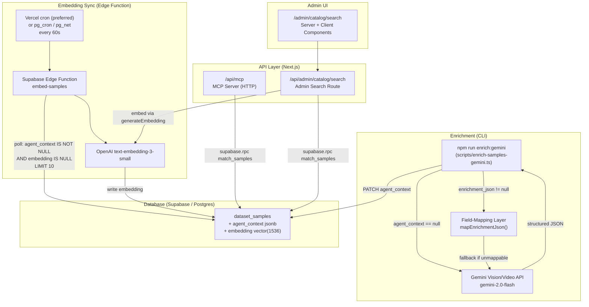

# Design: Catalog Semantic Enrichment + MCP Server

**Status:** Draft
**Requirements:** `tasks/docs/catalog-enrichment-requirements.md`
**Last updated:** 2026-03-20

---

## Overview

This document describes the technical design for three interlocking subsystems:

1. **Enrichment pipeline** — a CLI script that produces a canonical `agent_context` jsonb object for every `dataset_samples` row, either by calling Gemini Vision/Video API for unenriched samples or by mapping existing `enrichment_json` data through a deterministic field-mapping layer.

2. **Embedding sync pipeline** — a Supabase Edge Function invoked by Vercel cron (preferred) or pg_cron every 60 seconds that polls for rows where `agent_context IS NOT NULL AND embedding IS NULL`, calls the OpenAI `text-embedding-3-small` API, and writes a `vector(1536)` embedding back to `dataset_samples.embedding`. An optional enhancement uses a Postgres trigger + pgmq queue for more targeted job dispatch.

3. **MCP server + admin search UI** — three MCP tools (`search_catalog`, `get_dataset_overview`, `build_lead_brief`) served at `/api/mcp` (file: `src/app/api/mcp/route.ts`) behind bearer-token auth, plus an admin-only semantic search page at `/admin/catalog/search`.

The design is strictly additive: two nullable columns are added to `dataset_samples`, no existing columns or values are modified, and every schema object is created with `CREATE OR REPLACE` / `IF NOT EXISTS` guards.

---

## Architecture

### High-Level System Diagram



### Data Flow Summary

1. Admin runs `npm run enrich [--dataset-id X] [--dry-run] [--force]`.
2. Script fetches samples where `agent_context IS NULL` (plus those with `enrichment_json IS NOT NULL` to run the mapping layer).
3. For each sample: field-map if possible, else call Gemini; write `agent_context` to DB (with `embedding` left as NULL).
4. The Edge Function, invoked by Vercel cron (preferred) or pg_cron every 60 seconds, polls for rows where `agent_context IS NOT NULL AND embedding IS NULL` (LIMIT 10), calls OpenAI embeddings, and writes back to `embedding`.
5. Claude Code connects to `/api/mcp` with a static bearer token and calls MCP tools.
6. Admin opens `/admin/catalog/search`, types a query, and the page calls `/api/admin/catalog/search` which runs the same embedding + RPC search.

---

## Components and Interfaces

### 1. Enrichment CLI Script

**Location:** `scripts/enrich-samples-gemini.ts`
**Invocation:** `npx ts-node scripts/enrich-samples-gemini.ts [--dataset-id <uuid>] [--dry-run] [--force]`
**npm script:** `"enrich:gemini": "ts-node scripts/enrich-samples-gemini.ts"`

#### CLI Flags

| Flag | Type | Default | Description |
|------|------|---------|-------------|
| `--dataset-id` | string (UUID) | undefined | Restrict to a single dataset |
| `--dry-run` | boolean | false | Log what would be processed; no API calls or DB writes |
| `--force` | boolean | false | Overwrite existing `agent_context`; logs a warning per overwritten row |

#### Internal Functions

```typescript
// scripts/enrich-samples-gemini.ts

async function fetchCandidates(
  supabase: SupabaseClient,
  opts: { datasetId?: string; force: boolean }
): Promise<SampleRow[]>

async function enrichSample(
  sample: SampleRow,
  opts: { dryRun: boolean }
): Promise<AgentContext | null>

// Orchestrates field-mapping -> Gemini fallback for a single sample
async function buildAgentContext(
  sample: SampleRow
): Promise<AgentContext | null>
```

### 2. Field-Mapping Layer

**Location:** `src/lib/enrichment/field-mapper.ts`

```typescript
export type EnrichmentVariant = "egocentric" | "food_lifestyle" | "generic";

export function detectVariant(enrichmentJson: Record<string, unknown>): EnrichmentVariant

export function mapEgocentricToAgentContext(
  data: Record<string, unknown>
): Partial<AgentContext>

export function mapFoodLifestyleToAgentContext(
  data: Record<string, unknown>
): Partial<AgentContext>

export function mapGenericToAgentContext(
  data: Record<string, unknown>
): Partial<AgentContext>

export function fillDefaults(partial: Partial<AgentContext>): AgentContext
```

**Variant detection logic:**
- `"egocentric"` — detected when `enrichmentJson` contains any of: `domain`, `environment_label`, `task`, `hands`
- `"food_lifestyle"` — detected when `enrichmentJson` contains `captions.detailed` or `quality_scores`
- `"generic"` — fallback

### 3. Gemini Enrichment Client

**Location:** `src/lib/enrichment/gemini-client.ts`

```typescript
export async function callGeminiEnrichment(
  mediaUrl: string,
  mimeType: string
): Promise<AgentContext | null>
```

Uses `@google/generative-ai` SDK. Model: `gemini-2.0-flash`.

**Prompt template:**

```
You are analyzing a media sample from a human-annotated data collection.
Examine this ${mimeType.startsWith("video/") ? "video" : "image"} and return a JSON object
with exactly these fields:

{
  "scene_summary": "<1–3 sentence natural language description of the scene>",
  "environments": ["<location type 1>", "..."],
  "activities": ["<activity 1>", "..."],
  "objects": ["<notable object 1>", "..."],
  "camera_perspective": "<e.g. egocentric, static overhead, handheld third-person>",
  "people_count": "<one of: 0, 1, 2-4, 5-10, crowd>",
  "technical": {
    "fps": "<estimated fps as string or null>",
    "duration": "<duration in seconds as string or null>",
    "resolution": "<WxH or null>"
  },
  "quality_notes": "<lighting, motion blur, occlusion notes or empty string>"
}

Return only the JSON object — no markdown, no explanation.
```

**Media passing strategy:**
- For `s3_object_key` samples: call `getS3SignedUrl(key, 3600, bucketOverride)`, pass the returned presigned URL to Gemini's `fileData` or inline `inlineData` part depending on file size.
- Videos: use the Gemini File API (`genai.uploadFile`) for files >20 MB; pass inline for smaller files.
- The Gemini SDK method: `model.generateContent([{fileData: {mimeType, fileUri}}, promptText])`.

### 4. Database Migration

**Location:** `supabase/migrations/<timestamp>_catalog_enrichment.sql`

```sql
-- Enable pgvector extension (idempotent)
CREATE EXTENSION IF NOT EXISTS vector WITH SCHEMA extensions;

-- Add canonical agent_context column
ALTER TABLE dataset_samples
  ADD COLUMN IF NOT EXISTS agent_context jsonb;

-- Add embedding column (nullable, no default — non-destructive)
ALTER TABLE dataset_samples
  ADD COLUMN IF NOT EXISTS embedding extensions.vector(1536);

-- Add retry counter for embedding failures (max 5 retries before skipping)
ALTER TABLE dataset_samples
  ADD COLUMN IF NOT EXISTS embed_retry_count int NOT NULL DEFAULT 0;

-- HNSW index for fast cosine similarity search
-- Deferred until after embeddings are populated to avoid slow index build
CREATE INDEX IF NOT EXISTS dataset_samples_embedding_hnsw
  ON dataset_samples
  USING hnsw (embedding extensions.vector_cosine_ops)
  WITH (m = 16, ef_construction = 64);

-- Optional: pgmq queue for embedding jobs (only needed if using trigger-based approach)
-- SELECT pgmq.create('embedding_jobs');
```

> **Design decision:** The HNSW index is included in the migration but will be built with `CREATE INDEX CONCURRENTLY` in a follow-up step after the initial embedding batch is loaded, to avoid a slow lock-holding build on a large table.

### 5. `match_samples` Postgres Function

```sql
CREATE OR REPLACE FUNCTION match_samples(
  query_embedding  extensions.vector(1536),
  match_count      int,
  dataset_id       uuid            DEFAULT NULL
)
RETURNS TABLE (
  sample_id        uuid,
  dataset_id       uuid,
  dataset_name     text,
  similarity       float,
  agent_context    jsonb,
  s3_object_key    text,
  mime_type        text
)
LANGUAGE plpgsql
AS $$
BEGIN
  RETURN QUERY
  SELECT
    ds.id           AS sample_id,
    ds.dataset_id,
    d.name          AS dataset_name,
    1 - (ds.embedding <=> query_embedding) AS similarity,
    ds.agent_context,
    ds.s3_object_key,
    ds.mime_type
  FROM dataset_samples ds
  JOIN datasets d ON d.id = ds.dataset_id
  WHERE
    ds.embedding IS NOT NULL
    AND (dataset_id IS NULL OR ds.dataset_id = dataset_id)
  ORDER BY ds.embedding <=> query_embedding
  LIMIT match_count;
END;
$$;
```

**Notes:**
- Uses `<=>` (cosine distance); similarity returned as `1 - distance` (0 = orthogonal, 1 = identical).
- `dataset_id` defaults to `NULL` which skips the dataset filter.
- Joins `datasets` table to include `dataset_name` in the result set, avoiding extra round-trips.
- Function is exposed as a Supabase RPC: `supabase.rpc('match_samples', { query_embedding, match_count, dataset_id })`.

### 6. Supabase Automatic Embedding Pipeline

The primary approach is **polling**: the Edge Function queries for unenriched rows directly. This avoids the operational complexity of pgmq setup and trigger management. A pgmq-based trigger approach is documented as an optional enhancement in section 6d.

#### 6a. Supabase Edge Function: `embed-samples` (Polling Approach)

**Location:** `supabase/functions/embed-samples/index.ts`

```typescript
// Invoked by Vercel cron (preferred) or pg_cron via pg_net every 60 seconds
// or directly via: supabase functions invoke embed-samples

import { createClient } from "https://esm.sh/@supabase/supabase-js@2";
import OpenAI from "https://esm.sh/openai@4";

const BATCH_SIZE = 10;
const MAX_RETRIES = 5;

Deno.serve(async (req) => {
  // Auth: verify the request carries the service role key ONLY (anon key rejected)
  const authHeader = req.headers.get("Authorization");
  const expectedServiceKey = Deno.env.get("SUPABASE_SERVICE_ROLE_KEY");
  const token = authHeader?.replace("Bearer ", "");

  if (!token || token !== expectedServiceKey) {
    return new Response("Unauthorized", { status: 401 });
  }

  const supabaseUrl = Deno.env.get("SUPABASE_URL")!;
  const supabase = createClient(supabaseUrl, expectedServiceKey!);
  const openai = new OpenAI({ apiKey: Deno.env.get("OPENAI_API_KEY") });

  if (!Deno.env.get("OPENAI_API_KEY")) {
    console.error("[embed-samples] OPENAI_API_KEY not set");
    return new Response("ok"); // do not crash; rows remain for next invocation
  }

  // Poll for rows needing embeddings
  const { data: samples, error: queryError } = await supabase
    .from("dataset_samples")
    .select("id, agent_context, embed_retry_count")
    .not("agent_context", "is", null)
    .is("embedding", null)
    .lt("embed_retry_count", MAX_RETRIES)  // skip rows that have failed too many times
    .order("created_at", { ascending: true })
    .limit(BATCH_SIZE);

  if (queryError) {
    console.error("[embed-samples] Query error:", queryError);
    return new Response("ok");
  }

  for (const sample of samples ?? []) {
    const embeddingText = agentContextToEmbeddingText(sample.agent_context);

    if (!embeddingText) {
      // No usable text — mark as permanently skipped by setting retry to max
      await supabase
        .from("dataset_samples")
        .update({ embed_retry_count: MAX_RETRIES })
        .eq("id", sample.id);
      continue;
    }

    try {
      const response = await openai.embeddings.create({
        model: "text-embedding-3-small",
        input: embeddingText,
      });

      const embedding = response.data[0].embedding; // float[1536]

      const { error: writeError } = await supabase
        .from("dataset_samples")
        .update({ embedding: JSON.stringify(embedding) })
        .eq("id", sample.id);

      if (writeError) {
        // Do NOT mark as complete — leave for retry on next invocation
        console.error(`[embed-samples] Write failed for ${sample.id}:`, writeError);
        await supabase
          .from("dataset_samples")
          .update({ embed_retry_count: (sample.embed_retry_count ?? 0) + 1 })
          .eq("id", sample.id);
      }
    } catch (err) {
      // OpenAI API error — increment retry count, leave for next invocation
      console.error(`[embed-samples] Failed for sample ${sample.id}:`, err);
      await supabase
        .from("dataset_samples")
        .update({ embed_retry_count: (sample.embed_retry_count ?? 0) + 1 })
        .eq("id", sample.id);
    }
  }

  return new Response("ok");
});

/**
 * Build a richer embedding input by concatenating multiple agent_context fields.
 * This produces better semantic search results than embedding scene_summary alone.
 */
function agentContextToEmbeddingText(ctx: Record<string, unknown>): string | null {
  const parts: string[] = [];

  if (ctx.scene_summary && typeof ctx.scene_summary === "string") {
    parts.push(ctx.scene_summary);
  }
  if (Array.isArray(ctx.environments) && ctx.environments.length > 0) {
    parts.push("Environments: " + ctx.environments.join(", "));
  }
  if (Array.isArray(ctx.activities) && ctx.activities.length > 0) {
    parts.push("Activities: " + ctx.activities.join(", "));
  }
  if (Array.isArray(ctx.objects) && ctx.objects.length > 0) {
    parts.push("Objects: " + ctx.objects.join(", "));
  }
  if (ctx.camera_perspective && typeof ctx.camera_perspective === "string") {
    parts.push("Camera: " + ctx.camera_perspective);
  }

  const text = parts.join(". ").trim();
  return text.length > 0 ? text : null;
}
```

#### 6b. pg_cron Schedule

```sql
-- Run the Edge Function every 60 seconds via pg_net
SELECT cron.schedule(
  'embed-samples-cron',
  '*/1 * * * *',   -- every minute (pg_cron minimum resolution is 1 minute)
  $$
    SELECT net.http_post(
      url    := current_setting('app.supabase_functions_url') || '/embed-samples',
      headers := '{"Authorization": "Bearer ' || current_setting('app.supabase_service_role_key') || '"}'::jsonb,
      body   := '{}'::jsonb
    );
  $$
);
```

> **Design decision:** pg_cron's minimum resolution is 1 minute, which is acceptable. The polling query (`agent_context IS NOT NULL AND embedding IS NULL LIMIT 10`) is simple and self-healing: if the function crashes or a write fails, the row remains eligible for the next poll. No trigger or queue state to maintain. Typical end-to-end latency for a new enrichment write to searchable embedding: 60–120 seconds.

#### 6c. Database Support for Retry Tracking

```sql
-- Add retry counter to prevent infinite retries on permanently failing rows
ALTER TABLE dataset_samples
  ADD COLUMN IF NOT EXISTS embed_retry_count int NOT NULL DEFAULT 0;
```

Rows that reach `embed_retry_count >= 5` are excluded from the polling query. An admin can reset the counter manually to retry failed rows:

```sql
UPDATE dataset_samples SET embed_retry_count = 0 WHERE embed_retry_count >= 5;
```

#### 6d. Optional Enhancement: Postgres Trigger + pgmq

For higher-throughput scenarios or lower-latency requirements, the polling approach can be supplemented with a trigger-based queue. This is an optional enhancement and not required for the initial implementation.

```sql
-- pgmq queue for embedding jobs (requires pgmq extension)
SELECT pgmq.create('embedding_jobs');

CREATE OR REPLACE FUNCTION enqueue_embedding_job()
RETURNS TRIGGER LANGUAGE plpgsql AS $$
BEGIN
  -- Enqueue job only if agent_context actually changed and is not null
  IF NEW.agent_context IS NOT NULL AND
     ((TG_OP = 'INSERT') OR (OLD.agent_context IS DISTINCT FROM NEW.agent_context)) THEN
    -- Enqueue only the sample_id; the Edge Function must call
    -- agentContextToEmbeddingText() on the full agent_context from the DB row,
    -- NOT use scene_summary from the queue message directly.
    PERFORM pgmq.send(
      'embedding_jobs',
      jsonb_build_object('sample_id', NEW.id)
    );
  END IF;

  -- Clear stale embedding so polling also picks it up as a fallback
  IF (TG_OP = 'INSERT') OR (OLD.agent_context IS DISTINCT FROM NEW.agent_context) THEN
    NEW.embedding := NULL;
  END IF;

  RETURN NEW;
END;
$$;

CREATE OR REPLACE TRIGGER trg_enqueue_embedding
  BEFORE INSERT OR UPDATE OF agent_context
  ON dataset_samples
  FOR EACH ROW
  EXECUTE FUNCTION enqueue_embedding_job();
```

> **Important:** If pgmq is activated, the Edge Function that dequeues from `embedding_jobs` MUST read the full `agent_context` from the DB row and call `agentContextToEmbeddingText()` to build the embedding input. It must NOT use `scene_summary` from the queue message directly, since the embedding input is a concatenation of multiple `agent_context` fields. The queue message contains only `sample_id` as a pointer. The polling approach remains as a fallback that catches any rows missed by the trigger (e.g. during trigger downtime or manual `agent_context` updates via SQL).

### 7. MCP Server

**Location:** `src/app/api/mcp/route.ts`

#### Transport Design Decision

The MCP TypeScript SDK (`@modelcontextprotocol/sdk`) supports both `StdioServerTransport` and `StreamableHTTPServerTransport`. For a Next.js API route, `StreamableHTTPServerTransport` is used. This transport accepts a single `POST /api/mcp` endpoint and optionally a `GET` for SSE-based streaming. For Claude Code's use case, the single-endpoint POST mode is sufficient.

**MCP server initialisation:**

The `McpServer` instance and tool registrations are created at **module scope** so that the server object is reused across requests in long-lived environments (e.g. `next dev`, non-serverless deployments). A new `StreamableHTTPServerTransport` is created per request and connected to the shared server.

> **Spike required:** In Vercel serverless, each cold-start re-executes module scope, so this is safe. However, `mcpServer.connect(transport)` is called per-request. Verify via a spike that the SDK supports multiple sequential `connect()` calls on the same server instance without leaking state. If it does not, the server must be re-created per request instead.

```typescript
import { McpServer } from "@modelcontextprotocol/sdk/server/mcp.js";
import { StreamableHTTPServerTransport } from "@modelcontextprotocol/sdk/server/streamableHttp.js";

// Module-scope: created once, reused across requests in non-serverless environments
const mcpServer = new McpServer({ name: "claru-catalog", version: "1.0.0" });

// Register tools (see below)
mcpServer.tool("search_catalog", searchCatalogSchema, handleSearchCatalog);
mcpServer.tool("get_dataset_overview", getDatasetOverviewSchema, handleGetDatasetOverview);
mcpServer.tool("build_lead_brief", buildLeadBriefSchema, handleBuildLeadBrief);
```

**Auth middleware (same file, runs before MCP dispatch):**

```typescript
export async function POST(request: NextRequest) {
  const authHeader = request.headers.get("authorization");
  const token = authHeader?.replace("Bearer ", "");

  // Use timing-safe comparison to prevent timing attacks on the bearer token
  const expectedToken = process.env.ADMIN_MCP_TOKEN;
  if (!token || !expectedToken || !timingSafeCompare(token, expectedToken)) {
    return NextResponse.json({ error: "Unauthorized" }, { status: 401 });
  }

  // Delegate to MCP transport — new transport per request
  const transport = new StreamableHTTPServerTransport({ sessionIdGenerator: undefined });
  await mcpServer.connect(transport);
  return transport.handleRequest(request);
}

/**
 * Timing-safe string comparison using crypto.timingSafeEqual.
 * Returns false if strings differ in length (not constant-time for length,
 * but the token format is fixed-length in practice).
 */
function timingSafeCompare(a: string, b: string): boolean {
  if (a.length !== b.length) return false;
  return crypto.timingSafeEqual(Buffer.from(a), Buffer.from(b));
}
```

#### Claude Code MCP Config

```json
{
  "mcpServers": {
    "claru-catalog": {
      "type": "http",
      "url": "https://claru.ai/api/mcp",
      "headers": {
        "Authorization": "Bearer <ADMIN_MCP_TOKEN>"
      }
    }
  }
}
```

### 8. MCP Tool Schemas

#### `search_catalog`

**Input:**

```typescript
interface SearchCatalogInput {
  query: string;              // Required; natural language search query
  dataset_id?: string;        // Optional UUID; restrict to one dataset
  limit?: number;             // Optional; default 10, max 50
}
```

**Output (per result):**

```typescript
interface SearchCatalogResult {
  sample_id: string;
  dataset_id: string;
  dataset_name: string;
  similarity: number;           // 0.0–1.0, cosine similarity
  scene_summary: string;        // from agent_context
  environments: string[];       // from agent_context
  activities: string[];         // from agent_context
  objects: string[];            // from agent_context
  camera_perspective: string;   // from agent_context
  signed_url: string | null;    // presigned S3 or CloudFront URL; null if generation fails
  mime_type: string;
}
```

**Handler logic:**
1. Validate `query` is non-empty.
2. Call `generateEmbedding(query)` (from `src/lib/embeddings/openai.ts`) to embed `query`.
3. Call `supabase.rpc('match_samples', { query_embedding, match_count: limit ?? 10, dataset_id: dataset_id ?? null })`.
4. For each result, call `getS3SignedUrl` to get a media URL (dataset name is already included in the RPC result via the `datasets` join).
5. Apply `scrubS3Urls` (from `src/lib/scrub-s3-urls.ts`) to `agent_context` before including `scene_summary`.
6. Return results array; if empty, return `{ results: [], message: "No samples found matching query" }`.

#### `get_dataset_overview`

**Input:**

```typescript
interface GetDatasetOverviewInput {
  dataset_id: string;   // Required UUID
}
```

**Output:**

```typescript
interface DatasetOverviewOutput {
  name: string;
  category: string;
  subcategory: string | null;
  description: string;
  total_samples: number;
  total_duration_hours: number;
  annotation_types: string[];
  top_environments: string[];           // up to 5 most frequent values from agent_context
  top_activities: string[];             // up to 5 most frequent values from agent_context
  camera_perspectives: Record<string, number>;  // breakdown: { "egocentric": 42, "static overhead": 8, ... }
  samples_with_embeddings: number;
  samples_without_embeddings: number;
  representative_sample_urls: (string | null)[];  // up to 3 signed URLs for representative samples
}
```

**Handler logic:**
1. Query `datasets` joined with `dataset_categories` for the given `dataset_id`. Return MCP error if not found.
2. Query `dataset_samples` aggregates: `COUNT(*) FILTER (WHERE embedding IS NOT NULL)` as `samples_with_embeddings`, `COUNT(*) FILTER (WHERE embedding IS NULL)` as `samples_without_embeddings`.
3. Query up to 5 distinct `environments` and `activities` using `jsonb_array_elements_text` on `agent_context`.
4. Query `camera_perspective` frequency breakdown from `agent_context` across all samples in the dataset.
5. Select up to 3 representative samples, preferring highest-quality based on `agent_context.quality_notes` (non-empty quality_notes first, ordered alphabetically as a tiebreaker) with fallback to first 3 rows if no quality_notes are available. Generate signed URLs for them.
6. Compose and return the output. No `enrichment_json`, no raw S3 keys.

#### `build_lead_brief`

**Input:**

```typescript
interface BuildLeadBriefInput {
  company_description: string;   // Required; non-empty
  use_case: string;              // Required; non-empty
  limit?: number;                // Optional; default 5
}
```

**Output:**

```typescript
// Array of objects, one per matched dataset (grouped from search results)
type LeadBriefOutput = Array<{
  dataset_name: string;
  total_samples: number;                      // total samples in the dataset
  annotation_types: string[];                 // from datasets table
  matched_sample_count: number;               // how many samples from this dataset appeared in search results
  representative_signed_urls: (string | null)[];  // up to 3 signed URLs per dataset
  aggregated_environments: string[];          // environments from matched samples' agent_context
  aggregated_activities: string[];            // activities from matched samples' agent_context
}>;
```

**Handler logic:**
1. Validate both inputs are non-empty strings.
2. Internally call `search_catalog` with `company_description + " " + use_case` as query and `limit` (default 5).
3. Group results by dataset; for each dataset, fetch `total_samples` and `annotation_types` from the `datasets` table.
4. For each dataset group, select up to 3 representative samples and generate signed URLs.
5. Aggregate `environments` and `activities` from each dataset's matched samples' `agent_context`.
6. Apply `scrubS3Urls` (from `src/lib/scrub-s3-urls.ts`) to all text fields.
7. Return the array sorted by `matched_sample_count` descending.

### 9. `/api/admin/catalog/search` Route

**Location:** `src/app/api/admin/catalog/search/route.ts`

**Auth:** `verifyAdminToken(token.value)` from `@/lib/admin-auth` (same pattern as all other `/api/admin/*` routes).

**Request schema:**

```typescript
interface CatalogSearchRequest {
  query: string;          // Required
  dataset_id?: string;    // Optional UUID
  limit?: number;         // Default 20; max 50
}
```

**Response:**

```typescript
interface CatalogSearchResponse {
  results: Array<{
    sample_id: string;
    dataset_id: string;
    dataset_name: string;
    similarity: number;          // Raw float 0.0–1.0; UI displays as percentage
    agent_context: AgentContext | null;
    signed_url: string | null;
    mime_type: string;
  }>;
}
```

**Handler flow:**
1. Parse + validate request body (Zod schema).
2. Embed `query` using `generateEmbedding()` from `src/lib/embeddings/openai.ts`.
3. Call `supabase.rpc('match_samples', ...)`.
4. Fetch dataset names for results.
5. Presign media URLs per result using `getS3SignedUrl` with per-dataset `s3_bucket` override (fetched in a single `IN` query on `datasets`).
6. Return results (empty array on no matches, not a 404).

**Embedding helper (shared between admin route and MCP tools):**

```typescript
// src/lib/embeddings/openai.ts
export async function generateEmbedding(text: string): Promise<number[]>
```

This wrapper is extracted so that the OpenAI SDK is instantiated once and the API key validation happens in one place.

### 10. Admin Search UI

#### Page Architecture

```
/admin/catalog/search
├── page.tsx                  (Server Component)
│   └── fetches dataset list for filter dropdown (createSupabaseAdminClient)
│   └── renders SearchPageHeader + CatalogSearchClient
│
└── CatalogSearchClient.tsx   (Client Component, "use client")
    ├── query input
    ├── dataset filter dropdown
    ├── limit selector (10 / 25 / 50)
    └── results grid → SampleSearchCard (per result)
```

#### `CatalogSearchClient` State

```typescript
interface SearchState {
  query: string;
  datasetId: string | undefined;   // "" = all datasets
  limit: 10 | 25 | 50;
  status: "idle" | "loading" | "success" | "error";
  results: SearchResult[];
  error: string | null;
}
```

**Search trigger:** User submits via Enter key or submit button → `POST /api/admin/catalog/search`.

#### `SampleSearchCard` Props

```typescript
interface SampleSearchCardProps {
  result: {
    sample_id: string;
    dataset_name: string;
    similarity: number;
    agent_context: AgentContext | null;
    signed_url: string | null;
  };
}
```

Each card renders:
- Thumbnail/video preview using the existing `GalleryCard` component (`src/app/components/catalog/GalleryCard.tsx`) or a simplified version if the full component does not fit the data shape.
- Dataset name (muted, smaller text).
- Similarity score displayed as percentage (e.g. `87%` — raw float multiplied by 100 and rounded).
- `scene_summary` text truncated to 2 lines.

#### Header

Reuses the breadcrumb style from `AdminCatalogHeader`:

```
claru / admin / catalog / search
```

With a `[back to catalog]` link to `/admin/catalog` and an `[enrichment status]` link to `/admin/catalog/enrichment`.

### 11. Enrichment Management API/UI

#### `enrichment_jobs` Table Schema

```sql
CREATE TABLE IF NOT EXISTS enrichment_jobs (
  id            uuid PRIMARY KEY DEFAULT gen_random_uuid(),
  status        text NOT NULL DEFAULT 'pending'
                CHECK (status IN ('pending', 'running', 'completed', 'failed')),
  action        text NOT NULL
                CHECK (action IN ('map_existing', 'gemini_enrich')),
  dataset_id    uuid REFERENCES datasets(id) ON DELETE SET NULL,
  processed     int NOT NULL DEFAULT 0,
  total         int NOT NULL DEFAULT 0,
  failed        int NOT NULL DEFAULT 0,
  error_log     jsonb NOT NULL DEFAULT '[]',
  started_at    timestamptz,
  completed_at  timestamptz
);
```

Job state is persisted in this table so it survives Vercel serverless cold starts. The POST endpoint creates a row, then delegates actual work to a Supabase Edge Function.

#### API Route Signatures

| Route | Method | Purpose |
|-------|--------|---------|
| `/api/admin/catalog/enrichment/run` | POST | Create a job row in `enrichment_jobs`, invoke Edge Function `run-enrichment`. Body: `{ action, dataset_id?, limit?, dry_run? }` |
| `/api/admin/catalog/enrichment/status` | GET | Lightweight aggregation query on `dataset_samples` counts: total, with_agent_context, with_embedding, pending_enrichment, pending_embedding, by_dataset breakdown |
| `/api/admin/catalog/enrichment/job/:id` | GET | Read a single row from `enrichment_jobs`. Accepts `?log_offset=N` to return only log entries after offset N |

All routes require `verifyAdminToken()` auth (same pattern as existing admin routes).

**Dry run:** When `dry_run: true` is passed to the `run` endpoint, no job row is created. The response is synchronous: `{ dry_run: true, would_process: number, samples: Array<{ id, filename, dataset_name }> }`.

**Single-job enforcement:** The `run` endpoint uses an atomic DB check to prevent concurrent jobs:
```sql
INSERT INTO enrichment_jobs (action, dataset_id, total, status, started_at)
SELECT $1, $2, $3, 'pending', now()
WHERE NOT EXISTS (SELECT 1 FROM enrichment_jobs WHERE status IN ('pending', 'running'));
```
If the insert returns 0 rows, the endpoint returns HTTP 409.

#### Worker Delegation: Supabase Edge Function `run-enrichment`

**Location:** `supabase/functions/run-enrichment/index.ts`

The POST endpoint creates the `enrichment_jobs` row and then invokes the Edge Function via `supabase.functions.invoke('run-enrichment', { body: { job_id } })`. The Edge Function:

1. Reads the job row to get `action`, `dataset_id`, and `total`
2. Sets `status = 'running'` and `started_at = now()`
3. Iterates over candidate samples (same logic as CLI scripts):
   - For `map_existing`: applies field-mapping layer from `src/lib/enrichment/field-mapper.ts`
   - For `gemini_enrich`: calls Gemini API for samples where `agent_context IS NULL`
4. After each sample, updates `processed`, `failed`, and appends to `error_log` in the job row
5. On completion, sets `status = 'completed'` and `completed_at = now()`
6. On unrecoverable error, sets `status = 'failed'` with error details in `error_log`

#### Component Hierarchy for `/admin/catalog/enrichment`

```
/admin/catalog/enrichment
├── page.tsx                        (Server Component)
│   └── fetches enrichment status + dataset list
│   └── renders EnrichmentPageHeader + EnrichmentClient
│
└── EnrichmentClient.tsx            (Client Component, "use client")
    ├── EnrichmentStatusOverview    — stats cards + progress bar
    ├── DatasetBreakdownTable       — per-dataset rows with dropdown actions
    ├── ActionButtons               — global Map/Gemini buttons + dry run checkbox
    └── JobProgressPanel            — polls job/:id, shows log + progress bar
```

Cross-navigation: `[search catalog]` bracket-link in the header linking to `/admin/catalog/search`.

#### `EnrichmentState` TypeScript Interface

```typescript
interface EnrichmentState {
  phase: "idle" | "running" | "completed" | "failed";
  jobId: string | null;
  processed: number;
  total: number;
  failed: number;
  log: EnrichmentLogEntry[];
  logOffset: number;           // tracks last fetched offset for incremental polling
}

interface EnrichmentLogEntry {
  timestamp: string;           // ISO 8601
  sample_id: string;
  filename: string;
  result: "success" | "failed";
  error?: string;
}
```

#### Wire Format: Job Progress Response

```typescript
// GET /api/admin/catalog/enrichment/job/:id?log_offset=N
interface EnrichmentJobResponse {
  id: string;
  status: "pending" | "running" | "completed" | "failed";
  action: "map_existing" | "gemini_enrich";
  dataset_id: string | null;
  processed: number;
  total: number;
  failed: number;
  started_at: string | null;
  completed_at: string | null;
  log: EnrichmentLogEntry[];   // entries after log_offset only
  log_total: number;           // total log entries (for offset tracking)
}
```

The UI polls this endpoint every 3 seconds while `status` is `'pending'` or `'running'`, passing the current `logOffset` to avoid refetching the entire log on each poll.

---

## Data Models

### `AgentContext` TypeScript Interface

```typescript
// src/lib/enrichment/types.ts

export interface AgentContextTechnical {
  fps: string | null;
  duration: string | null;
  resolution: string | null;
}

export interface AgentContext {
  scene_summary: string;
  environments: string[];
  activities: string[];
  objects: string[];
  camera_perspective: string;
  people_count: string;
  technical: AgentContextTechnical;
  quality_notes: string;
}

/** Zero-value AgentContext for filling defaults */
export const AGENT_CONTEXT_DEFAULTS: AgentContext = {
  scene_summary: "",
  environments: [],
  activities: [],
  objects: [],
  camera_perspective: "",
  people_count: "",
  technical: { fps: null, duration: null, resolution: null },
  quality_notes: "",
};
```

### Database Schema Changes

```sql
-- dataset_samples additions (additive only)
ALTER TABLE dataset_samples
  ADD COLUMN IF NOT EXISTS agent_context       jsonb,
  ADD COLUMN IF NOT EXISTS embedding           extensions.vector(1536),
  ADD COLUMN IF NOT EXISTS embed_retry_count   int NOT NULL DEFAULT 0;
```

**Existing columns unchanged:**

| Column | Type | Notes |
|--------|------|-------|
| `id` | uuid | PK |
| `dataset_id` | uuid | FK → datasets |
| `filename` | text | |
| `s3_object_key` | text | Used for presigning |
| `mime_type` | text | Passed to Gemini |
| `enrichment_json` | jsonb | Unchanged; source for field-mapping |
| `metadata_json` | jsonb | Unchanged |

**New columns:**

| Column | Type | Nullable | Notes |
|--------|------|----------|-------|
| `agent_context` | jsonb | Yes | Canonical enrichment; source for embeddings |
| `embedding` | vector(1536) | Yes | OpenAI text-embedding-3-small output |
| `embed_retry_count` | int | No (default 0) | Tracks failed embedding attempts; rows with count >= 5 are skipped |

### Field-Mapping Strategy

#### Egocentric Activity (`enrichment_json` contains `domain` / `environment_label` / `task`)

| Source field | Target `agent_context` field | Transform |
|---|---|---|
| `environment_label` | `environments` | Wrap in `[value]` if string |
| `task_description` | `scene_summary` (first part) | Concatenate: `task_description + " " + environment_description` |
| `environment_description` | `scene_summary` (second part) | See above |
| `task` | `activities` | Wrap in `[value]` if string |
| `hands.primary_hand` | `objects` | Add `"<primary_hand> hand"` |
| `technical_specs.duration_s` | `technical.duration` | Stringify |
| `technical_specs.fps_estimate` | `technical.fps` | Stringify |
| `technical_specs.resolution_px` | `technical.resolution` | `"WxH"` |

**`scene_summary` construction:** `"${task_description} ${environment_description}"` — trimmed and normalised. Both fields are concatenated with a space; if either is missing, use empty string so the result is just the available part.

#### Food & Lifestyle (`enrichment_json` contains `captions` object with `detailed`/`activities`/`objects`, or `quality_scores`)

| Source field | Target `agent_context` field | Transform |
|---|---|---|
| `captions.detailed` | `scene_summary` | Direct string |
| `captions.activities` | `activities` | Direct array |
| `captions.objects` | `objects` | Direct array |
| `quality_scores` (object) | `quality_notes` | Flatten key: value pairs, join with `"; "` |
| `environment` (if present) | `environments` | Wrap in array |

#### Generic Fallback

Try in order:
1. `scene_analysis` → `scene_summary`
2. `captions.detailed` → `scene_summary`
3. `description` → `scene_summary`

All other top-level string/array fields are logged as unmapped. If no `scene_summary` can be extracted, return `null` to trigger Gemini fallback.

---

## Error Handling

### Enrichment CLI

| Scenario | Behaviour |
|----------|-----------|
| `GEMINI_API_KEY` not set | Exit with code 1, message: `"GEMINI_API_KEY is required"` |
| `OPENAI_API_KEY` not set | Non-fatal; warn on startup (not needed for enrichment script itself) |
| Gemini API error (rate limit, 5xx) | Exponential backoff: initial 1s delay, max 3 retries, 2x backoff factor; if all retries fail, log `[SKIP] sample <id>: Gemini error` and continue |
| Gemini returns non-JSON text | Log `[SKIP] sample <id>: unparseable response` + raw output; continue |
| Gemini returns JSON missing required fields | Fill defaults via `fillDefaults()`; write `agent_context` with populated defaults |
| Sample has no `s3_object_key` and no resolvable media URL | Log `[SKIP] sample <id>: no media URL` and continue |
| `getS3SignedUrl` returns null | Log `[SKIP] sample <id>: presign failed`; continue |
| Supabase write error | Log error; increment failed counter; continue to next sample |
| Mapping layer cannot produce `scene_summary` | Fall through to Gemini; log `[FALLBACK] sample <id>: mapping layer insufficient` |

### Edge Function (embed-samples)

| Scenario | Behaviour |
|----------|-----------|
| `OPENAI_API_KEY` not set | Log error; return 200 (do not crash; rows remain eligible for next poll) |
| Unauthorized request (invalid bearer token) | Return 401; no processing |
| OpenAI API error | Increment `embed_retry_count`; leave `embedding` as NULL for retry on next poll |
| Supabase write error (embedding update fails) | Do **not** mark as complete — increment `embed_retry_count`; row remains eligible for next poll |
| No eligible rows (poll returns empty) | No-op; return 200 |
| `agentContextToEmbeddingText()` returns null (no usable text) | Set `embed_retry_count` to MAX_RETRIES (5) to permanently skip; continue to next row |
| Row reaches `embed_retry_count >= 5` | Excluded from polling query; admin can reset manually via SQL |

### MCP Server

| Scenario | Behaviour |
|----------|-----------|
| Missing/invalid bearer token | HTTP 401 `{ "error": "Unauthorized" }` |
| Empty `query` parameter | MCP error response: `"query must be a non-empty string"` |
| OpenAI embedding failure | MCP error response: `"Embedding generation failed"` |
| `match_samples` RPC error | MCP error response: `"Search failed: <message>"` |
| `dataset_id` not found | MCP error response: `"Dataset not found"` |
| `getS3SignedUrl` returns null | Set `signed_url: null`; do not error |

### Admin Search Route

| Scenario | Behaviour |
|----------|-----------|
| Invalid admin token | HTTP 401 |
| Invalid request body | HTTP 400 with Zod validation details |
| Empty query | HTTP 400 `{ "error": "query is required" }` |
| Embedding or RPC failure | HTTP 500 with `{ "error": <message> }` |
| Zero results | HTTP 200 with `{ "results": [] }` |

---

## Testing Strategy

### Unit Tests

**Framework:** Vitest

**Priority test targets:**

| Module | What to test |
|--------|-------------|
| `src/lib/enrichment/field-mapper.ts` | All three variant mappers with fixture data; `detectVariant` with representative `enrichment_json` shapes; `fillDefaults` with partial inputs |
| `src/lib/enrichment/types.ts` | `AGENT_CONTEXT_DEFAULTS` has all required keys |
| `src/lib/embeddings/openai.ts` | `generateEmbedding()` returns `number[]` of length 1536; throws on missing `OPENAI_API_KEY` |
| `src/lib/scrub-s3-urls.ts` | Nested objects, arrays, strings containing `s3://`; URL-encoded `s3%3A%2F%2F` variants; ARN-style `arn:aws:s3:::` references; partial string replacement (only the S3 substring is replaced, not the entire value); non-S3 strings pass through unchanged |

**Fixture data approach:** Use the known `enrichment_json` shapes from `src/lib/schemas/annotation-metadata.ts` (`RekVisionMetadata`, `EgocentricShortForm`, `EgocentricLongForm`) as test input to the field mapper.

### Integration Tests

**Tool:** Vitest with Supabase test client against a local Supabase dev instance.

| Test | Setup |
|------|-------|
| `match_samples` RPC | Seed 5 rows with known embeddings; query with a known-similar embedding; assert top result is the expected row |
| Embedding polling pipeline | Insert a row with `agent_context`, invoke the `embed-samples` Edge Function, verify `embedding` is populated with a 1536-dim vector |
| Enrichment CLI `--dry-run` | Run script; assert zero writes to DB; assert console log lists candidates |

### End-to-End Tests

**Tool:** Playwright (to be added per CLAUDE.md TODO)

| Flow | Steps |
|------|-------|
| Admin search page | Log in as admin; navigate to `/admin/catalog/search`; type query; assert results grid appears; assert similarity scores are visible |
| MCP `search_catalog` | Call `/api/mcp` with valid bearer token and `search_catalog` tool; assert 200 response; assert results array present |
| MCP unauthorized | Call `/api/mcp` with no token; assert 401 |

### Manual Verification Checklist

Before marking enrichment pipeline as production-ready:
- [ ] Run `npm run enrich:gemini -- --dry-run` on a dataset; confirm log output matches DB state
- [ ] Run `npm run enrich:gemini -- --dataset-id <egocentric-dataset-uuid>`; confirm `agent_context` written
- [ ] Open `/admin/catalog/search`; run query `"person cooking in kitchen"`; confirm semantically relevant results appear
- [ ] Verify `signed_url` values load in browser (not expired)
- [ ] Confirm no `s3://` strings appear in any MCP tool response via curl

---

## New Files Summary

| Path | Purpose |
|------|---------|
| `scripts/map-enrichment-to-agent-context.ts` | Field-mapping script (existing enrichment → agent_context) |
| `scripts/enrich-samples-gemini.ts` | Gemini enrichment script (unenriched samples) |
| `scripts/backfill-embeddings.ts` | One-time embedding backfill script |
| `src/lib/enrichment/types.ts` | `AgentContext` interface + defaults |
| `src/lib/enrichment/field-mapper.ts` | Three-variant field mapping layer |
| `src/lib/enrichment/gemini-client.ts` | Gemini API wrapper |
| `src/lib/embeddings/openai.ts` | OpenAI embeddings wrapper (`generateEmbedding()`) |
| `src/app/api/mcp/route.ts` | MCP server (POST handler) |
| `src/app/api/admin/catalog/search/route.ts` | Admin semantic search API |
| `src/app/admin/catalog/search/page.tsx` | Server component: loads dataset list |
| `src/app/admin/catalog/search/CatalogSearchClient.tsx` | Client component: search UI |
| `src/lib/scrub-s3-urls.ts` | Shared `scrubS3Urls()` utility (moved from portal route) |
| `supabase/migrations/<ts>_catalog_enrichment.sql` | DB migration (columns + indexes + embed_retry_count) |
| `supabase/migrations/<ts>_match_samples_fn.sql` | `match_samples` RPC function |
| `supabase/migrations/<ts>_embedding_trigger.sql` | _(Optional)_ Postgres trigger + pgmq enqueue function |
| `supabase/functions/embed-samples/index.ts` | Supabase Edge Function (embedding sync) |
| `src/app/api/admin/catalog/enrichment/run/route.ts` | Enrichment job trigger API |
| `src/app/api/admin/catalog/enrichment/status/route.ts` | Enrichment status aggregation API |
| `src/app/api/admin/catalog/enrichment/job/[id]/route.ts` | Enrichment job progress API |
| `src/app/admin/catalog/enrichment/page.tsx` | Server component: enrichment dashboard |
| `src/app/admin/catalog/enrichment/EnrichmentClient.tsx` | Client component: enrichment management UI |
| `supabase/migrations/<ts>_enrichment_jobs.sql` | `enrichment_jobs` table migration |
| `supabase/functions/run-enrichment/index.ts` | Supabase Edge Function (enrichment worker) |

---

## Environment Variables

| Variable | Required By | Notes |
|----------|-------------|-------|
| `GEMINI_API_KEY` | Enrichment CLI | New; exit-fatal if missing |
| `OPENAI_API_KEY` | Admin search route, MCP server, Edge Function | New; soft-fail per row in Edge Function |
| `ADMIN_MCP_TOKEN` | MCP server | New static secret; distinct from JWT |
| `JWT_SECRET` | Admin auth | Existing; unchanged |
| `AWS_REGION` | S3 presigner | Existing; unchanged |
| `S3_BUCKET_NAME` | S3 presigner | Existing; unchanged |
| `CLOUDFRONT_DOMAIN` | CloudFront signer | Existing; unchanged |
| `CLOUDFRONT_KEY_PAIR_ID` | CloudFront signer | Existing; unchanged |
| `CLOUDFRONT_PRIVATE_KEY` | CloudFront signer | Existing; unchanged |
| `NEXT_PUBLIC_SUPABASE_URL` | Supabase clients | Existing; unchanged |
| `SUPABASE_SERVICE_ROLE_KEY` | Supabase admin client | Existing; unchanged |

Edge Function environment variables are set via `supabase secrets set OPENAI_API_KEY=...`.

---

## Design Decisions and Rationale

**D1: Single Next.js API route for MCP (`/api/mcp`, file: `src/app/api/mcp/route.ts`) rather than separate routes per tool.**
Rationale: The MCP SDK's `StreamableHTTPServerTransport` dispatches tool calls internally by tool name. A single endpoint is simpler to configure in Claude Code's `mcp.json` and matches the MCP HTTP spec which defines one endpoint per server.

**D2: Static bearer token (`ADMIN_MCP_TOKEN`) rather than reusing the admin JWT cookie.**
Rationale: Claude Code and other agents cannot set cookies; they use HTTP headers. A static token in the `Authorization` header is the correct pattern for machine-to-machine auth. It is a separate secret from `JWT_SECRET` to limit blast radius if leaked.

**D3: Polling-based Edge Function for embedding sync rather than inline embedding in the enrichment CLI.**
Rationale: The CLI may be run infrequently or in bulk. Decoupling embedding from enrichment ensures: (a) new enrichments are embedded even if the CLI is not rerun, (b) the embedding pipeline can be retried independently, (c) the CLI remains fast (no synchronous OpenAI calls per sample). The polling approach (`WHERE agent_context IS NOT NULL AND embedding IS NULL LIMIT 10`) is self-healing and requires no trigger or queue infrastructure. The tradeoff is ~60–120s latency before new embeddings are searchable. A pgmq-based trigger approach is documented as an optional enhancement for lower-latency needs.

**D4: `text-embedding-3-small` (1536 dims) over `text-embedding-3-large` (3072 dims).**
Rationale: `text-embedding-3-small` at 1536 dims has excellent retrieval quality for short descriptive text, costs ~6x less than `text-embedding-3-large`, and the HNSW index size is proportional to dimensions. For a catalog of ~150 samples, `small` is more than sufficient.

**D5: HNSW index with `m=16, ef_construction=64`.**
Rationale: Default pgvector HNSW params. At ~150 current samples the index is negligibly small. These parameters provide good recall (>95%) with fast build time. `ef_construction` can be increased later if recall degrades as the catalog grows to thousands of samples.

**D6: Field-mapping layer runs before Gemini; falls through to Gemini only if unmappable.**
Rationale: Avoids redundant Gemini API calls for ~50% of samples that already have structured `enrichment_json`. Cost and rate-limit savings. The `--force` flag bypasses the mapping layer for re-enrichment scenarios.

**D7: `build_lead_brief` returns raw data only; no narrative generation.**
Rationale: Per requirements (Req 9.5), interpretation is left to the calling agent (Claude). Generating sales copy inside the MCP tool would make the tool less composable and harder to test.

**D8: Shared `scrubS3Urls()` from `/api/portal/s3-annotation/route.ts` extracted into `src/lib/scrub-s3-urls.ts`.**
Rationale: The portal route defines the authoritative implementation. Moving it to a top-level lib file avoids duplication across the MCP server and admin search route. The portal route will import from the new location.

> **Note on D8:** The existing `scrubS3Urls` function in `/api/portal/s3-annotation/route.ts` should be moved to `src/lib/scrub-s3-urls.ts` and re-imported by the portal route and the portal catalog page. This is a pure refactor with no behaviour change. The function must also be extended to match URL-encoded S3 paths (e.g. `s3%3A%2F%2F`), ARN-style references (e.g. `arn:aws:s3:::`), and perform partial string replacement (replacing only the S3 substring rather than the entire string value).
