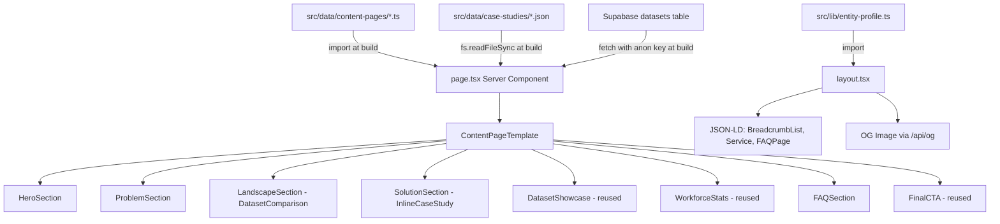

# Claru SEO Content Pages -- Design Document

## Overview

This document specifies the technical design for ~11 new SEO content pages targeting low-competition, high-value buyer-intent keywords in the AI training data space. These pages are **problem-first** (addressing what the buyer needs) rather than **service-first** (describing what Claru offers), differentiating them from the existing `/pillars/*` capability pages.

Each page integrates real data from two sources -- case study JSONs (`src/data/case-studies/*.json`) and the Supabase `datasets` table -- alongside research paper citations, to create authoritative, evidence-backed content that ranks for informational and transactional queries simultaneously.

### Business Value

- Capture buyer-intent search traffic ("I need egocentric video data for my robot") that pillar pages do not target
- Build topical authority through research citations and real project metrics
- Create internal linking hub between content pages, pillar pages, case studies, and data catalog
- Generate qualified leads through embedded CTAs backed by proof of delivery

### Key Architectural Decisions

| Decision | Choice | Rationale |
|----------|--------|-----------|
| URL structure | `/solutions/{slug}` | Keeps URLs short with keyword in path; groups problem-first pages under a clear parent; avoids collision with `/pillars/*` capability pages; "solutions" signals buyer intent to both users and search engines |
| Rendering strategy | Server Components with static generation (SSG) | Content is data-driven but changes infrequently; SSG provides fastest TTFB for crawlers; Supabase data fetched at build time |
| Revalidation | ISR with 1-hour revalidation | Allows dataset catalog updates to propagate without full rebuild |
| Page data model | TypeScript data files per page | Co-locates copy, citations, dataset IDs, and case study mappings in typed objects; no CMS dependency |
| Template architecture | Shared `ContentPageLayout` + composable section components | Consistent structure across all 11 pages; each page is a thin data file + a page.tsx that composes sections |

### Target Pages

| # | Slug | Primary Keyword | Target Intent |
|---|------|----------------|---------------|
| 1 | `egocentric-video-data` | egocentric video data | Buyer seeking first-person video datasets |
| 2 | `vla-training-data` | VLA training data | Buyer building vision-language-action models |
| 3 | `red-teaming-ai-models` | red teaming AI models | Buyer needing adversarial testing |
| 4 | `video-generation-training-data` | video generation training data | Buyer training video gen models |
| 5 | `manipulation-trajectory-data` | manipulation trajectory data | Buyer training robotic manipulation |
| 6 | `expert-rlhf-data` | expert RLHF data | Buyer needing expert human feedback |
| 7 | `sim-to-real-transfer-data` | sim-to-real transfer data | Buyer bridging simulation to reality |
| 8 | `teleoperation-data` | teleoperation data | Buyer collecting teleop demonstrations |
| 9 | `ai-safety-evaluation` | AI safety evaluation data | Buyer evaluating model safety |
| 10 | `multimodal-annotation` | multimodal annotation services | Buyer needing cross-modal labeling |
| 11 | `video-annotation-at-scale` | video annotation at scale | Buyer needing high-volume video labeling |

---

## Architecture

### Route Structure

```
src/app/solutions/
  layout.tsx                         # Shared layout: JSON-LD injection, OG defaults
  [slug]/
    page.tsx                         # Dynamic route rendering ContentPageTemplate
```

Using a dynamic `[slug]` route instead of 11 static folders because:
1. All pages share identical template structure -- only data differs
2. `generateStaticParams()` pre-renders all pages at build time (SSG)
3. Adding a new page requires only adding a data file, not a new directory

The dynamic route uses `generateStaticParams` to produce static HTML at build time:

```typescript
// src/app/solutions/[slug]/page.tsx
export async function generateStaticParams() {
  return getAllContentPageSlugs().map((slug) => ({ slug }));
}
```

### Internal Linking Topology

```
                    claru.ai (Homepage)
                         |
              +----------+----------+
              |                     |
         /pillars/*            /solutions/*
       (capability-first)    (problem-first)
              |                     |
              +-------- X ---------+
              (cross-links between related
               pillar and solution pages)
              |                     |
         /case-studies/*      /data-catalog
       (proof/evidence)      (browse datasets)
```

Each content page links to:
- 1-2 related pillar pages (via `pillarLinks` in page data)
- 1-3 case studies (inline proof sections + card links)
- Data catalog filtered views (via dataset showcase)
- Contact CTA (existing `FinalCTA` component)

Each pillar page gains reciprocal links back to relevant content pages in its "Related Resources" section.

### Data Flow



### Rendering Strategy

All content pages use **static generation with ISR**:

```typescript
// src/app/solutions/[slug]/page.tsx
export const revalidate = 3600; // 1 hour ISR
```

**Build-time data resolution:**
1. Page copy, citations, and mappings: imported from TypeScript data files (zero runtime cost)
2. Case study metrics: read from JSON files via `fs.readFileSync` in server components (build-time only)
3. Dataset showcase: fetched from Supabase using the existing `getDatasets` pattern from `DatasetShowcase.tsx` (cached with `React.cache`)

---

## Components and Interfaces

### New Components

#### 1. `ContentPageTemplate` (Server Component)

The main template that composes all sections for a content page. Each page.tsx passes its data object to this template.

**Location:** `src/app/components/content/ContentPageTemplate.tsx`

```typescript
interface ContentPageTemplateProps {
  data: ContentPageData;
}
```

This is a **server component** that:
- Reads case study JSONs from disk
- Passes dataset IDs to the existing async `DatasetShowcase`
- Renders all sections in order
- Contains no client-side JavaScript itself (sections that need interactivity are individually marked `'use client'`)

#### 2. `ContentHero` (Server Component)

**Location:** `src/app/components/content/ContentHero.tsx`

Renders the page hero with:
- Breadcrumb navigation (Home > Solutions > {Page Title})
- H1 targeting the primary keyword
- Subtitle paragraph with answer-first structure
- Primary CTA button

```typescript
interface ContentHeroProps {
  title: string;           // H1 text
  subtitle: string;        // Lead paragraph
  breadcrumbLabel: string; // Short label for breadcrumb
  ctaText?: string;        // CTA button text, defaults to "Discuss Your Project"
  ctaHref?: string;        // CTA link, defaults to "/#contact"
}
```

Design rationale: Server component because the hero has no interactive elements. Breadcrumb rendered as semantic `<nav>` with `<ol>` for accessibility and crawlability.

#### 3. `ProblemSection` (Server Component)

**Location:** `src/app/components/content/ProblemSection.tsx`

Renders the "The Problem" section with:
- Question-form H2 for AEO (e.g., "Why is egocentric video data hard to collect at scale?")
- Answer-first paragraph structure
- Inline research citations using the existing `Citation` component (wrapped for server use)
- Optional callout box for key statistics

```typescript
interface ProblemSectionProps {
  heading: string;                    // Question-form H2
  paragraphs: string[];               // Answer-first body text
  citations: ResearchCitation[];       // Inline citations
  callout?: {
    title: string;
    body: string;
    citationUrl?: string;
  };
}
```

#### 4. `DatasetComparison` (Server Component)

**Location:** `src/app/components/content/DatasetComparison.tsx`

Renders a comparison table of open/public datasets versus Claru's offering, highlighting gaps that Claru fills.

```typescript
interface DatasetComparisonRow {
  name: string;              // Dataset name (e.g., "Ego4D")
  source: string;            // "Open" | "Commercial" | "Claru"
  scale: string;             // e.g., "3,670 hours"
  limitations: string[];     // Gap descriptions
  claruAdvantage?: string;   // What Claru does differently
  url?: string;              // Link to dataset/paper
}

interface DatasetComparisonProps {
  heading: string;           // Question-form H2
  description: string;       // Section intro
  rows: DatasetComparisonRow[];
}
```

Renders as a responsive table on desktop, stacked cards on mobile. Uses the site's dark theme with `#121210` card backgrounds and `#92B090` accent for Claru rows.

#### 5. `InlineCaseStudy` (Server Component)

**Location:** `src/app/components/content/InlineCaseStudy.tsx`

Unlike the existing `CaseStudyCard` (which shows title + description + link), this component renders **inline proof** from case study data: actual metrics, methodology summary, and results -- embedded directly in the page content flow.

```typescript
interface InlineCaseStudyProps {
  slug: string;              // Case study slug to load from JSON
  focusMetrics?: string[];   // Which results to highlight (by label substring match)
  showMethodology?: boolean; // Whether to show approach excerpt (default: true)
  showProcess?: boolean;     // Whether to show process steps (default: false)
}
```

Data loading: reads from `src/data/case-studies/{slug}.json` at build time using `fs.readFileSync` + `JSON.parse`. This is safe because the component is a server component and the route uses `generateStaticParams`.

Renders:
- Case study title as H3
- 2-4 highlighted metric cards (from `results` array)
- Methodology excerpt (first 2 sentences of `approach`)
- Link to full case study page

#### 6. `ResearchCitations` (Server Component)

**Location:** `src/app/components/content/ResearchCitations.tsx`

Renders a "References" section at the bottom of the page with numbered citations.

```typescript
interface ResearchCitation {
  id: string;                // e.g., "ego4d-2022"
  title: string;             // Paper title
  authors: string;           // Abbreviated author list
  venue: string;             // "CVPR 2022", "NeurIPS 2023", etc.
  year: number;
  url: string;               // Link to paper
  keyClaim: string;          // One-sentence summary of relevant finding
}

interface ResearchCitationsProps {
  citations: ResearchCitation[];
}
```

#### 7. `ContentFAQ` (Client Component)

**Location:** `src/app/components/content/ContentFAQ.tsx`

Renders an expandable FAQ accordion. Client component because it needs toggle state.

```typescript
interface ContentFAQProps {
  heading?: string;          // Defaults to "Frequently Asked Questions"
  items: Array<{
    question: string;
    answer: string;          // Plain text (not JSX) for JSON-LD compatibility
  }>;
}
```

FAQ items are plain strings (not React nodes) because the same data is used in both the rendered component and the FAQPage JSON-LD schema in the layout.

### Existing Components Reused

| Component | Location | Usage in Content Pages |
|-----------|----------|----------------------|
| `DatasetShowcase` | `src/app/components/prospect/DatasetShowcase.tsx` | Async server component; pass dataset UUIDs per page |
| `WorkforceStats` | `src/app/components/prospect/WorkforceStats.tsx` | Client component; renders animated stat counters |
| `FinalCTA` | `src/app/components/sections/FinalCTA.tsx` | Client component; contact form CTA |
| `Citation` | `src/app/components/ui/Citation.tsx` | Client component; inline citation links. Will create a server-compatible version (`CitationLink`) for use in server components |
| `CaseStudyCallout` | `src/app/components/ui/CaseStudyCallout.tsx` | Client component; used in "Related Case Studies" section at bottom |
| `Logo` | `src/app/components/ui/Logo.tsx` | Header branding |
| `Button` | `src/app/components/ui/Button.tsx` | CTA buttons |

### Component Hierarchy

```
solutions/[slug]/page.tsx (Server Component)
  |
  +-- solutions/layout.tsx (Server Component)
  |     +-- <script type="application/ld+json"> (BreadcrumbList, Service, FAQPage)
  |
  +-- ContentPageTemplate (Server Component)
        +-- Header (reused from layout)
        +-- ContentHero (Server)
        |     +-- Breadcrumb <nav>
        |     +-- <h1>
        |     +-- Button (CTA)
        |
        +-- ProblemSection (Server)
        |     +-- <h2> (question-form)
        |     +-- CitationLink (Server) -- server-safe anchor tag
        |     +-- Callout box
        |
        +-- DatasetComparison (Server)
        |     +-- <h2> (question-form)
        |     +-- Responsive table / card grid
        |
        +-- SolutionSection (Server)
        |     +-- <h2> (question-form)
        |     +-- InlineCaseStudy (Server) x 1-3
        |           +-- Metric cards
        |           +-- Methodology excerpt
        |
        +-- DatasetShowcase (Async Server -- reused)
        |     +-- Supabase fetch via React.cache
        |
        +-- WorkforceStats (Client -- reused)
        |
        +-- ContentFAQ (Client)
        |     +-- Accordion items
        |
        +-- FinalCTA (Client -- reused)
```

---

## Data Models

### `ContentPageData` -- Core Page Data Type

**Location:** `src/data/content-pages/types.ts`

```typescript
import type { ResearchCitation } from "@/app/components/content/ResearchCitations";

export interface ContentPageData {
  // -- Identity & SEO --
  slug: string;                          // URL slug: "egocentric-video-data"
  title: string;                         // H1 text
  metaTitle: string;                     // <title> tag (50-60 chars)
  metaDescription: string;               // meta description (150-160 chars)
  primaryKeyword: string;                // Target keyword
  secondaryKeywords: string[];           // Additional keywords for <meta keywords>
  breadcrumbLabel: string;               // Short label for breadcrumb trail
  ogCategory: string;                    // OG image category param (use "default")

  // -- Hero --
  heroSubtitle: string;                  // Lead paragraph under H1

  // -- Problem Section --
  problem: {
    heading: string;                     // Question-form H2
    paragraphs: string[];                // Body paragraphs (answer-first)
    callout?: {
      title: string;
      body: string;
      citationUrl?: string;
    };
  };

  // -- Landscape / Comparison --
  landscape: {
    heading: string;                     // Question-form H2
    description: string;                 // Section intro
    datasets: Array<{
      name: string;
      source: "Open" | "Commercial" | "Claru";
      scale: string;
      limitations: string[];
      claruAdvantage?: string;
      url?: string;
    }>;
  };

  // -- Solution Section --
  solution: {
    heading: string;                     // Question-form H2
    intro: string;                       // How Claru solves this
    caseStudySlugs: string[];            // Case study slugs to render inline
    focusMetrics?: Record<string, string[]>;  // slug -> metric labels to highlight
  };

  // -- Dataset Showcase --
  datasetIds: string[];                  // Supabase dataset UUIDs

  // -- FAQ --
  faqs: Array<{
    question: string;
    answer: string;
  }>;

  // -- Research Citations --
  citations: ResearchCitation[];

  // -- Internal Linking --
  pillarLinks: Array<{
    href: string;                        // e.g., "/pillars/acquire/egocentric-video"
    label: string;                       // e.g., "Egocentric Video Collection"
    pillarCategory: string;              // e.g., "ACQUIRE"
  }>;

  // -- Related Content Pages --
  relatedSlugs?: string[];              // Other content page slugs for "Related" section
}
```

### Page Data Files

**Location:** `src/data/content-pages/{slug}.ts`

Each file exports a single `ContentPageData` object:

```typescript
// src/data/content-pages/egocentric-video-data.ts
import type { ContentPageData } from "./types";

export const egocentricVideoData: ContentPageData = {
  slug: "egocentric-video-data",
  title: "Egocentric Video Data for Robotics and Embodied AI",
  metaTitle: "Egocentric Video Data for Robotics | Claru",
  metaDescription: "Custom first-person video datasets for robotics training. 386K+ clips delivered across 3 pipelines. Expert collectors, same-day QA, weekly delivery.",
  primaryKeyword: "egocentric video data",
  // ... rest of page data
};
```

### Page Registry

**Location:** `src/data/content-pages/index.ts`

Central registry that maps slugs to data, used by `generateStaticParams` and `generateMetadata`.

```typescript
import type { ContentPageData } from "./types";
import { egocentricVideoData } from "./egocentric-video-data";
import { vlaTrainingData } from "./vla-training-data";
// ... all page imports

const CONTENT_PAGES: Record<string, ContentPageData> = {
  "egocentric-video-data": egocentricVideoData,
  "vla-training-data": vlaTrainingData,
  // ... all pages
};

export function getContentPage(slug: string): ContentPageData | undefined {
  return CONTENT_PAGES[slug];
}

export function getAllContentPageSlugs(): string[] {
  return Object.keys(CONTENT_PAGES);
}

export function getAllContentPages(): ContentPageData[] {
  return Object.values(CONTENT_PAGES);
}
```

### Case Study JSON Schema (Existing)

The existing case study JSONs at `src/data/case-studies/*.json` already contain all the fields needed by `InlineCaseStudy`:

- `results[]` -- array of `{ value, label }` metric objects
- `approach` -- methodology text
- `processSteps[]` -- array of `{ step, title, description }`
- `title`, `teaser`, `headlineStat`, `headlineStatLabel`

No schema changes are needed. A server-side utility function will read and parse these:

```typescript
// src/lib/case-studies-server.ts
import fs from "fs";
import path from "path";

export interface CaseStudyData {
  slug: string;
  title: string;
  teaser: string;
  headlineStat: string;
  headlineStatLabel: string;
  results: Array<{ value: string; label: string }>;
  approach: string;
  processSteps: Array<{ step: string; title: string; description: string }>;
  // ... other fields as needed
}

export function getCaseStudyData(slug: string): CaseStudyData | null {
  const filePath = path.join(process.cwd(), "src/data/case-studies", `${slug}.json`);
  try {
    const raw = fs.readFileSync(filePath, "utf-8");
    return JSON.parse(raw) as CaseStudyData;
  } catch {
    return null;
  }
}
```

### Supabase Dataset Schema (Existing)

The existing `DatasetShowcase` component already handles Supabase queries. Content pages pass dataset UUIDs through the `datasetIds` field in their data files. No schema changes needed.

### Page-to-Data Mapping

| Content Page | Case Study Slugs | Pillar Links |
|-------------|------------------|-------------|
| egocentric-video-data | `egocentric-video-collection`, `workplace-egocentric-data` | `/pillars/acquire/egocentric-video` |
| vla-training-data | `egocentric-video-collection`, `workplace-egocentric-data`, `game-based-data-capture` | `/pillars/acquire/egocentric-video`, `/pillars/acquire/synthetic-data` |
| red-teaming-ai-models | `red-teaming-moderation`, `generative-ai-safety` | `/pillars/validate/red-teaming` |
| video-generation-training-data | `video-model-evaluation`, `video-quality-at-scale`, `video-content-classification` | `/pillars/enrich/video-annotation` |
| manipulation-trajectory-data | `egocentric-video-collection`, `game-based-data-capture` | `/pillars/acquire/egocentric-video` |
| expert-rlhf-data | `prompt-enhancement-benchmark`, `video-quality-at-scale` | `/pillars/enrich/rlhf` |
| sim-to-real-transfer-data | `game-based-data-capture`, `egocentric-video-collection` | `/pillars/acquire/synthetic-data` |
| teleoperation-data | `egocentric-video-collection`, `workplace-egocentric-data` | `/pillars/acquire/egocentric-video` |
| ai-safety-evaluation | `generative-ai-safety`, `red-teaming-moderation` | `/pillars/validate/red-teaming`, `/pillars/validate/bias-detection` |
| multimodal-annotation | `fashion-ai-annotation`, `object-identity-persistence` | `/pillars/enrich/expert-annotation` |
| video-annotation-at-scale | `video-content-classification`, `video-quality-at-scale`, `object-identity-persistence` | `/pillars/enrich/video-annotation` |

---

## SEO and Structured Data

### Metadata Generation

Each page generates metadata via the Next.js `generateMetadata` function:

```typescript
// src/app/solutions/[slug]/page.tsx
export async function generateMetadata({ params }: Props): Promise<Metadata> {
  const { slug } = await params;
  const page = getContentPage(slug);
  if (!page) return {};

  return {
    title: page.metaTitle,
    description: page.metaDescription,
    keywords: [page.primaryKeyword, ...page.secondaryKeywords],
    alternates: {
      canonical: `/solutions/${page.slug}`,
    },
    openGraph: {
      title: page.metaTitle,
      description: page.metaDescription,
      url: `/solutions/${page.slug}`,
      type: "website",
      images: [{
        url: ogImageUrl(page.title, { category: page.ogCategory }),
        width: 1200,
        height: 630,
      }],
    },
  };
}
```

### JSON-LD Schemas

The solutions layout injects three JSON-LD schemas per page:

**1. BreadcrumbList**
```json
{
  "@type": "BreadcrumbList",
  "itemListElement": [
    { "@type": "ListItem", "position": 1, "item": { "@id": "https://claru.ai", "name": "Home" } },
    { "@type": "ListItem", "position": 2, "item": { "@id": "https://claru.ai/solutions", "name": "Solutions" } },
    { "@type": "ListItem", "position": 3, "item": { "@id": "https://claru.ai/solutions/{slug}", "name": "{breadcrumbLabel}" } }
  ]
}
```

**2. Service (linked to Organization)**
```json
{
  "@type": "Service",
  "name": "{title}",
  "serviceType": "AI Training Data",
  "provider": {
    "@type": "Organization",
    "name": "Claru",
    "url": "https://claru.ai"
  },
  "description": "{metaDescription}",
  "areaServed": "Worldwide",
  "dateModified": "{BUILD_DATE}"
}
```

**3. FAQPage**
Generated from the `faqs` array in the page data. Because FAQ answers are plain strings (not JSX), they serialize cleanly into JSON-LD.

### OG Image Category

Add `"solution"` to the `VALID_CATEGORIES` array in `src/app/api/og/route.tsx`:

```typescript
const VALID_CATEGORIES = [
  "default", "pillar", "case-study", "job", "data-catalog", "legal", "solution",
] as const;

// In CATEGORY_CONFIG:
solution: { badge: "SOLUTION", borderColor: "#92B090", titlePrefix: "" },
```

### AEO Optimization

Every content page follows answer engine optimization patterns:

1. **Question-form H2s**: Each section heading is phrased as a question the buyer would ask
   - "Why is egocentric video data hard to collect at scale?"
   - "What open datasets exist for egocentric video, and where do they fall short?"
   - "How does Claru solve the egocentric video data gap?"

2. **Answer-first paragraphs**: The first sentence under each H2 directly answers the question, followed by supporting detail. This maximizes the chance of being selected as an AI Overview or featured snippet.

3. **FAQ schema**: 3-5 Q&As per page in both rendered HTML and FAQPage JSON-LD.

---

## Error Handling

### Build-Time Errors

| Scenario | Handling |
|----------|----------|
| Unknown slug in `[slug]/page.tsx` | `notFound()` -- returns 404 |
| Case study JSON not found | `InlineCaseStudy` returns `null` with console warning; page renders without that proof section |
| Supabase fetch fails | `DatasetShowcase` returns empty state (existing behavior); logged to console |
| Page data file missing from registry | `generateStaticParams` excludes it; direct URL access returns 404 |

### Runtime Errors

| Scenario | Handling |
|----------|----------|
| ISR revalidation fails for Supabase | Serves stale cached version (Next.js default ISR behavior) |
| Client component hydration error | Framer Motion components have `viewport={{ once: true }}` guards; graceful degradation to static content |

### Data Validation

Page data files use TypeScript's type system for compile-time validation. A build-time check in `generateStaticParams` verifies that:
1. All referenced case study slugs correspond to existing JSON files
2. All `pillarLinks.href` values match existing routes
3. FAQ arrays have 3-5 items

```typescript
// src/app/solutions/[slug]/page.tsx
export async function generateStaticParams() {
  const slugs = getAllContentPageSlugs();

  // Build-time validation
  for (const slug of slugs) {
    const page = getContentPage(slug)!;

    // Verify case studies exist
    for (const csSlug of page.solution.caseStudySlugs) {
      const csPath = path.join(process.cwd(), "src/data/case-studies", `${csSlug}.json`);
      if (!fs.existsSync(csPath)) {
        console.warn(`[content-pages] Case study "${csSlug}" not found for page "${slug}"`);
      }
    }

    // Verify FAQ count
    if (page.faqs.length < 3 || page.faqs.length > 5) {
      console.warn(`[content-pages] Page "${slug}" has ${page.faqs.length} FAQs (expected 3-5)`);
    }
  }

  return slugs.map((slug) => ({ slug }));
}
```

---

## Testing Strategy

### Unit Tests

| Component | Test Cases |
|-----------|-----------|
| `ContentPageTemplate` | Renders all sections; handles missing optional data gracefully |
| `DatasetComparison` | Renders table rows; handles empty array; responsive layout |
| `InlineCaseStudy` | Renders metrics from JSON; handles missing JSON file; filters focus metrics |
| `ResearchCitations` | Renders numbered list; links are external with noopener |
| `ContentFAQ` | Toggle expand/collapse; keyboard accessibility |
| `getContentPage()` | Returns data for valid slug; returns undefined for invalid |
| `getCaseStudyData()` | Parses valid JSON; returns null for missing file |

### Integration Tests

| Test | Description |
|------|-------------|
| Page rendering | Each of the 11 pages renders without errors at build time |
| Metadata generation | Each page produces correct title, description, canonical, OG image URL |
| JSON-LD validation | Each page's JSON-LD parses as valid schema.org (BreadcrumbList, Service, FAQPage) |
| Internal links | All `pillarLinks` and case study links resolve to existing routes |
| Supabase integration | `DatasetShowcase` renders dataset cards when valid UUIDs are provided |

### SEO Validation Tests

| Test | Assertion |
|------|-----------|
| H1 count | Exactly 1 `<h1>` per page |
| H2 format | All H2s are question-form (contain "?" or start with "What/Why/How") |
| Canonical URL | Matches `/solutions/{slug}` |
| Meta description length | 150-160 characters |
| Title tag length | 50-60 characters |
| FAQ count | 3-5 items per page |
| JSON-LD validity | Passes schema.org validation |

### QA Loop

Each page goes through a multi-agent review cycle:

1. **Implementation**: Agent creates page with copy, data integration, citations
2. **Code Review**: Separate agent reviews TypeScript types, component composition, rendering strategy, and performance
3. **Content QA**: Separate agent reviews:
   - Copy quality and tone consistency
   - Citation accuracy (research paper claims match what's cited)
   - SEO optimization (keyword density, H2 question format, answer-first structure)
   - Factual accuracy of dataset comparison tables
4. **Fix Cycle**: Issues from steps 2-3 are resolved before marking complete

### E2E Tests (Playwright)

- Each content page loads without JavaScript errors
- FAQ accordion expands/collapses on click
- CTA button scrolls to contact form
- OG image endpoint returns 200 for each page's title
- Breadcrumb links are navigable

---

## Implementation Plan

### Phase 1: Infrastructure (1-2 days)

1. Create `src/data/content-pages/types.ts` with `ContentPageData` interface
2. Create `src/data/content-pages/index.ts` registry
3. Create `src/lib/case-studies-server.ts` with `getCaseStudyData()`
4. Create `src/app/solutions/layout.tsx` with JSON-LD injection
5. Create `src/app/solutions/[slug]/page.tsx` with `generateStaticParams`, `generateMetadata`, and template composition
6. Add `"solution"` category to OG image route
7. Create server-safe `CitationLink` component (anchor tag without Lucide icon, for server components)

### Phase 2: Shared Components (2-3 days)

1. `ContentPageTemplate` -- main template compositor
2. `ContentHero` -- hero with breadcrumb
3. `ProblemSection` -- problem statement with citations
4. `DatasetComparison` -- comparison table
5. `InlineCaseStudy` -- inline case study proof
6. `ResearchCitations` -- references section
7. `ContentFAQ` -- expandable FAQ accordion

### Phase 3: Page Data Files (3-5 days)

Create one data file per page in `src/data/content-pages/`:
1. `egocentric-video-data.ts`
2. `vla-training-data.ts`
3. `red-teaming-ai-models.ts`
4. `video-generation-training-data.ts`
5. `manipulation-trajectory-data.ts`
6. `expert-rlhf-data.ts`
7. `sim-to-real-transfer-data.ts`
8. `teleoperation-data.ts`
9. `ai-safety-evaluation.ts`
10. `multimodal-annotation.ts`
11. `video-annotation-at-scale.ts`

Each data file requires:
- Research into 3-5 relevant academic papers
- Accurate dataset comparison table
- 3-5 FAQs targeting long-tail keywords
- Mapping to correct case study slugs and dataset UUIDs

### Phase 4: QA and Cross-Linking (1-2 days)

1. Run SEO validation tests on all 11 pages
2. Add reciprocal links from pillar pages to related content pages
3. Add content pages to sitemap
4. Validate JSON-LD with Google Rich Results Test
5. Run Lighthouse performance audit on each page
6. Content QA review cycle

### Phase 5: Deployment

1. Deploy to Vercel preview for stakeholder review
2. Submit new URLs to Google Search Console for indexing
3. Monitor Core Web Vitals post-launch

---

## File Tree (New/Modified Files)

```
src/
  app/
    solutions/
      layout.tsx                              # NEW - shared layout with JSON-LD
      [slug]/
        page.tsx                              # NEW - dynamic route
    components/
      content/
        ContentPageTemplate.tsx               # NEW - main template
        ContentHero.tsx                       # NEW - hero section
        ProblemSection.tsx                    # NEW - problem statement
        DatasetComparison.tsx                 # NEW - comparison table
        InlineCaseStudy.tsx                   # NEW - inline case study proof
        ResearchCitations.tsx                 # NEW - references section
        ContentFAQ.tsx                        # NEW - FAQ accordion
        CitationLink.tsx                      # NEW - server-safe citation anchor
    api/
      og/
        route.tsx                             # MODIFIED - add "solution" category
  data/
    content-pages/
      types.ts                                # NEW - ContentPageData interface
      index.ts                                # NEW - page registry
      egocentric-video-data.ts                # NEW - page data
      vla-training-data.ts                    # NEW - page data
      red-teaming-ai-models.ts                # NEW - page data
      video-generation-training-data.ts       # NEW - page data
      manipulation-trajectory-data.ts         # NEW - page data
      expert-rlhf-data.ts                     # NEW - page data
      sim-to-real-transfer-data.ts            # NEW - page data
      teleoperation-data.ts                   # NEW - page data
      ai-safety-evaluation.ts                 # NEW - page data
      multimodal-annotation.ts                # NEW - page data
      video-annotation-at-scale.ts            # NEW - page data
  lib/
    case-studies-server.ts                    # NEW - server-side case study reader
```

**Total new files:** 25
**Modified files:** 1 (OG image route)
