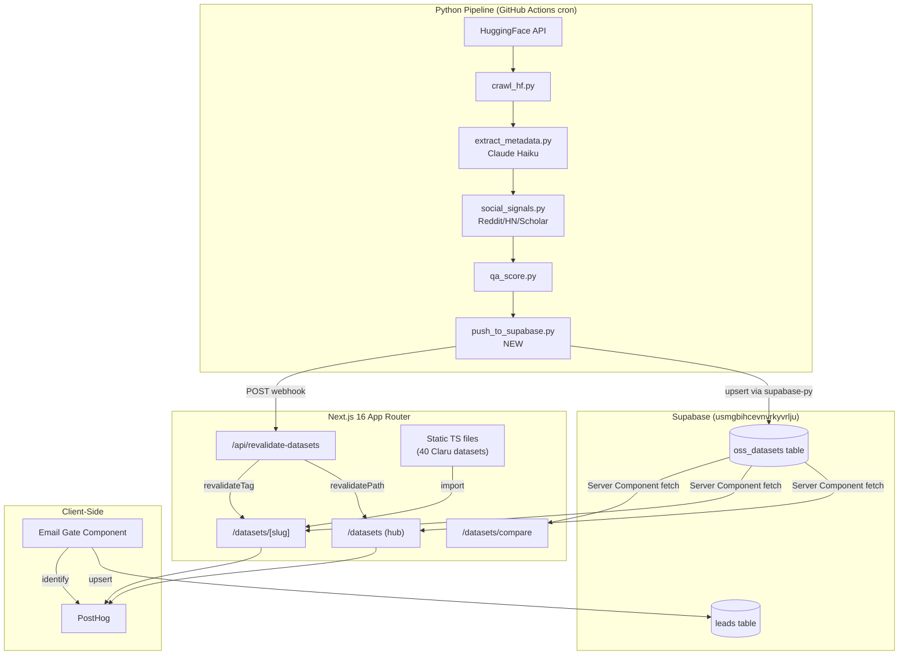

# Physical AI Dataset Portal -- Design Document

**Feature**: Searchable directory of open-source physical AI datasets at `/datasets`
**Date**: 2026-04-10
**Status**: Draft

---

## 1. Overview

### 1.1 Business Value

Claru positions itself as the authority on physical AI training data. Today, researchers and ML engineers discover datasets through fragmented sources -- HuggingFace search, Reddit threads, Twitter posts, and word of mouth. By building a curated, searchable directory of 400+ open-source physical AI datasets with structured metadata, social signals, and comparison tools, Claru becomes the "go-to" resource hub for anyone training robotics, embodied AI, or world models.

The portal serves a dual purpose:
1. **SEO/GEO magnet** -- 400+ indexable pages targeting long-tail keywords (e.g., "kitchen manipulation dataset for VLA training"), each with JSON-LD Dataset schema markup.
2. **Lead generation engine** -- PostHog tracking on all interactions creates intent signals. Email gate on advanced features (comparison export, full access) captures leads directly into the existing `leads` table and Resend audience.

### 1.2 Scope

- **In scope**: Hub page with search/filter, dynamic `[slug]` detail pages, comparison tool (up to 3 datasets), email gate, PostHog event tracking, Supabase schema, pipeline integration, SEO optimization, coexistence with 40 existing static Claru dataset pages.
- **Out of scope**: User accounts/authentication (beyond email capture), dataset hosting/downloads (we link to HuggingFace), payment/pricing, annotations or labeling within the portal, mobile app.

### 1.3 Key Architectural Decisions

| Decision | Choice | Rationale |
|----------|--------|-----------|
| Data source for OSS pages | Supabase `oss_datasets` table | Dynamic data from daily pipeline; ISR for SEO; avoids 400+ static TS files |
| Rendering strategy | ISR with 1-hour revalidation + on-demand revalidation webhook | Balances SEO (SSR HTML) with fresh data after pipeline runs |
| Routing coexistence | Static Claru pages take priority; Supabase lookup as fallback | Preserves existing SEO equity on 40 Claru pages; new OSS pages served from DB |
| Filter state | URL searchParams (not React state) | Shareable/bookmarkable URLs; SSR-compatible; back button works |
| Email gate storage | `localStorage` + Supabase `leads` table | Persists across sessions; feeds existing CRM pipeline |
| Pipeline push method | `supabase-py` client with upsert | Already in Python ecosystem; matches pipeline's existing patterns |
| Comparison state | URL searchParams (`?compare=slug1,slug2,slug3`) | Shareable comparison URLs; max 3 datasets |

---

## 2. Architecture

### 2.1 System Architecture



### 2.2 Data Flow

1. **Pipeline** (daily at 06:00 UTC via GitHub Actions):
   - `crawl_hf.py` fetches 300+ robotics datasets from HuggingFace Hub API
   - `extract_metadata.py` sends README text to Claude Haiku for structured extraction
   - `social_signals.py` queries Reddit, HN, Semantic Scholar for community signals
   - `qa_score.py` validates extraction quality
   - `push_to_supabase.py` (NEW) upserts all records into `oss_datasets` table
   - Calls `/api/revalidate-datasets` webhook to trigger ISR cache purge

2. **Frontend rendering**:
   - Hub page: Server Component queries Supabase for all active datasets, renders grid with search/filter
   - Detail page: `[slug]` route checks static Claru data first, then queries Supabase
   - Client-side: PostHog tracks all interactions; email gate persists in localStorage

### 2.3 Rendering Strategy

The hub and detail pages use **Incremental Static Regeneration (ISR)** with a 1-hour background revalidation, matching the existing pattern in `src/app/blog/page.tsx` and `src/app/solutions/[slug]/page.tsx`:

```typescript
// src/app/datasets/page.tsx (new hub)
export const revalidate = 3600; // 1 hour
```

After each pipeline run, the `push_to_supabase.py` script calls the revalidation webhook to immediately refresh cached pages:

```typescript
// src/app/api/revalidate-datasets/route.ts
import { revalidatePath } from "next/cache";

export async function POST(request: Request) {
  const { secret } = await request.json();
  if (secret !== process.env.REVALIDATION_SECRET) {
    return Response.json({ error: "Unauthorized" }, { status: 401 });
  }
  revalidatePath("/datasets", "layout");
  return Response.json({ revalidated: true });
}
```

---

## 3. Components and Interfaces

### 3.1 Route Structure

```
/datasets                     -- Hub page (search, filter, grid)
/datasets/compare             -- Comparison page (side-by-side)
/datasets/[slug]              -- Detail page (static Claru OR dynamic OSS)
```

### 3.2 Hub Page (`/datasets`)

The hub page replaces the current simple grid (40 Claru datasets) with a full-featured search and filter interface for 400+ OSS datasets plus the 40 Claru datasets combined.

```
/datasets (Server Component)
├── DatasetHubHero
│   ├── h1, subtitle, total count
│   └── DatasetStats (distribution badges: "142 manipulation", "89 navigation", etc.)
├── DatasetSearchBar (client component)
│   └── text input with debounce, reads/writes searchParams
├── DatasetFilterBar (client component)
│   ├── ModalityFilter (multi-select: rgb, depth, lidar, imu, audio, etc.)
│   ├── EnvironmentFilter (multi-select: kitchen, warehouse, lab, outdoor, simulation)
│   ├── TaskTypeFilter (multi-select: manipulation, navigation, locomotion, grasping)
│   ├── EmbodimentFilter (multi-select: Franka, UR5, humanoid, quadruped, etc.)
│   ├── LicenseFilter (multi-select: CC-BY-4.0, MIT, Apache-2.0, etc.)
│   ├── FormatFilter (multi-select: RLDS, HDF5, LeRobot, zarr, WebDataset)
│   └── SortSelect (downloads, likes, citations, recently_updated, name)
├── ActiveFilters (pills with remove button)
├── DatasetGrid (server-rendered initial, client-updated on filter)
│   └── DatasetCard[] (up to 24 per page, with pagination)
│       ├── name, description (2 lines), source badge (HuggingFace/Claru)
│       ├── modality pills, episode/hours count
│       ├── downloads/likes/citations metrics
│       └── "Add to compare" checkbox (max 3)
├── CompareFloatingBar (sticky bottom, shows when 2+ selected)
│   └── "Compare N datasets" button -> /datasets/compare?slugs=...
└── DatasetHubCTA (Claru contextual offer at bottom)
```

### 3.3 Detail Page (`/datasets/[slug]`)

The `[slug]` route must serve two types of content:

1. **Claru datasets** (40 existing static TS files) -- rendered via existing `Wave3PageTemplate`
2. **OSS datasets** (400+ from Supabase) -- rendered via new `OSSDatasetTemplate`

**Routing logic:**

```typescript
// src/app/datasets/[slug]/page.tsx
export default async function DatasetPage({ params }) {
  const { slug } = await params;

  // Priority 1: Check static Claru data (preserves existing SEO)
  const claruPage = getDatasetPage(slug);
  if (claruPage) {
    const jsonLd = buildDatasetJsonLd(claruPage);
    return (
      <>
        <script type="application/ld+json" ... />
        <Wave3PageTemplate page={claruPage} />
      </>
    );
  }

  // Priority 2: Query Supabase for OSS dataset
  const supabase = await createSupabaseServerClient();
  const { data: ossDataset } = await supabase
    .from("oss_datasets")
    .select("*")
    .eq("slug", slug)
    .eq("is_active", true)
    .single();

  if (!ossDataset) notFound();

  return <OSSDatasetTemplate dataset={ossDataset} />;
}
```

**OSS Detail Page layout:**

```
/datasets/[slug] (OSSDatasetTemplate)
├── OSSDatasetHero
│   ├── Breadcrumb (Home / Datasets / {name})
│   ├── h1 (dataset name)
│   ├── Description (full text)
│   ├── Source badges (HuggingFace link, paper link, license)
│   └── Metric pills (downloads, likes, citations)
├── OSSDatasetMetadata (structured grid)
│   ├── Modalities (pill list)
│   ├── Robot Embodiments (pill list)
│   ├── Action Space
│   ├── Environment Types (pill list)
│   ├── Task Types (pill list)
│   ├── Episodes / Hours
│   ├── Data Format
│   ├── Annotation Types (pill list)
│   ├── Year Released
│   └── License
├── OSSDatasetRelevance
│   └── "Why this matters for physical AI" (physical_ai_relevance field)
├── OSSDatasetSocial (gated behind email -- see section 5)
│   ├── Reddit mentions summary
│   ├── HN discussion summary
│   ├── Citation count + Semantic Scholar link
│   └── Community sentiment (LLM summary)
├── OSSDatasetRelated
│   └── 3-6 related datasets (same modality + task type, ordered by downloads)
├── ClaruContextualCTA
│   ├── "Need custom data like this?"
│   ├── Matching Claru datasets (if modality overlap)
│   └── Contact form link
└── OSSDatasetTracking (invisible client component, fires PostHog events)
```

### 3.4 Comparison Page (`/datasets/compare`)

```
/datasets/compare?slugs=slug1,slug2,slug3
├── ComparisonHeader
│   ├── Selected dataset names with remove buttons
│   └── "Add dataset" button (opens search modal)
├── ComparisonTable
│   ├── Row: Description
│   ├── Row: Modalities
│   ├── Row: Robot Embodiments
│   ├── Row: Environment Types
│   ├── Row: Task Types
│   ├── Row: Episodes / Hours
│   ├── Row: Data Format
│   ├── Row: License
│   ├── Row: Downloads / Likes
│   ├── Row: Citations
│   └── Row: Physical AI Relevance
├── ComparisonExport (email-gated)
│   └── "Export as CSV" button (triggers email gate if not captured)
└── ComparisonCTA
    └── "Need a custom dataset that combines the best of these?"
```

### 3.5 Component File Structure

```
src/app/datasets/
├── page.tsx                          -- Hub page (REPLACE existing)
├── compare/
│   └── page.tsx                      -- Comparison page (NEW)
├── [slug]/
│   └── page.tsx                      -- Detail page (MODIFY existing)
└── components/
    ├── DatasetSearchBar.tsx           -- Client: text search with debounce
    ├── DatasetFilterBar.tsx           -- Client: faceted filter controls
    ├── DatasetActiveFilters.tsx       -- Client: active filter pills
    ├── DatasetGrid.tsx                -- Server: results grid
    ├── DatasetCard.tsx                -- Server: individual card in grid
    ├── DatasetStats.tsx               -- Server: distribution summary
    ├── DatasetCompareBar.tsx          -- Client: sticky compare selection
    ├── OSSDatasetTemplate.tsx         -- Server: full detail page for OSS datasets
    ├── OSSDatasetMetadata.tsx         -- Server: structured metadata grid
    ├── OSSDatasetSocial.tsx           -- Client: social signals (gated)
    ├── OSSDatasetRelated.tsx          -- Server: related datasets
    ├── OSSDatasetTracking.tsx         -- Client: PostHog event tracking
    ├── ComparisonTable.tsx            -- Server: side-by-side table
    ├── ComparisonExport.tsx           -- Client: email-gated CSV export
    ├── EmailGate.tsx                  -- Client: reusable email capture overlay
    └── ClaruContextualCTA.tsx         -- Server: contextual Claru offer
```

### 3.6 Key Interfaces

```typescript
// src/types/oss-dataset.ts

/** Row shape from Supabase oss_datasets table */
export interface OSSDataset {
  id: string;
  dataset_id: string;       // e.g., "google-deepmind/droid"
  slug: string;             // URL-safe, e.g., "google-deepmind-droid"
  name: string;
  description: string | null;
  hf_url: string | null;
  source: "huggingface" | "arxiv" | "github";

  // Structured metadata
  modalities: string[] | null;
  robot_embodiments: string[] | null;
  action_space: string | null;
  environment_type: string[] | null;
  task_types: string[] | null;
  num_episodes: string | null;
  total_hours: string | null;
  license: string | null;
  annotation_types: string[] | null;
  data_format: string | null;
  year_released: number | null;
  paper_url: string | null;
  physical_ai_relevance: string | null;
  parent_project: string | null;

  // Social signals
  citation_count: number;
  reddit_mentions: number;
  hn_mentions: number;
  community_sentiment: string | null;

  // HuggingFace metrics
  downloads: number;
  likes: number;
  last_modified: string | null;

  // Pipeline metadata
  extraction_success: boolean;
  extraction_completeness: number;
  last_crawled_at: string;
  last_verified_at: string | null;
  is_active: boolean;

  created_at: string;
  updated_at: string;
}

/** Filter state derived from URL searchParams */
export interface DatasetFilters {
  q: string | null;              // text search
  modalities: string[];          // array-contains filter
  environment_type: string[];
  task_types: string[];
  robot_embodiments: string[];
  license: string[];
  data_format: string[];
  sort: "downloads" | "likes" | "citations" | "recently_updated" | "name";
  page: number;
}

/** Comparison selection (max 3) */
export interface ComparisonState {
  slugs: string[];  // max length 3
}
```

---

## 4. Data Models

### 4.1 Supabase Schema: `oss_datasets`

```sql
-- oss_datasets: Open-source physical AI datasets from the crawl pipeline
CREATE TABLE IF NOT EXISTS oss_datasets (
  id uuid PRIMARY KEY DEFAULT gen_random_uuid(),
  dataset_id text UNIQUE NOT NULL,
  slug text UNIQUE NOT NULL,
  name text NOT NULL,
  description text,
  hf_url text,
  source text NOT NULL DEFAULT 'huggingface',

  -- Structured metadata (from LLM extraction)
  modalities text[],
  robot_embodiments text[],
  action_space text,
  environment_type text[],
  task_types text[],
  num_episodes text,
  total_hours text,
  license text,
  annotation_types text[],
  data_format text,
  year_released integer,
  paper_url text,
  physical_ai_relevance text,
  parent_project text,

  -- Social signals
  citation_count integer NOT NULL DEFAULT 0,
  reddit_mentions integer NOT NULL DEFAULT 0,
  hn_mentions integer NOT NULL DEFAULT 0,
  community_sentiment text,

  -- HuggingFace metrics
  downloads integer NOT NULL DEFAULT 0,
  likes integer NOT NULL DEFAULT 0,
  last_modified timestamptz,

  -- Pipeline metadata
  extraction_success boolean NOT NULL DEFAULT false,
  extraction_completeness real DEFAULT 0.0,
  last_crawled_at timestamptz NOT NULL DEFAULT now(),
  last_verified_at timestamptz,
  is_active boolean NOT NULL DEFAULT true,

  created_at timestamptz NOT NULL DEFAULT now(),
  updated_at timestamptz NOT NULL DEFAULT now()
);

-- Trigger to auto-update updated_at
CREATE OR REPLACE FUNCTION update_oss_datasets_updated_at()
RETURNS TRIGGER AS $$
BEGIN
  NEW.updated_at = now();
  RETURN NEW;
END;
$$ LANGUAGE plpgsql;

CREATE TRIGGER oss_datasets_updated_at
  BEFORE UPDATE ON oss_datasets
  FOR EACH ROW
  EXECUTE FUNCTION update_oss_datasets_updated_at();
```

### 4.2 Indexes

```sql
-- Primary lookups
CREATE UNIQUE INDEX idx_oss_datasets_dataset_id ON oss_datasets (dataset_id);
CREATE UNIQUE INDEX idx_oss_datasets_slug ON oss_datasets (slug);

-- Array column filters (GIN indexes for @> operator)
CREATE INDEX idx_oss_datasets_modalities ON oss_datasets USING GIN (modalities);
CREATE INDEX idx_oss_datasets_environment_type ON oss_datasets USING GIN (environment_type);
CREATE INDEX idx_oss_datasets_task_types ON oss_datasets USING GIN (task_types);
CREATE INDEX idx_oss_datasets_robot_embodiments ON oss_datasets USING GIN (robot_embodiments);
CREATE INDEX idx_oss_datasets_annotation_types ON oss_datasets USING GIN (annotation_types);

-- Sort/range indexes
CREATE INDEX idx_oss_datasets_downloads ON oss_datasets (downloads DESC)
  WHERE is_active = true;
CREATE INDEX idx_oss_datasets_likes ON oss_datasets (likes DESC)
  WHERE is_active = true;
CREATE INDEX idx_oss_datasets_citations ON oss_datasets (citation_count DESC)
  WHERE is_active = true;
CREATE INDEX idx_oss_datasets_last_modified ON oss_datasets (last_modified DESC NULLS LAST)
  WHERE is_active = true;

-- Full-text search index
CREATE INDEX idx_oss_datasets_fts ON oss_datasets
  USING GIN (to_tsvector('english', coalesce(name, '') || ' ' || coalesce(description, '') || ' ' || coalesce(physical_ai_relevance, '')));

-- Composite: active + extraction success (for hub page default query)
CREATE INDEX idx_oss_datasets_active_extracted ON oss_datasets (is_active, extraction_success)
  WHERE is_active = true AND extraction_success = true;
```

### 4.3 Row-Level Security

```sql
-- Public read access for all active datasets (anon key)
ALTER TABLE oss_datasets ENABLE ROW LEVEL SECURITY;

CREATE POLICY "Public read access for active datasets"
  ON oss_datasets
  FOR SELECT
  USING (is_active = true);

-- Service role can do everything (pipeline writes)
CREATE POLICY "Service role full access"
  ON oss_datasets
  FOR ALL
  USING (auth.role() = 'service_role');
```

### 4.4 Slug Generation

The pipeline generates URL-safe slugs from `dataset_id`:

```python
def generate_slug(dataset_id: str) -> str:
    """Convert HuggingFace dataset_id to URL-safe slug.
    
    Examples:
        "google-deepmind/droid" -> "google-deepmind-droid"
        "nvidia/PhysicalAI-Robotics-GR00T" -> "nvidia-physicalai-robotics-gr00t"
    """
    slug = dataset_id.lower()
    slug = slug.replace("/", "-")
    slug = re.sub(r"[^a-z0-9-]", "-", slug)
    slug = re.sub(r"-+", "-", slug)
    return slug.strip("-")
```

Static Claru dataset slugs (e.g., `egocentric-kitchen-video`) will never collide with OSS slugs because OSS slugs always contain the HuggingFace author prefix (e.g., `google-deepmind-droid`).

---

## 5. API Layer

### 5.1 Data Fetching Strategy

The frontend uses **server-side Supabase queries in Server Components** via `createSupabaseServerClient()`, matching the existing pattern in `src/app/blog/page.tsx` and `src/app/solutions/[slug]/page.tsx`.

For dynamic filtering triggered by client-side searchParam changes, the page re-renders server-side via Next.js App Router's native searchParam handling (no separate API route needed).

### 5.2 Hub Page Query

```typescript
// src/app/datasets/page.tsx

interface HubSearchParams {
  q?: string;
  modalities?: string;    // comma-separated
  environment?: string;   // comma-separated
  tasks?: string;         // comma-separated
  embodiments?: string;   // comma-separated
  license?: string;       // comma-separated
  format?: string;        // comma-separated
  sort?: string;
  page?: string;
}

async function fetchOSSDatasets(searchParams: HubSearchParams) {
  const supabase = await createSupabaseServerClient();
  const PAGE_SIZE = 24;
  const page = parseInt(searchParams.page ?? "1", 10);
  const offset = (page - 1) * PAGE_SIZE;

  let query = supabase
    .from("oss_datasets")
    .select("*", { count: "exact" })
    .eq("is_active", true)
    .eq("extraction_success", true);

  // Text search
  if (searchParams.q) {
    query = query.textSearch(
      "name_description_fts",  // uses the GIN tsvector index
      searchParams.q,
      { type: "websearch" }
    );
  }

  // Array-contains filters (Supabase cs = @> operator)
  if (searchParams.modalities) {
    const vals = searchParams.modalities.split(",");
    query = query.contains("modalities", vals);
  }
  if (searchParams.environment) {
    const vals = searchParams.environment.split(",");
    query = query.contains("environment_type", vals);
  }
  if (searchParams.tasks) {
    const vals = searchParams.tasks.split(",");
    query = query.contains("task_types", vals);
  }
  if (searchParams.embodiments) {
    const vals = searchParams.embodiments.split(",");
    query = query.contains("robot_embodiments", vals);
  }
  // Scalar filters (license, data_format are text, not array)
  if (searchParams.license) {
    const vals = searchParams.license.split(",");
    query = query.in("license", vals);
  }
  if (searchParams.format) {
    const vals = searchParams.format.split(",");
    query = query.in("data_format", vals);
  }

  // Sort
  const sortMap: Record<string, { column: string; ascending: boolean }> = {
    downloads: { column: "downloads", ascending: false },
    likes: { column: "likes", ascending: false },
    citations: { column: "citation_count", ascending: false },
    recently_updated: { column: "last_modified", ascending: false },
    name: { column: "name", ascending: true },
  };
  const sort = sortMap[searchParams.sort ?? "downloads"] ?? sortMap.downloads;
  query = query.order(sort.column, { ascending: sort.ascending, nullsFirst: false });

  // Pagination
  query = query.range(offset, offset + PAGE_SIZE - 1);

  return query;
}
```

### 5.3 Supabase Full-Text Search

Supabase does not natively support `textSearch` on a computed tsvector without a generated column or an RPC. The recommended approach is a Postgres function:

```sql
-- RPC for full-text search with filters
CREATE OR REPLACE FUNCTION search_oss_datasets(
  search_query text DEFAULT NULL,
  filter_modalities text[] DEFAULT NULL,
  filter_environment text[] DEFAULT NULL,
  filter_tasks text[] DEFAULT NULL,
  filter_embodiments text[] DEFAULT NULL,
  filter_licenses text[] DEFAULT NULL,
  filter_formats text[] DEFAULT NULL,
  sort_by text DEFAULT 'downloads',
  sort_asc boolean DEFAULT false,
  page_size integer DEFAULT 24,
  page_offset integer DEFAULT 0
)
RETURNS TABLE (
  dataset oss_datasets,
  total_count bigint
)
LANGUAGE plpgsql
AS $$
BEGIN
  RETURN QUERY
  WITH filtered AS (
    SELECT d.*
    FROM oss_datasets d
    WHERE d.is_active = true
      AND d.extraction_success = true
      AND (search_query IS NULL OR
           to_tsvector('english', coalesce(d.name, '') || ' ' || coalesce(d.description, '') || ' ' || coalesce(d.physical_ai_relevance, ''))
           @@ websearch_to_tsquery('english', search_query))
      AND (filter_modalities IS NULL OR d.modalities @> filter_modalities)
      AND (filter_environment IS NULL OR d.environment_type @> filter_environment)
      AND (filter_tasks IS NULL OR d.task_types @> filter_tasks)
      AND (filter_embodiments IS NULL OR d.robot_embodiments @> filter_embodiments)
      AND (filter_licenses IS NULL OR d.license = ANY(filter_licenses))
      AND (filter_formats IS NULL OR d.data_format = ANY(filter_formats))
  )
  SELECT
    f.*,
    (SELECT count(*) FROM filtered) AS total_count
  FROM filtered f
  ORDER BY
    CASE WHEN sort_by = 'downloads' AND NOT sort_asc THEN f.downloads END DESC NULLS LAST,
    CASE WHEN sort_by = 'downloads' AND sort_asc THEN f.downloads END ASC NULLS LAST,
    CASE WHEN sort_by = 'likes' AND NOT sort_asc THEN f.likes END DESC NULLS LAST,
    CASE WHEN sort_by = 'likes' AND sort_asc THEN f.likes END ASC NULLS LAST,
    CASE WHEN sort_by = 'citations' AND NOT sort_asc THEN f.citation_count END DESC NULLS LAST,
    CASE WHEN sort_by = 'citations' AND sort_asc THEN f.citation_count END ASC NULLS LAST,
    CASE WHEN sort_by = 'recently_updated' AND NOT sort_asc THEN f.last_modified END DESC NULLS LAST,
    CASE WHEN sort_by = 'recently_updated' AND sort_asc THEN f.last_modified END ASC NULLS LAST,
    CASE WHEN sort_by = 'name' AND sort_asc THEN f.name END ASC NULLS LAST,
    CASE WHEN sort_by = 'name' AND NOT sort_asc THEN f.name END DESC NULLS LAST,
    f.downloads DESC NULLS LAST  -- tiebreaker
  LIMIT page_size
  OFFSET page_offset;
END;
$$;
```

The frontend calls this via `supabase.rpc("search_oss_datasets", { ... })`.

### 5.4 Detail Page Query

```typescript
// Simple single-row fetch in server component
const { data } = await supabase
  .from("oss_datasets")
  .select("*")
  .eq("slug", slug)
  .eq("is_active", true)
  .single();
```

### 5.5 Related Datasets Query

```typescript
// Find related datasets by overlapping modalities and task types
async function fetchRelatedDatasets(dataset: OSSDataset, limit = 6) {
  const supabase = await createSupabaseServerClient();
  const { data } = await supabase
    .from("oss_datasets")
    .select("slug, name, description, modalities, task_types, downloads, likes")
    .eq("is_active", true)
    .eq("extraction_success", true)
    .neq("slug", dataset.slug)
    .overlaps("modalities", dataset.modalities ?? [])
    .order("downloads", { ascending: false })
    .limit(limit);
  return data ?? [];
}
```

### 5.6 Facet Aggregation for Filter Counts

To show counts next to each filter option (e.g., "rgb (287)"), the hub page needs aggregation data. This is done via an RPC:

```sql
CREATE OR REPLACE FUNCTION get_dataset_facets()
RETURNS jsonb
LANGUAGE sql STABLE
AS $$
  SELECT jsonb_build_object(
    'modalities', (
      SELECT jsonb_object_agg(val, cnt) FROM (
        SELECT unnest(modalities) AS val, count(*) AS cnt
        FROM oss_datasets WHERE is_active AND extraction_success
        GROUP BY val ORDER BY cnt DESC
      ) t
    ),
    'environment_type', (
      SELECT jsonb_object_agg(val, cnt) FROM (
        SELECT unnest(environment_type) AS val, count(*) AS cnt
        FROM oss_datasets WHERE is_active AND extraction_success
        GROUP BY val ORDER BY cnt DESC
      ) t
    ),
    'task_types', (
      SELECT jsonb_object_agg(val, cnt) FROM (
        SELECT unnest(task_types) AS val, count(*) AS cnt
        FROM oss_datasets WHERE is_active AND extraction_success
        GROUP BY val ORDER BY cnt DESC
      ) t
    ),
    'robot_embodiments', (
      SELECT jsonb_object_agg(val, cnt) FROM (
        SELECT unnest(robot_embodiments) AS val, count(*) AS cnt
        FROM oss_datasets WHERE is_active AND extraction_success
        GROUP BY val ORDER BY cnt DESC
      ) t
    ),
    'license', (
      SELECT jsonb_object_agg(val, cnt) FROM (
        SELECT license AS val, count(*) AS cnt
        FROM oss_datasets WHERE is_active AND extraction_success AND license IS NOT NULL
        GROUP BY license ORDER BY cnt DESC
      ) t
    ),
    'data_format', (
      SELECT jsonb_object_agg(val, cnt) FROM (
        SELECT data_format AS val, count(*) AS cnt
        FROM oss_datasets WHERE is_active AND extraction_success AND data_format IS NOT NULL
        GROUP BY data_format ORDER BY cnt DESC
      ) t
    ),
    'total_active', (SELECT count(*) FROM oss_datasets WHERE is_active AND extraction_success)
  );
$$;
```

---

## 6. Email Gate Design

### 6.1 Free vs Gated Content

| Content | Access Level |
|---------|-------------|
| Hub page: search, filter, browse | **Free** |
| Dataset cards: name, description, modalities, downloads | **Free** |
| Detail page: hero, metadata grid, physical AI relevance | **Free** |
| Detail page: social signals section (Reddit/HN/citations) | **Gated** |
| Comparison page: view comparison table | **Free** (up to 2 datasets) |
| Comparison page: export as CSV | **Gated** |
| Comparison page: compare 3 datasets | **Gated** |
| Hub page: beyond page 2 of results | **Gated** |

### 6.2 Technical Implementation

```typescript
// src/app/datasets/components/EmailGate.tsx
"use client";

import { useState, useEffect } from "react";
import { usePostHog } from "posthog-js/react";

const STORAGE_KEY = "claru_dataset_portal_email";

interface EmailGateProps {
  /** What content is being gated */
  context: "social_signals" | "comparison_export" | "extended_results" | "full_comparison";
  /** Dataset IDs being viewed (for PostHog tracking) */
  datasetIds?: string[];
  /** Render prop: children receive unlock state */
  children: (unlocked: boolean) => React.ReactNode;
}

export function EmailGate({ context, datasetIds, children }: EmailGateProps) {
  const posthog = usePostHog();
  const [email, setEmail] = useState<string | null>(null);

  useEffect(() => {
    const stored = localStorage.getItem(STORAGE_KEY);
    if (stored) {
      try {
        const parsed = JSON.parse(stored);
        setEmail(parsed.email);
      } catch { /* ignore */ }
    }
  }, []);

  async function handleSubmit(formData: { email: string; company?: string }) {
    // 1. Store locally
    localStorage.setItem(STORAGE_KEY, JSON.stringify(formData));
    setEmail(formData.email);

    // 2. PostHog identify + event
    posthog?.identify(formData.email, { company: formData.company });
    posthog?.capture("dataset_email_captured", {
      email: formData.email,
      company: formData.company,
      context,
      dataset_ids_viewed: datasetIds,
    });

    // 3. Upsert to leads table via API route
    await fetch("/api/dataset-portal/capture", {
      method: "POST",
      headers: { "Content-Type": "application/json" },
      body: JSON.stringify({
        email: formData.email,
        company: formData.company,
        source: "dataset_portal",
        context,
        dataset_ids: datasetIds,
      }),
    });
  }

  if (email) {
    return <>{children(true)}</>;
  }

  return (
    <div className="relative">
      {/* Blurred preview of gated content */}
      <div className="pointer-events-none select-none blur-sm opacity-50">
        {children(false)}
      </div>
      {/* Overlay with email form */}
      <div className="absolute inset-0 flex items-center justify-center bg-[#0a0908]/80 backdrop-blur-sm rounded-lg">
        <EmailCaptureForm onSubmit={handleSubmit} context={context} />
      </div>
    </div>
  );
}
```

### 6.3 Email Capture API Route

```typescript
// src/app/api/dataset-portal/capture/route.ts
import { NextRequest, NextResponse } from "next/server";
import { createSupabaseAdminClient } from "@/lib/supabase/admin";
import { getPostHogServer } from "@/lib/posthog-server";

export async function POST(request: NextRequest) {
  const { email, company, source, context, dataset_ids } = await request.json();

  if (!email) {
    return NextResponse.json({ error: "Email required" }, { status: 400 });
  }

  const supabase = createSupabaseAdminClient();

  // Upsert into existing leads table (same table used by contact form)
  await supabase.from("leads").upsert(
    {
      email,
      company: company || null,
      use_case: `Dataset portal: ${context}`,
      source: source || "dataset_portal",
    },
    { onConflict: "email" }
  );

  // Server-side PostHog event
  const ph = getPostHogServer();
  ph?.capture({
    distinctId: email,
    event: "dataset_email_captured_server",
    properties: {
      company,
      context,
      dataset_ids,
      source: "dataset_portal",
    },
  });

  // Add to Resend audience (same pattern as contact form)
  try {
    const { Resend } = await import("resend");
    const resend = new Resend(process.env.RESEND_API_KEY);
    await resend.contacts.create({
      audienceId: process.env.RESEND_AUDIENCE_ID || "e33492fa-da3f-495e-a699-c054e0e5f27a",
      email,
      unsubscribed: false,
    });
  } catch { /* non-fatal */ }

  return NextResponse.json({ success: true });
}
```

---

## 7. PostHog Event Schema

All events follow the existing PostHog patterns in `src/app/components/prospect/ProspectTracking.tsx` and `src/app/components/portal/DatasetViewTracker.tsx`.

### 7.1 Event Definitions

| Event Name | Trigger | Properties |
|-----------|---------|------------|
| `oss_dataset_search` | User submits search query | `query`, `result_count`, `filters_active` |
| `oss_dataset_filter` | User applies/removes a filter | `filter_type`, `filter_value`, `action` ("add"/"remove"), `result_count` |
| `oss_dataset_viewed` | User lands on detail page | `dataset_id`, `slug`, `source` ("hub"/"search"/"comparison"/"direct"), `name` |
| `oss_dataset_comparison_started` | User clicks "Compare" button | `dataset_slugs[]`, `dataset_count` |
| `oss_dataset_comparison_viewed` | User lands on compare page | `dataset_slugs[]` |
| `dataset_email_captured` | User submits email in gate | `email`, `company`, `context`, `dataset_ids_viewed[]` |
| `oss_dataset_download_clicked` | User clicks HuggingFace download link | `dataset_id`, `slug`, `hf_url` |
| `oss_dataset_paper_clicked` | User clicks paper link | `dataset_id`, `slug`, `paper_url` |
| `oss_dataset_cta_clicked` | User clicks Claru CTA on dataset page | `dataset_id`, `cta_type` ("contact"/"sample_pack"/"claru_dataset") |
| `oss_dataset_hub_pageview` | User views hub page | `page_number`, `active_filters`, `sort`, `total_results` |
| `oss_dataset_comparison_exported` | User exports comparison CSV | `dataset_slugs[]`, `export_format` |

### 7.2 SDR Intent Scoring

PostHog events feed into Claru's SDR workflow. High-intent signals:

- **Hot**: `dataset_email_captured` + `oss_dataset_comparison_started` (actively evaluating datasets)
- **Warm**: `dataset_email_captured` + 3+ `oss_dataset_viewed` in same session
- **Informational**: Single `oss_dataset_viewed` without email capture

These can be configured as PostHog cohorts that trigger alerts to the SDR team.

### 7.3 Tracking Component

```typescript
// src/app/datasets/components/OSSDatasetTracking.tsx
"use client";

import { useEffect, useRef } from "react";
import { usePostHog } from "posthog-js/react";

interface Props {
  datasetId: string;
  slug: string;
  name: string;
}

export function OSSDatasetTracking({ datasetId, slug, name }: Props) {
  const posthog = usePostHog();
  const fired = useRef(false);

  useEffect(() => {
    if (!posthog || fired.current) return;
    fired.current = true;

    posthog.capture("oss_dataset_viewed", {
      dataset_id: datasetId,
      slug,
      name,
      source: document.referrer.includes("/datasets") ? "hub" : "direct",
    });
  }, [posthog, datasetId, slug, name]);

  return null;
}
```

---

## 8. Pipeline to Supabase Integration

### 8.1 New Script: `push_to_supabase.py`

A new pipeline step that takes the enriched JSON output and upserts it into Supabase.

```python
"""
Push enriched dataset metadata to Supabase oss_datasets table.

Usage:
    python push_to_supabase.py [--input PATH] [--webhook-url URL]

Requires:
    SUPABASE_URL and SUPABASE_SERVICE_ROLE_KEY environment variables
"""

import argparse
import json
import os
import re
import sys
from pathlib import Path

import requests
from supabase import create_client

INPUT_FILE = Path(__file__).parent / "output" / "enriched_with_social.json"
BATCH_SIZE = 50


def generate_slug(dataset_id: str) -> str:
    slug = dataset_id.lower().replace("/", "-")
    slug = re.sub(r"[^a-z0-9-]", "-", slug)
    slug = re.sub(r"-+", "-", slug)
    return slug.strip("-")


def transform_record(raw: dict) -> dict:
    """Transform pipeline output record to oss_datasets row."""
    ext = raw.get("extraction") or {}
    social = raw.get("social") or {}

    # Calculate extraction completeness
    fields = [
        "name", "description", "modalities", "robot_embodiments",
        "action_space", "environment_type", "task_types", "num_episodes",
        "total_hours", "license", "annotation_types", "data_format",
        "year_released", "paper_url", "physical_ai_relevance",
    ]
    non_null = sum(1 for f in fields if ext.get(f) is not None)
    completeness = non_null / len(fields) if fields else 0.0

    return {
        "dataset_id": raw["dataset_id"],
        "slug": generate_slug(raw["dataset_id"]),
        "name": ext.get("name") or raw["dataset_id"].split("/")[-1],
        "description": ext.get("description"),
        "hf_url": f"https://huggingface.co/datasets/{raw['dataset_id']}",
        "source": "huggingface",
        "modalities": ext.get("modalities"),
        "robot_embodiments": ext.get("robot_embodiments"),
        "action_space": ext.get("action_space"),
        "environment_type": ext.get("environment_type"),
        "task_types": ext.get("task_types"),
        "num_episodes": ext.get("num_episodes"),
        "total_hours": ext.get("total_hours"),
        "license": ext.get("license") or raw.get("license"),
        "annotation_types": ext.get("annotation_types"),
        "data_format": ext.get("data_format"),
        "year_released": ext.get("year_released"),
        "paper_url": ext.get("paper_url"),
        "physical_ai_relevance": ext.get("physical_ai_relevance"),
        "parent_project": ext.get("parent_project"),
        "citation_count": social.get("citation_count", 0),
        "reddit_mentions": social.get("reddit_mentions", 0),
        "hn_mentions": social.get("hn_mentions", 0),
        "community_sentiment": social.get("community_sentiment"),
        "downloads": raw.get("downloads", 0),
        "likes": raw.get("likes", 0),
        "last_modified": raw.get("last_modified"),
        "extraction_success": raw.get("extraction_success", False),
        "extraction_completeness": completeness,
        "is_active": True,
    }


def main():
    parser = argparse.ArgumentParser()
    parser.add_argument("--input", default=str(INPUT_FILE))
    parser.add_argument("--webhook-url", help="Revalidation webhook URL")
    args = parser.parse_args()

    url = os.environ.get("SUPABASE_URL") or os.environ.get("NEXT_PUBLIC_SUPABASE_URL")
    key = os.environ.get("SUPABASE_SERVICE_ROLE_KEY")
    if not url or not key:
        print("ERROR: SUPABASE_URL and SUPABASE_SERVICE_ROLE_KEY required")
        sys.exit(1)

    supabase = create_client(url, key)

    with open(args.input) as f:
        raw_datasets = json.load(f)

    print(f"Loaded {len(raw_datasets)} datasets from {args.input}")

    records = [transform_record(r) for r in raw_datasets]
    print(f"Transformed {len(records)} records")

    # Upsert in batches
    success = 0
    for i in range(0, len(records), BATCH_SIZE):
        batch = records[i : i + BATCH_SIZE]
        result = supabase.table("oss_datasets").upsert(
            batch, on_conflict="dataset_id"
        ).execute()
        success += len(batch)
        print(f"  Upserted batch {i // BATCH_SIZE + 1}: {len(batch)} records")

    # Soft-delete datasets no longer in pipeline output
    current_ids = {r["dataset_id"] for r in records}
    existing = supabase.table("oss_datasets") \
        .select("dataset_id") \
        .eq("is_active", True) \
        .execute()
    stale_ids = [
        r["dataset_id"] for r in (existing.data or [])
        if r["dataset_id"] not in current_ids
    ]
    if stale_ids:
        for sid in stale_ids:
            supabase.table("oss_datasets") \
                .update({"is_active": False}) \
                .eq("dataset_id", sid) \
                .execute()
        print(f"Soft-deleted {len(stale_ids)} stale datasets")

    print(f"\nDone: {success} upserted, {len(stale_ids)} deactivated")

    # Trigger ISR revalidation
    if args.webhook_url:
        secret = os.environ.get("REVALIDATION_SECRET", "")
        resp = requests.post(
            args.webhook_url,
            json={"secret": secret},
            timeout=10,
        )
        print(f"Revalidation webhook: {resp.status_code}")


if __name__ == "__main__":
    main()
```

### 8.2 GitHub Actions Workflow

```yaml
# .github/workflows/dataset-pipeline.yml
name: Dataset Pipeline

on:
  schedule:
    - cron: "0 6 * * *"  # Daily at 06:00 UTC
  workflow_dispatch:       # Manual trigger

jobs:
  pipeline:
    runs-on: ubuntu-latest
    timeout-minutes: 30

    steps:
      - uses: actions/checkout@v4

      - uses: actions/setup-python@v5
        with:
          python-version: "3.12"

      - name: Install dependencies
        run: |
          cd scripts/dataset-pipeline
          pip install huggingface_hub anthropic requests supabase

      - name: Crawl HuggingFace
        run: python scripts/dataset-pipeline/crawl_hf.py --limit 500
        env:
          HF_TOKEN: ${{ secrets.HF_TOKEN }}

      - name: Extract metadata
        run: python scripts/dataset-pipeline/extract_metadata.py
        env:
          ANTHROPIC_API_KEY: ${{ secrets.ANTHROPIC_API_KEY }}

      - name: Gather social signals
        run: python scripts/dataset-pipeline/social_signals.py

      - name: QA scoring
        run: python scripts/dataset-pipeline/qa_score.py

      - name: Push to Supabase
        run: >
          python scripts/dataset-pipeline/push_to_supabase.py
          --webhook-url "${{ secrets.REVALIDATION_WEBHOOK_URL }}"
        env:
          SUPABASE_URL: ${{ secrets.SUPABASE_URL }}
          SUPABASE_SERVICE_ROLE_KEY: ${{ secrets.SUPABASE_SERVICE_ROLE_KEY }}
          REVALIDATION_SECRET: ${{ secrets.REVALIDATION_SECRET }}

      - name: Upload artifacts
        if: always()
        uses: actions/upload-artifact@v4
        with:
          name: pipeline-output
          path: scripts/dataset-pipeline/output/
          retention-days: 7
```

---

## 9. SEO Strategy

### 9.1 JSON-LD Dataset Schema

Each OSS detail page includes schema.org Dataset markup:

```typescript
// src/lib/oss-dataset-jsonld.ts
export function buildOSSDatasetJsonLd(dataset: OSSDataset) {
  return {
    "@context": "https://schema.org",
    "@graph": [
      {
        "@type": "BreadcrumbList",
        itemListElement: [
          { "@type": "ListItem", position: 1, item: { "@id": "https://claru.ai", name: "Home" } },
          { "@type": "ListItem", position: 2, item: { "@id": "https://claru.ai/datasets", name: "Datasets" } },
          { "@type": "ListItem", position: 3, item: { "@id": `https://claru.ai/datasets/${dataset.slug}`, name: dataset.name } },
        ],
      },
      {
        "@type": "Dataset",
        name: dataset.name,
        description: dataset.description,
        url: `https://claru.ai/datasets/${dataset.slug}`,
        sameAs: dataset.hf_url,
        license: dataset.license ? `https://spdx.org/licenses/${dataset.license}` : undefined,
        creator: {
          "@type": "Organization",
          name: dataset.dataset_id.split("/")[0],
        },
        distribution: dataset.hf_url ? {
          "@type": "DataDownload",
          contentUrl: dataset.hf_url,
          encodingFormat: dataset.data_format || "application/octet-stream",
        } : undefined,
        keywords: [
          ...(dataset.modalities ?? []),
          ...(dataset.task_types ?? []),
          ...(dataset.environment_type ?? []),
          "physical AI",
          "robotics",
        ].join(", "),
        measurementTechnique: (dataset.modalities ?? []).join(", "),
        temporalCoverage: dataset.year_released ? `${dataset.year_released}` : undefined,
      },
    ],
  };
}
```

### 9.2 Dynamic Metadata

```typescript
// src/app/datasets/[slug]/page.tsx
export async function generateMetadata({ params }): Promise<Metadata> {
  const { slug } = await params;

  // Check static first
  const claruPage = getDatasetPage(slug);
  if (claruPage) {
    return { /* existing metadata logic */ };
  }

  // OSS dataset
  const supabase = await createSupabaseServerClient();
  const { data } = await supabase
    .from("oss_datasets")
    .select("name, description, slug, modalities, task_types")
    .eq("slug", slug)
    .eq("is_active", true)
    .single();

  if (!data) return {};

  const title = `${data.name} -- Physical AI Dataset | Claru`;
  const description = data.description
    ? `${data.description.slice(0, 150)}...`
    : `Explore the ${data.name} dataset for physical AI and robotics research.`;

  return {
    title,
    description,
    keywords: [...(data.modalities ?? []), ...(data.task_types ?? []), "physical AI dataset", "robotics training data"],
    alternates: { canonical: `https://claru.ai/datasets/${data.slug}` },
    openGraph: {
      title,
      description,
      type: "article",
      url: `https://claru.ai/datasets/${data.slug}`,
      images: [{ url: ogImageUrl(data.name, { category: "dataset" }), width: 1200, height: 630 }],
    },
  };
}
```

### 9.3 OG Image Generation

Uses the existing `/api/og` route handler (see `src/lib/og.ts`). The `ogImageUrl` function already supports `category: "dataset"`.

### 9.4 Sitemap Integration

Extend the existing `src/app/sitemap.ts` to include OSS datasets from Supabase:

```typescript
// Addition to src/app/sitemap.ts

// ── Dynamic: OSS Dataset Pages ──────────────────────────────────
let ossDatasetPages: MetadataRoute.Sitemap = [];
try {
  const supabase = createSupabaseAdminClient();
  const { data } = await supabase
    .from("oss_datasets")
    .select("slug, updated_at")
    .eq("is_active", true)
    .eq("extraction_success", true);

  ossDatasetPages = (data ?? []).map((ds) => ({
    url: `${BASE}/datasets/${ds.slug}`,
    lastModified: ds.updated_at ?? now,
    changeFrequency: "weekly" as const,
    priority: 0.6,
  }));
} catch {
  // Graceful degradation
}

// Add comparison page
const comparisonPage: MetadataRoute.Sitemap = [
  { url: `${BASE}/datasets/compare`, lastModified: now, changeFrequency: "monthly" as const, priority: 0.5 },
];
```

### 9.5 Static Generation for OSS Pages

Unlike the 40 static Claru dataset pages which use `generateStaticParams`, OSS pages are rendered on-demand with ISR. This avoids a build step that requires Supabase access and keeps build times fast:

```typescript
// src/app/datasets/[slug]/page.tsx
export const revalidate = 3600; // ISR: 1 hour

// generateStaticParams returns ONLY Claru slugs (static at build time)
export async function generateStaticParams() {
  return getAllDatasetSlugs().map((slug) => ({ slug }));
}

// Dynamic OSS slugs are rendered on first request, then cached
export const dynamicParams = true;
```

---

## 10. State Management

### 10.1 URL-Based Filter State

All filter state lives in URL searchParams. This is the standard pattern for Next.js App Router search/filter pages.

```typescript
// src/app/datasets/components/DatasetSearchBar.tsx
"use client";

import { useRouter, useSearchParams, usePathname } from "next/navigation";
import { useCallback, useTransition } from "react";

export function DatasetSearchBar() {
  const router = useRouter();
  const pathname = usePathname();
  const searchParams = useSearchParams();
  const [isPending, startTransition] = useTransition();

  const updateParam = useCallback(
    (key: string, value: string | null) => {
      const params = new URLSearchParams(searchParams?.toString() ?? "");
      if (value) {
        params.set(key, value);
      } else {
        params.delete(key);
      }
      // Reset to page 1 when filters change
      params.delete("page");

      startTransition(() => {
        router.push(`${pathname}?${params.toString()}`, { scroll: false });
      });
    },
    [router, pathname, searchParams]
  );

  // ... render search input with debounce
}
```

### 10.2 Comparison Selection

Comparison selection is tracked via URL searchParams on the compare page and via client-side state on the hub page before navigation:

```typescript
// src/app/datasets/components/DatasetCompareBar.tsx
"use client";

import { useState, useCallback } from "react";
import { useRouter } from "next/navigation";

const MAX_COMPARE = 3;

export function DatasetCompareBar() {
  const router = useRouter();
  const [selected, setSelected] = useState<string[]>([]);

  const toggleDataset = useCallback((slug: string) => {
    setSelected((prev) => {
      if (prev.includes(slug)) {
        return prev.filter((s) => s !== slug);
      }
      if (prev.length >= MAX_COMPARE) return prev;
      return [...prev, slug];
    });
  }, []);

  const goToCompare = useCallback(() => {
    if (selected.length >= 2) {
      router.push(`/datasets/compare?slugs=${selected.join(",")}`);
    }
  }, [router, selected]);

  return { selected, toggleDataset, goToCompare };
}
```

### 10.3 Email Gate Persistence

Email gate state persists in `localStorage` under the key `claru_dataset_portal_email`:

```typescript
interface StoredGateState {
  email: string;
  company?: string;
  capturedAt: string; // ISO timestamp
}
```

On page load, the `EmailGate` component checks localStorage. If a valid entry exists, the gate is bypassed. There is no expiration -- once captured, the user has permanent access.

---

## 11. Coexistence with Static Pages

### 11.1 Routing Priority

The `[slug]` route handler uses a two-pass lookup:

1. **Static Claru data** (checked first via `getDatasetPage(slug)` from `src/data/programmatic/datasets/index.ts`). This is a synchronous in-memory lookup -- zero latency.
2. **Supabase OSS data** (checked second if static lookup returns null). This hits the database but benefits from ISR caching.

This order ensures:
- Existing 40 Claru pages keep their exact current behavior and rendering
- No slug collision is possible (Claru slugs are like `egocentric-kitchen-video`; OSS slugs are like `google-deepmind-droid`)
- If a static Claru page is deleted, the slug naturally falls through to Supabase

### 11.2 Hub Page Merging

The hub page displays both Claru and OSS datasets in a unified grid. Claru datasets are distinguished by a "Claru" badge:

```typescript
// In the hub page server component:
const claruDatasets = getAllDatasetPages();
const { data: ossDatasets } = await fetchOSSDatasets(searchParams);

// Claru datasets are always shown at the top when no search/filter is active
// When filters are active, Claru datasets are included only if they match
const mergedDatasets = [
  ...claruDatasets.map((cd) => ({
    slug: cd.slug,
    name: cd.h1,
    description: cd.heroSubtitle,
    modalities: cd.datasetProfile.modalities,
    source: "claru" as const,
    downloads: null,
    likes: null,
    // ... map to unified shape
  })),
  ...(ossDatasets ?? []),
];
```

### 11.3 Cross-Linking

OSS detail pages include a "Related Claru Datasets" section when modality overlap exists:

```typescript
function findRelatedClaruDatasets(ossDataset: OSSDataset): DatasetPageData[] {
  const allClaru = getAllDatasetPages();
  return allClaru.filter((cd) =>
    cd.datasetProfile.modalities.some((mod) =>
      (ossDataset.modalities ?? []).includes(mod)
    )
  ).slice(0, 3);
}
```

---

## 12. Error Handling

### 12.1 Pipeline Errors

| Error Scenario | Handling |
|---------------|----------|
| HuggingFace API down | `crawl_hf.py` retries 3x with exponential backoff; exits with error code; GH Actions marks run as failed |
| Claude Haiku extraction failure | `extract_metadata.py` sets `extraction_success: false` for that record; pipeline continues; record is stored but not shown on frontend |
| Supabase upsert failure | `push_to_supabase.py` logs the failing record; continues with remaining batches; exits with non-zero if any batch failed |
| Revalidation webhook failure | Non-blocking; pages will revalidate naturally at the 1-hour ISR interval |

### 12.2 Frontend Errors

| Error Scenario | Handling |
|---------------|----------|
| Supabase query timeout | Server Component catches error; renders fallback hub with only static Claru datasets |
| Detail page: slug not found in either source | `notFound()` returns 404 |
| Email gate API failure | Form shows generic error; localStorage still stores email locally so user is not re-gated |
| PostHog unavailable | All tracking is fire-and-forget; `usePostHog()` returns null; no user-facing impact |
| Comparison page: invalid slugs | Fetches whatever exists; renders partial comparison with available datasets |

### 12.3 Data Integrity

- Pipeline uses `ON CONFLICT dataset_id DO UPDATE` for upserts, preventing duplicates per the existing pattern in `src/app/api/contact/route.ts`
- Soft-delete via `is_active = false` preserves historical data and avoids broken URLs (404 pages still serve the layout gracefully)
- `extraction_completeness` score (0.0-1.0) allows the frontend to optionally filter out low-quality extractions

---

## 13. Testing Strategy

### 13.1 Unit Tests (Vitest)

| Test | Description |
|------|-------------|
| `generate_slug()` | Verify slug generation for various dataset_id formats including edge cases (unicode, double slashes, trailing hyphens) |
| `transform_record()` | Verify pipeline record to Supabase row transformation; null handling; completeness score calculation |
| `DatasetFilters` parsing | Verify URL searchParam parsing for all filter types |
| `EmailGate` state | Verify localStorage read/write; unlock logic; form submission |
| `buildOSSDatasetJsonLd()` | Verify JSON-LD output structure matches schema.org Dataset spec |

### 13.2 Integration Tests (Vitest)

| Test | Description |
|------|-------------|
| Hub page query | Mock Supabase; verify query construction for various filter combinations |
| Detail page routing | Verify static-first, Supabase-second routing logic |
| Email capture flow | Verify leads table upsert + Resend contact creation + PostHog event |
| Facet aggregation | Verify `get_dataset_facets()` RPC returns correct counts |
| Sitemap integration | Verify OSS datasets appear in sitemap output |

### 13.3 E2E Tests (Playwright)

| Test | Description |
|------|-------------|
| Hub page loads with datasets | Navigate to `/datasets`; verify grid renders; verify count |
| Search returns results | Type in search bar; verify URL updates; verify grid filters |
| Filter by modality | Click "rgb" filter; verify URL updates; verify cards all have rgb |
| Pagination works | Click page 2; verify URL updates; verify different results |
| Detail page renders | Click a dataset card; verify detail page loads with metadata |
| Static Claru page still works | Navigate to `/datasets/egocentric-kitchen-video`; verify existing template |
| Comparison flow | Select 2 datasets; click compare; verify comparison table |
| Email gate shows | Navigate to page 3 (gated); verify blur overlay appears |
| Email gate unlocks | Submit email in gate; verify content reveals; verify localStorage |
| OG image works | Fetch OG meta tags; verify image URL resolves |
| Mobile responsive | Test hub and detail pages at 375px viewport |

### 13.4 Pipeline Tests

| Test | Description |
|------|-------------|
| Dry-run upsert | Run `push_to_supabase.py` against staging DB; verify row count |
| Soft-delete logic | Remove a dataset from input JSON; verify `is_active` flips to false |
| Idempotent upsert | Run push twice; verify no duplicate rows |
| Revalidation webhook | Verify POST to webhook returns 200 |
| Completeness scoring | Verify score calculation matches expected values for known datasets |

---

## 14. Design Decisions and Rationale

### D1: Server-side Supabase queries over client-side `supabase-js`

**Decision**: All data fetching happens in Server Components via `createSupabaseServerClient()`.

**Rationale**: Server-side fetching means the HTML returned to crawlers contains full dataset content (critical for SEO). Client-side fetching would require a loading state and the crawler would see empty content. This matches the existing patterns in `src/app/blog/page.tsx` and `src/app/solutions/[slug]/page.tsx`.

**Trade-off**: Filter changes trigger a full server round-trip (Next.js navigation). For 400 datasets with simple filters, this is fast enough (<200ms with ISR cache). If latency becomes a problem, we can add a client-side `supabase-js` overlay for instant filter feedback while the server re-renders.

### D2: RPC function for search over direct query builder

**Decision**: Complex search with text + array filters uses a Postgres function (`search_oss_datasets`) rather than chained Supabase query builder calls.

**Rationale**: Supabase's JS client cannot natively combine `textSearch` on a computed tsvector with array `@>` filters and dynamic sorting in a single query. The RPC approach gives us full Postgres power, proper query planning, and a single network round-trip. The facet aggregation RPC (`get_dataset_facets`) similarly requires SQL that's impractical to express in the query builder.

### D3: Static Claru pages take priority over Supabase

**Decision**: The `[slug]` route checks `getDatasetPage(slug)` (synchronous, in-memory) before querying Supabase.

**Rationale**: The 40 existing Claru dataset pages have established SEO equity and use the rich `Wave3PageTemplate` with custom sections, comparison tables, use cases, and citations. They must continue to render exactly as they do today. Checking static first also means zero latency for these pages. The slug namespaces are naturally disjoint (Claru uses descriptive slugs; OSS uses `author-name` prefixed slugs), so collisions are impossible.

### D4: Email gate in localStorage rather than cookie

**Decision**: Gate state stored in `localStorage` rather than a cookie.

**Rationale**: Cookies would be sent to the server on every request, adding unnecessary overhead. The gate is purely a client-side UX concern -- the server does not need to know whether a user has been gated (there is no server-side content restriction). localStorage is simpler, does not pollute headers, and persists across sessions.

### D5: ISR over SSG or full SSR

**Decision**: Pages use ISR with 1-hour revalidation + on-demand revalidation webhook.

**Rationale**: Full SSG (build-time generation of 400+ pages) would require Supabase access at build time, slow down deploys, and delay new dataset visibility until the next deploy. Full SSR (no caching) would hit Supabase on every request. ISR gives us the best of both: fast cached responses, SEO-friendly HTML, and fresh data within 1 hour (or immediately after pipeline runs via webhook).

---

## 15. Implementation Phases

### Phase 1: Foundation (Days 1-3)
- Create Supabase `oss_datasets` table with indexes and RLS
- Build `push_to_supabase.py` pipeline step
- Run initial data load (421 datasets from `enriched_v2.json`)
- Create `search_oss_datasets` and `get_dataset_facets` RPCs
- Create revalidation webhook API route

### Phase 2: Hub Page (Days 4-6)
- Replace existing `/datasets/page.tsx` with new hub design
- Build `DatasetSearchBar`, `DatasetFilterBar`, `DatasetActiveFilters` components
- Build `DatasetGrid` and `DatasetCard` components
- Add pagination and sort controls
- Merge static Claru datasets into grid
- Add PostHog tracking

### Phase 3: Detail Pages (Days 7-9)
- Modify `[slug]/page.tsx` with dual-source routing
- Build `OSSDatasetTemplate` and sub-components
- Build `OSSDatasetTracking` component
- Add JSON-LD Dataset schema
- Add `generateMetadata` for OSS pages
- Build related datasets query
- Add Claru contextual CTA

### Phase 4: Comparison Tool (Days 10-11)
- Build `/datasets/compare/page.tsx`
- Build `ComparisonTable` component
- Build `ComparisonExport` (email-gated CSV)
- Add `DatasetCompareBar` to hub page

### Phase 5: Email Gate + Analytics (Days 12-13)
- Build `EmailGate` component
- Build `/api/dataset-portal/capture` route
- Integrate with existing `leads` table and Resend
- Configure PostHog events and cohorts
- Gate social signals section and extended results

### Phase 6: SEO + Pipeline Automation (Days 14-15)
- Extend `sitemap.ts` with OSS datasets
- Set up GitHub Actions workflow for daily pipeline
- Configure secrets in GitHub repository
- OG image verification
- robots.txt verification

### Phase 7: Testing + Polish (Days 16-18)
- Write unit tests (Vitest)
- Write E2E tests (Playwright)
- Mobile responsiveness pass
- Performance audit (Lighthouse, Core Web Vitals)
- Staging deployment and UAT
