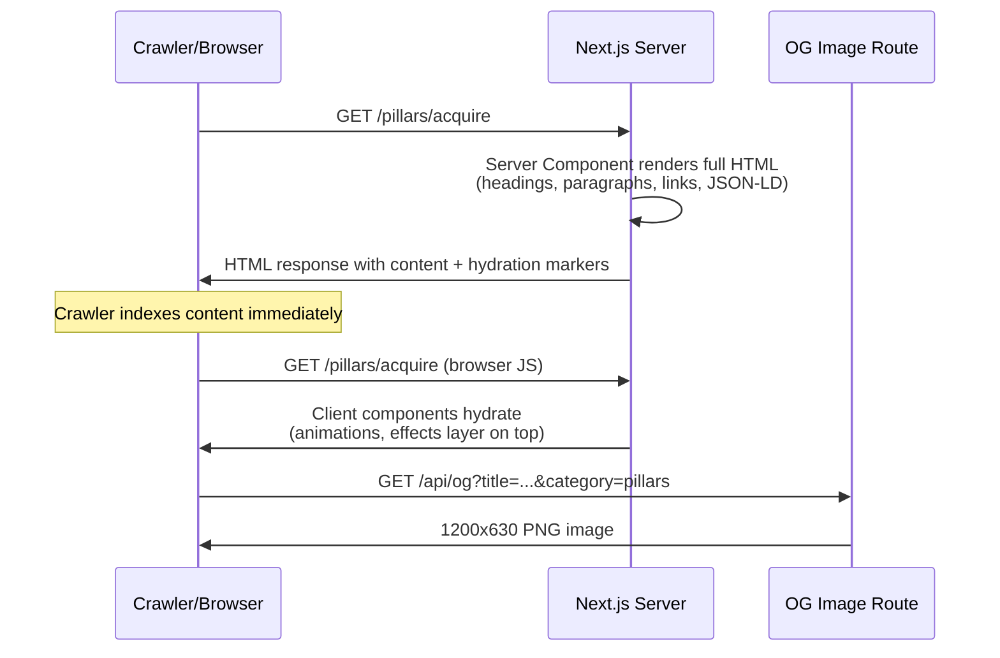

# Claru SEO/AEO/GEO Optimization -- Design Document

## Overview

This document specifies the technical design for a comprehensive SEO, Answer Engine Optimization (AEO), and Generative Engine Optimization (GEO) overhaul of the Claru marketing site (https://claru.ai). The site is a Next.js 16.1.1 App Router application with 82 pages. The primary technical debt is that the homepage and all 16 pillar pages render `null` on the server due to `'use client'` + `if (!mounted) return null`, making them invisible to crawlers that do not execute JavaScript.

### Goals

1. **SEO**: Ensure all public pages deliver meaningful HTML to crawlers on first response (SSR), include structured data, canonical URLs, and dynamic OG images.
2. **AEO**: Surface content in AI answer engines (Perplexity, ChatGPT Browse, Google AI Overviews) via question-form headings, FAQ schema, and answer-first paragraph structure.
3. **GEO**: Provide machine-readable site summaries (`llms.txt`) and structured data that LLM-based systems can ingest directly.

### Scope

| Area | Pages Affected |
|------|---------------|
| Homepage SSR refactor | `src/app/page.tsx` + 10 section components |
| Pillar SSR refactor | 16 pillar pages (4 main + 12 sub-pillar) |
| Dynamic OG images | All ~82 public pages |
| JSON-LD schemas | Homepage, all pillars, data-catalog |
| robots.txt | Site-wide |
| llms.txt | Site-wide |
| Canonical URLs | All public pages |
| FAQ schemas | Homepage, data-catalog, pillar pages (already on case studies) |
| Question-form H2s | 16 pillar pages |

---

## Architecture

### High-Level System Design

```
                    Crawler / LLM Request
                            |
                            v
                   ┌─────────────────┐
                   │   Vercel Edge    │
                   │  (robots.txt,   │
                   │   llms.txt)     │
                   └────────┬────────┘
                            |
                            v
                   ┌─────────────────┐
                   │  Next.js Server  │
                   │   Component      │
                   │  (SSR HTML +     │
                   │   JSON-LD +      │
                   │   metadata)      │
                   └────────┬────────┘
                            |
              ┌─────────────┼─────────────┐
              v             v             v
     ┌──────────────┐ ┌──────────┐ ┌──────────────┐
     │ Static HTML  │ │ OG Image │ │ Structured   │
     │ (headings,   │ │ Generator│ │ Data (JSON-LD│
     │  text, links,│ │ /api/og  │ │  in <script>)│
     │  CTAs)       │ │          │ │              │
     └──────┬───────┘ └──────────┘ └──────────────┘
            |
            v
     ┌──────────────┐
     │ Client-side  │
     │ Hydration    │
     │ (Framer,     │
     │  GSAP, Lenis)│
     └──────────────┘
```

### Request Flow for a Pillar Page



---

## Components and Interfaces

### 1. Homepage SSR Refactor Architecture

#### Current Problem

```typescript
// src/app/page.tsx (CURRENT)
"use client";
export default function Home() {
  const [mounted, setMounted] = useState(false);
  useEffect(() => setMounted(true), []);
  if (!mounted) return null;  // <-- Crawlers see NOTHING
  return <LenisProvider>...</LenisProvider>;
}
```

Crawlers (Googlebot, Perplexity, ChatGPT Browse) receive an empty `<body>` tag. No headings, no text, no links.

#### Refactored Architecture

The homepage becomes a **server component** that renders all semantic content (headings, paragraphs, links) directly, then wraps interactive elements in client component boundaries.

**Component Hierarchy:**

```
src/app/page.tsx (SERVER COMPONENT -- no 'use client')
├── <HomepageJsonLd />           -- Server: JSON-LD scripts
├── <Header />                   -- Already client, keep as-is
├── <main>
│   ├── <HeroServer />           -- NEW server component: renders H1, subheading, CTA links
│   │   └── <HeroAnimations />   -- Client: parallax, rotating text, particle effects
│   ├── <ProblemAgitationServer /> -- NEW server component: renders H2, pain points text
│   │   └── <ProblemAnimations /> -- Client: FadeIn, motion wrappers
│   ├── <SectionBridge />        -- Tiny client component (motion.div, fine as-is)
│   ├── <OriginServer />         -- NEW server component
│   │   └── <OriginAnimations />
│   ├── <TwoPathsServer />       -- NEW server component
│   │   └── <TwoPathsAnimations />
│   ├── <ProofOfWorkServer />    -- NEW server component
│   │   └── <ProofOfWorkAnimations />
│   ├── <TestimonialsServer />   -- NEW server component
│   │   └── <TestimonialsAnimations />
│   ├── <FinalCTAServer />       -- NEW server component
│   │   └── <FinalCTAAnimations /> + <ContactForm /> (client)
│   └── <AnimatedLogo />         -- Client (purely decorative, ssr: false is fine)
├── <Footer />                   -- Already client, keep as-is
└── <ClientProviders>            -- NEW wrapper for LenisProvider, HeroBackground, ScrollAnimations
    └── children (portaled or layered effects)
```

#### Design Decision: Islands Architecture vs. Wrapper Pattern

**Option A -- Islands Architecture (CHOSEN):** Each section has a server component that renders content, with a nested client component for animations only. The server component passes content as children or props to the client wrapper.

**Option B -- Single Client Shell:** Keep one client component that wraps all content but provide a `<noscript>` or SSR fallback. Rejected because this does not solve the core problem: the server component tree must render the content.

**Rationale for Option A:** Next.js App Router is designed for this pattern. Server components render on the server, client components hydrate on the client. The animation layer (Framer Motion, GSAP) only needs to wrap rendered DOM elements -- it does not need to control whether content exists.

#### Server Component Content Contract

The server-rendered HTML for the homepage MUST include:

| Element | Content | Purpose |
|---------|---------|---------|
| `<h1>` | "Purpose-built data for frontier AI labs." | Primary keyword target |
| `<p>` (subheading) | "Training data built to your model's exact specifications..." | Description reinforcement |
| `<a>` (CTA) | Link to `#contact` | Crawlable internal link |
| `<h2>` per section | Section headings (see below) | Content structure for crawlers |
| `<p>` per section | Core paragraph text | Indexable body content |
| `<a>` links | Internal links to `/pillars/*`, `/case-studies`, `/jobs` | Internal link graph |

**Section headings the server MUST render:**

1. Hero H1: "Purpose-built data for frontier AI labs."
2. ProblemAgitation H2: "The data you need doesn't exist yet" (first pain point as heading)
3. Origin H2: Current section heading
4. TwoPaths H2: Current section heading
5. ProofOfWork H2: Current section heading
6. Testimonials H2: "What our partners say" or equivalent
7. FinalCTA H2: "Let's build your dataset" or equivalent

#### Animation Preservation Strategy

**Framer Motion:** Client components receive server-rendered DOM and wrap it with `<motion.div>` using `initial={{ opacity: 1 }}` on server, then animate on client. The key insight: Framer Motion's `initial` prop on a client component will not cause a flash because the server-rendered content is already visible.

Pattern for each section:

```typescript
// src/app/components/sections/HeroServer.tsx (SERVER)
export default function HeroServer() {
  return (
    <section id="hero" className="relative min-h-screen ...">
      <div className="container relative z-20">
        <div className="max-w-3xl mx-auto text-center">
          <h1 className="text-4xl md:text-5xl lg:text-6xl font-bold ...">
            Purpose-built data for frontier{" "}
            <span className="text-[var(--accent-secondary)] italic">video</span>{" "}
            labs.
          </h1>
          <p className="text-lg md:text-xl text-[var(--text-secondary)] ...">
            Training data built to your model&apos;s exact specifications...
          </p>
          <div className="flex ... gap-4">
            <a href="#contact" className="btn-primary">Learn More</a>
          </div>
        </div>
      </div>
      <HeroAnimations />
    </section>
  );
}

// src/app/components/sections/HeroAnimations.tsx (CLIENT)
"use client";
import { motion, AnimatePresence } from "framer-motion";
import { useState, useEffect, useCallback } from "react";

// Rotating text overlay, parallax effects, particle field
// This component renders ON TOP of server content using absolute positioning
// or replaces specific elements via portal/ref patterns
export default function HeroAnimations() {
  // ... rotating text, scroll parallax, particle effects
}
```

**GSAP + Lenis:** These are purely client-side concerns. The `LenisProvider` and `ScrollAnimations` become a client-only layout wrapper that does NOT gate content rendering:

```typescript
// src/app/components/providers/ClientProviders.tsx (CLIENT)
"use client";
import { useEffect, useState } from "react";
import dynamic from "next/dynamic";

const LenisProvider = dynamic(() => import("./LenisProvider"), { ssr: false });
const HeroBackground = dynamic(() => import("../effects/HeroBackground"), { ssr: false });

export default function ClientProviders({ children }: { children: React.ReactNode }) {
  const [mounted, setMounted] = useState(false);
  useEffect(() => setMounted(true), []);

  return (
    <>
      {mounted && <HeroBackground />}
      {mounted && <div className="noise-overlay-animated" />}
      {mounted ? <LenisProvider>{children}</LenisProvider> : children}
    </>
  );
}
```

**Key constraint:** The `children` (server-rendered content) are ALWAYS rendered, whether the client has mounted or not. The mounted guard only controls the effects layer.

#### Refactored page.tsx Structure

```typescript
// src/app/page.tsx (REFACTORED -- SERVER COMPONENT)
import Header from "./components/layout/Header";
import Footer from "./components/sections/Footer";
import ClientProviders from "./components/providers/ClientProviders";
import HeroServer from "./components/sections/HeroServer";
import ProblemAgitationServer from "./components/sections/ProblemAgitationServer";
import OriginServer from "./components/sections/OriginServer";
import TwoPathsServer from "./components/sections/TwoPathsServer";
import ProofOfWorkServer from "./components/sections/ProofOfWorkServer";
import TestimonialsServer from "./components/sections/TestimonialsServer";
import FinalCTAServer from "./components/sections/FinalCTAServer";
import AnimatedLogo from "./components/sections/AnimatedLogo";
import HomepageJsonLd from "./components/seo/HomepageJsonLd";

export default function Home() {
  return (
    <>
      <HomepageJsonLd />
      <ClientProviders>
        <Header />
        <main className="relative z-10">
          <HeroServer />
          <ProblemAgitationServer />
          <OriginServer />
          <TwoPathsServer />
          <ProofOfWorkServer />
          <TestimonialsServer />
          <FinalCTAServer />
          <AnimatedLogo />
        </main>
        <Footer />
      </ClientProviders>
    </>
  );
}
```

#### File Structure for Refactored Sections

```
src/app/components/sections/
├── Hero.tsx                    -- CURRENT (to be deprecated)
├── HeroServer.tsx              -- NEW: server component with content
├── HeroAnimations.tsx          -- NEW: client component with animations
├── ProblemAgitation.tsx        -- CURRENT (to be deprecated)
├── ProblemAgitationServer.tsx  -- NEW: server component
├── ProblemAgitationAnimations.tsx -- NEW: client component
├── ... (same pattern for each section)
```

**Migration strategy:** Create new `*Server.tsx` files alongside existing ones. The old files remain until the new ones are verified. Each server component extracts the static content (headings, text, links) from the existing client component, and the corresponding `*Animations.tsx` extracts the motion/animation logic.

#### Pillar Page SSR Refactor

The same pattern applies to all 16 pillar pages. Each currently uses `'use client'` + mounted guard. They should be refactored to:

1. A server `page.tsx` that exports `metadata` (or `generateMetadata`) and renders content directly.
2. A client component (e.g., `AcquireClient.tsx`) that wraps the interactive/animated portions.

The pillar pages are simpler than the homepage because they do not use `LenisProvider` or global effects -- they just use Framer Motion `motion.*` wrappers and `FadeIn`.

**Pattern for pillar pages:**

```typescript
// src/app/pillars/acquire/page.tsx (REFACTORED)
import type { Metadata } from "next";
import AcquireClient from "./AcquireClient";
import AcquireJsonLd from "./AcquireJsonLd";

export const metadata: Metadata = {
  title: "Data Acquisition for AI Training | Claru",
  description: "...",
  openGraph: { ... },
  alternates: { canonical: "/pillars/acquire" },
};

export default function AcquirePage() {
  return (
    <>
      <AcquireJsonLd />
      {/* Server-rendered content visible to crawlers */}
      <div className="sr-only" aria-hidden="false">
        <h1>How Does Claru Acquire Training Data for Frontier AI?</h1>
        <p>80% of ML project time goes to data work...</p>
        <h2>What Is the Data Wall in AI Training?</h2>
        <p>AI now consumes data faster than humanity generates it...</p>
        {/* ... all semantic content ... */}
      </div>
      <AcquireClient />
    </>
  );
}
```

**Alternative approach (preferred):** Instead of `sr-only` duplicate content, refactor the client component to accept server-rendered content as children, similar to the homepage pattern. The client component uses `useEffect` to layer animations onto already-rendered DOM:

```typescript
// src/app/pillars/acquire/page.tsx (PREFERRED)
import type { Metadata } from "next";
import AcquireContent from "./AcquireContent";
import PillarJsonLd from "@/app/components/seo/PillarJsonLd";

export const metadata: Metadata = { ... };

export default function AcquirePage() {
  return (
    <>
      <PillarJsonLd pillar="acquire" />
      <AcquireContent />
    </>
  );
}

// AcquireContent.tsx -- server component that renders HTML
// with client animation wrappers for interactive parts
```

**Design decision:** The preferred approach is to refactor each pillar page so that `page.tsx` is a server component that can export `metadata`, and the bulk of the rendering (including animations) moves to a client component. The server component renders the JSON-LD and wraps the client component. This is the same pattern already used by `case-studies/[slug]/page.tsx` and `jobs/[slug]/page.tsx`.

However, this does NOT solve the SSR content problem because the client component still returns `null` before mount. The full solution requires either:

**(a)** Removing the `if (!mounted) return null` guard and fixing any hydration mismatches (preferred long-term), or
**(b)** Having the server component render a static HTML snapshot of the page content that the client component replaces on mount.

**Recommendation: Option (a)** -- Remove the mounted guard. The guard was originally added to prevent hydration mismatches from dynamic content (e.g., `Math.random()`, `Date.now()`). Instead, isolate the truly dynamic parts (animations, canvas effects) into `ssr: false` dynamic imports, and let the rest render on both server and client identically. This is the correct Next.js pattern and avoids content duplication.

---

### 2. Dynamic OG Image Generator

#### Architecture

Next.js supports OG image generation via the `ImageResponse` API from `next/og`. There are two placement strategies:

**Option A -- Route Handler (`src/app/api/og/route.tsx`):** A single API endpoint that accepts query parameters (`title`, `description`, `category`). Each page references it via `openGraph.images` in metadata.

**Option B -- File Convention (`opengraph-image.tsx`):** Place `opengraph-image.tsx` files at each route segment. Next.js automatically wires them into metadata.

**Chosen: Option A (Route Handler)** for the following reasons:
- One template file to maintain, not 20+
- Easier to test (hit URL directly in browser)
- Category-specific styling via query param, not file duplication
- Cacheable via Vercel Edge with `Cache-Control`

#### File Location

```
src/app/api/og/route.tsx        -- Main OG image generator
src/app/api/og/templates.ts     -- Template rendering functions per category
```

#### Route Specification

```
GET /api/og?title={title}&description={description}&category={category}
```

| Parameter | Type | Required | Default | Description |
|-----------|------|----------|---------|-------------|
| `title` | string | Yes | -- | Page title (URL-encoded) |
| `description` | string | No | "" | Short description |
| `category` | enum | No | "default" | One of: `default`, `pillar`, `case-study`, `job`, `legal`, `data-catalog` |

#### Template Design

All templates share the base layout:

```
┌─────────────────────────────────────────────────────────┐
│  Background: #0a0908                                     │
│                                                          │
│  ┌─ Top Left ──────────────────────────────────────────┐ │
│  │ CLARU                     (JetBrains Mono, #92B090) │ │
│  └─────────────────────────────────────────────────────┘ │
│                                                          │
│  ┌─ Center ────────────────────────────────────────────┐ │
│  │                                                     │ │
│  │  {title}                  (Geist Sans Bold, #FFFFFF │ │
│  │                            48px, max 2 lines)       │ │
│  │                                                     │ │
│  │  {description}            (Geist Sans, #999999      │ │
│  │                            24px, max 2 lines)       │ │
│  │                                                     │ │
│  └─────────────────────────────────────────────────────┘ │
│                                                          │
│  ┌─ Bottom ────────────────────────────────────────────┐ │
│  │ ─── claru.ai ──────── {category badge} ──────────── │ │
│  │     (#92B090)          (pill, #92B090 border)       │ │
│  └─────────────────────────────────────────────────────┘ │
│                                                          │
│  Decorative: subtle scanline overlay at 3% opacity       │
│  Decorative: #92B090 1px border on left edge             │
│                                                          │
│  Dimensions: 1200 x 630                                  │
└─────────────────────────────────────────────────────────┘
```

Category-specific variations:

| Category | Badge Text | Left Border Color | Extra Element |
|----------|-----------|-------------------|---------------|
| `default` | none | `#92B090` | none |
| `pillar` | "CAPABILITY" | `#92B090` | Terminal prompt `>` prefix on title |
| `case-study` | "CASE STUDY" | `#92B090` | none |
| `job` | "NOW HIRING" | `#92B090` | Location text below description |
| `data-catalog` | "DATA" | `#92B090` | none |
| `legal` | none | `#666666` | Muted styling |

#### Font Loading

The `ImageResponse` API requires fonts loaded as `ArrayBuffer`. Use `fetch` to load from the `public/` directory or Google Fonts CDN:

```typescript
// src/app/api/og/route.tsx
import { ImageResponse } from "next/og";

export const runtime = "edge";

export async function GET(request: Request) {
  const { searchParams } = new URL(request.url);
  const title = searchParams.get("title") ?? "Claru";
  const description = searchParams.get("description") ?? "";
  const category = searchParams.get("category") ?? "default";

  // Load fonts
  const geistBold = await fetch(
    new URL("../../../public/fonts/GeistSans-Bold.woff", import.meta.url)
  ).then((res) => res.arrayBuffer());

  const jetbrainsMono = await fetch(
    new URL("../../../public/fonts/JetBrainsMono-Regular.woff", import.meta.url)
  ).then((res) => res.arrayBuffer());

  return new ImageResponse(
    ( /* JSX template -- see template design above */ ),
    {
      width: 1200,
      height: 630,
      fonts: [
        { name: "Geist", data: geistBold, weight: 700 },
        { name: "JetBrains Mono", data: jetbrainsMono, weight: 400 },
      ],
    }
  );
}
```

**Font file requirement:** Download `.woff` files for Geist Sans Bold and JetBrains Mono Regular into `public/fonts/`. The Google Fonts API can also be used but adds latency.

#### Metadata Integration

Each page's metadata references the OG image via the route handler:

```typescript
// Example: src/app/pillars/acquire/page.tsx
export const metadata: Metadata = {
  title: "Data Acquisition for AI Training | Claru",
  description: "...",
  openGraph: {
    title: "Data Acquisition for AI Training | Claru",
    description: "...",
    images: [{
      url: "/api/og?title=Data+Acquisition+for+AI+Training&category=pillar",
      width: 1200,
      height: 630,
      alt: "Data Acquisition for AI Training | Claru",
    }],
  },
};
```

**Helper function** to reduce boilerplate:

```typescript
// src/lib/metadata.ts
export function buildOgImageUrl(title: string, category: string, description?: string): string {
  const params = new URLSearchParams({ title, category });
  if (description) params.set("description", description);
  return `/api/og?${params.toString()}`;
}

export function buildPageMetadata(opts: {
  title: string;
  description: string;
  path: string;
  category?: string;
}): Metadata {
  const ogImage = buildOgImageUrl(opts.title, opts.category ?? "default", opts.description);
  return {
    title: opts.title,
    description: opts.description,
    alternates: { canonical: opts.path },
    openGraph: {
      title: opts.title,
      description: opts.description,
      url: `https://claru.ai${opts.path}`,
      images: [{ url: ogImage, width: 1200, height: 630, alt: opts.title }],
    },
    twitter: {
      card: "summary_large_image",
      title: opts.title,
      description: opts.description,
      images: [ogImage],
    },
  };
}
```

#### Caching Strategy

The OG image route handler should set aggressive cache headers since page titles rarely change:

```typescript
export async function GET(request: Request) {
  // ... generate image ...
  const response = new ImageResponse(/* ... */);
  response.headers.set("Cache-Control", "public, max-age=86400, s-maxage=604800, stale-while-revalidate=86400");
  return response;
}
```

---

### 3. Organization + WebSite Schema Architecture

#### Placement

JSON-LD scripts are placed in the `<body>` (not `<head>`) using `<script type="application/ld+json">`. This is the standard Next.js approach and matches the pattern already used in `case-studies/[slug]/page.tsx`.

**Global schemas** (Organization, WebSite) go in `src/app/layout.tsx` so they appear on every page.

**Page-specific schemas** (FAQPage, BreadcrumbList, etc.) go in each page's server component.

#### Schema Structure: @graph Array

Use a single `<script>` tag with a `@graph` array combining Organization and WebSite. This is the recommended approach by Schema.org and Google because it establishes relationships between entities in a single context.

```typescript
// src/app/components/seo/GlobalJsonLd.tsx (SERVER COMPONENT)
export default function GlobalJsonLd() {
  const schema = {
    "@context": "https://schema.org",
    "@graph": [
      {
        "@type": "Organization",
        "@id": "https://claru.ai/#organization",
        "name": "Claru",
        "legalName": "Reka AI Inc.",
        "url": "https://claru.ai",
        "logo": {
          "@type": "ImageObject",
          "@id": "https://claru.ai/#logo",
          "url": "https://claru.ai/images/logo.png",
          "width": 512,
          "height": 512,
          "caption": "Claru"
        },
        "image": { "@id": "https://claru.ai/#logo" },
        "description": "Purpose-built training data for frontier AI labs. From raw capture to production-ready dataset -- sourced, labeled, and validated for video, vision, and robotics AI.",
        "foundingDate": "2024",
        "numberOfEmployees": {
          "@type": "QuantitativeValue",
          "minValue": 11,
          "maxValue": 50
        },
        "sameAs": [
          "https://www.linkedin.com/company/claruai",
          "https://twitter.com/claruai"
        ],
        "contactPoint": {
          "@type": "ContactPoint",
          "contactType": "sales",
          "url": "https://claru.ai/#contact"
        },
        "knowsAbout": [
          "AI training data",
          "Data annotation",
          "RLHF",
          "Egocentric video data",
          "Robotics training data",
          "Video generation training data",
          "Expert annotation",
          "Synthetic data generation"
        ]
      },
      {
        "@type": "WebSite",
        "@id": "https://claru.ai/#website",
        "url": "https://claru.ai",
        "name": "Claru",
        "description": "Purpose-built training data for frontier AI labs.",
        "publisher": { "@id": "https://claru.ai/#organization" },
        "potentialAction": {
          "@type": "SearchAction",
          "target": {
            "@type": "EntryPoint",
            "urlTemplate": "https://claru.ai/jobs?q={search_term_string}"
          },
          "query-input": "required name=search_term_string"
        }
      }
    ]
  };

  return (
    <script
      type="application/ld+json"
      dangerouslySetInnerHTML={{ __html: JSON.stringify(schema) }}
    />
  );
}
```

**Note on SearchAction:** The `potentialAction` targets the jobs listing page with a query parameter. This is optional and only worth including if the jobs page supports `?q=` search filtering. If not, omit it.

#### Integration in layout.tsx

```typescript
// src/app/layout.tsx (modified)
import GlobalJsonLd from "./components/seo/GlobalJsonLd";

export default function RootLayout({ children }: { children: React.ReactNode }) {
  return (
    <html lang="en" suppressHydrationWarning>
      <head>...</head>
      <body className={...}>
        <GlobalJsonLd />
        <MotionProvider>
          <CalendlyProvider>
            {children}
            <CalendlyModal />
          </CalendlyProvider>
        </MotionProvider>
      </body>
    </html>
  );
}
```

---

### 4. robots.txt

#### Source Location: Dynamic (`src/app/robots.ts`)

**Rationale:** Next.js App Router supports `robots.ts` which generates `robots.txt` at build/request time. This is preferred over a static `public/robots.txt` because:
- It can reference the sitemap URL dynamically
- It lives in the app directory alongside other route files
- It can be conditionally modified (e.g., different rules for preview deploys)

Currently no `robots.ts` or `public/robots.txt` exists. The only robots directive is in `layout.tsx` metadata (`robots: { index: true, follow: true }`).

#### Specification

```typescript
// src/app/robots.ts
import type { MetadataRoute } from "next";

export default function robots(): MetadataRoute.Robots {
  return {
    rules: [
      {
        userAgent: "*",
        allow: "/",
        disallow: [
          "/portal/",
          "/admin/",
          "/api/",
          "/experiment/",
          "/data-catalog/request/",
        ],
      },
      {
        // Block AI training scrapers (not search/answer engines)
        userAgent: [
          "CCBot",          // Common Crawl (used for AI training)
          "GPTBot",         // OpenAI training crawler
          "Google-Extended", // Google AI training (not search)
          "anthropic-ai",   // Anthropic training crawler
          "ClaudeBot",
        ],
        disallow: "/",
      },
    ],
    sitemap: "https://claru.ai/sitemap.xml",
  };
}
```

**Design decisions:**

| Decision | Rationale |
|----------|-----------|
| Allow all standard crawlers | Googlebot, Bingbot, Applebot, PerplexityBot need access for search/AEO |
| Block `/portal/`, `/admin/` | Authenticated areas with no public value |
| Block `/api/` | API routes should not be indexed |
| Block `/experiment/` | Test page, not for public |
| Block `/data-catalog/request/` | Form page, not indexable content |
| Block AI training crawlers | Protect content from being used in training datasets. GPTBot and CCBot are training crawlers, not the same as ChatGPT Browse (which uses a different user agent). Google-Extended blocks Google's AI training while allowing Google Search indexing. |
| Include sitemap reference | Standard practice for crawler discovery |

**Important note:** Blocking `GPTBot` does NOT prevent ChatGPT's browsing feature from accessing the site. ChatGPT Browse uses `ChatGPT-User` user agent, which remains allowed. Similarly, blocking `Google-Extended` does not affect Google Search or AI Overviews -- it only prevents use in Gemini training.

---

### 5. llms.txt Structure

#### Purpose

`llms.txt` is an emerging convention (proposed at llmstxt.org) that provides LLMs with a structured, machine-readable summary of a website. It serves GEO by making the site easily digestible for AI systems that retrieve and summarize web content.

#### File Location

```
public/llms.txt           -- Static file served at /llms.txt
public/llms-full.txt      -- Extended version with more detail
```

Using `public/` static files because the content changes infrequently and does not need dynamic generation.

#### Content Structure

```markdown
# Claru

> Purpose-built training data for frontier AI labs. From raw capture to production-ready dataset -- sourced, labeled, and validated for video, vision, and robotics AI.

Claru (operated by Reka AI Inc.) provides end-to-end data services for frontier AI research companies building video generation, vision-language, robotics, and embodied AI models.

## Core Services

- [Data Acquisition](https://claru.ai/pillars/acquire): Egocentric video capture, web-scale harvesting, synthetic data generation, and data licensing for AI training.
- [Data Enrichment](https://claru.ai/pillars/enrich): Expert annotation, RLHF preference labeling, and video annotation by domain specialists.
- [Data Preparation](https://claru.ai/pillars/prepare): Deduplication, multimodal alignment, and quality scoring pipelines.
- [Data Validation](https://claru.ai/pillars/validate): Benchmark curation, bias detection, and red teaming for AI safety.

## Sub-Services

### Acquire
- [Egocentric Video Collection](https://claru.ai/pillars/acquire/egocentric-video): First-person video capture for robotics and embodied AI.
- [Data Licensing](https://claru.ai/pillars/acquire/data-licensing): Copyright-safe, properly licensed training data.
- [Synthetic Data Generation](https://claru.ai/pillars/acquire/synthetic-data): AI-augmented data creation with human validation.

### Enrich
- [Expert Annotation](https://claru.ai/pillars/enrich/expert-annotation): Domain-expert labeling for complex AI tasks.
- [RLHF & Preference Data](https://claru.ai/pillars/enrich/rlhf): Human preference annotation for reinforcement learning.
- [Video Annotation](https://claru.ai/pillars/enrich/video-annotation): Frame-level and temporal annotation for video AI.

### Prepare
- [Deduplication](https://claru.ai/pillars/prepare/deduplication): Remove redundant samples to improve training efficiency.
- [Multimodal Alignment](https://claru.ai/pillars/prepare/multimodal-alignment): Align text, image, video, and audio modalities.
- [Quality Scoring](https://claru.ai/pillars/prepare/quality-scoring): Automated and human quality assessment pipelines.

### Validate
- [Benchmark Curation](https://claru.ai/pillars/validate/benchmark-curation): Build evaluation benchmarks for model assessment.
- [Bias Detection](https://claru.ai/pillars/validate/bias-detection): Identify and mitigate bias in training data.
- [Red Teaming](https://claru.ai/pillars/validate/red-teaming): Adversarial testing for AI safety and robustness.

## Additional Pages
- [Case Studies](https://claru.ai/case-studies): Real-world examples of data projects for frontier AI teams.
- [Data Catalog](https://claru.ai/data-catalog): Browse available datasets across video, robotics, and annotation categories.
- [Expert Labeling](https://claru.ai/labeling): Dedicated expert labeling service page.
- [Jobs](https://claru.ai/jobs): Open positions for annotators and data specialists.
- [For Annotators](https://claru.ai/for-annotators): Information for prospective annotators.

## Contact
- Website: https://claru.ai
- Contact form: https://claru.ai/#contact
```

#### Maintenance Strategy

The `llms.txt` file should be updated whenever:
- A new pillar or sub-pillar page is added
- A major service offering changes
- The site structure changes significantly

Add a comment in the file header noting the last update date:

```markdown
<!-- Last updated: 2026-03-12 -->
# Claru
...
```

---

### 6. Canonical URL Strategy

#### Approach

Next.js `metadataBase` is already set to `https://claru.ai` in `layout.tsx`. Canonical URLs are set via the `alternates.canonical` field in each page's metadata export. Relative paths are resolved against `metadataBase`.

#### Pages Requiring Explicit Canonical URLs

**All public pages need canonical URLs.** Currently, only case study and job detail pages have `openGraph.url` set, but none have `alternates.canonical`.

| Page Type | Pattern | Canonical URL |
|-----------|---------|---------------|
| Homepage | `src/app/page.tsx` | `/` |
| Pillar main | `src/app/pillars/{slug}/page.tsx` | `/pillars/{slug}` |
| Pillar sub | `src/app/pillars/{slug}/{sub}/page.tsx` | `/pillars/{slug}/{sub}` |
| Case studies index | `src/app/case-studies/page.tsx` | `/case-studies` |
| Case study detail | `src/app/case-studies/[slug]/page.tsx` | `/case-studies/{slug}` |
| Jobs index | `src/app/jobs/page.tsx` | `/jobs` |
| Job detail | `src/app/jobs/[slug]/page.tsx` | `/jobs/{slug}` |
| Data catalog | `src/app/data-catalog/page.tsx` | `/data-catalog` |
| Labeling | `src/app/labeling/page.tsx` | `/labeling` |
| For annotators | `src/app/for-annotators/page.tsx` | `/for-annotators` |
| Data | `src/app/data/page.tsx` | `/data` |
| Legal pages | `src/app/{privacy,terms,...}/page.tsx` | `/{slug}` |

#### Implementation for Client-Only Pages

The problem: pages that are `'use client'` cannot export `metadata` or `generateMetadata`. These pages need to be refactored to either:

1. **Split into server page + client component** (as described in section 1), allowing the server `page.tsx` to export metadata, or
2. **Use a `layout.tsx`** at the route level that exports metadata while the `page.tsx` remains client-only.

**Recommended: Option 2 for pillar pages as an interim step.** Create a `layout.tsx` in each pillar directory that exports metadata:

```typescript
// src/app/pillars/acquire/layout.tsx
import type { Metadata } from "next";

export const metadata: Metadata = {
  title: "How Does Claru Acquire Training Data for Frontier AI?",
  description: "...",
  alternates: { canonical: "/pillars/acquire" },
  openGraph: { ... },
};

export default function AcquireLayout({ children }: { children: React.ReactNode }) {
  return children;
}
```

This provides canonical URLs, metadata, and OG images immediately, without requiring the full SSR refactor. The SSR refactor (section 1) can then be done as a separate phase.

#### Dynamic Routes

For `case-studies/[slug]` and `jobs/[slug]`, canonical URLs are set in `generateMetadata`:

```typescript
export async function generateMetadata({ params }): Promise<Metadata> {
  const { slug } = await params;
  // ... existing code ...
  return {
    // ... existing fields ...
    alternates: { canonical: `/case-studies/${slug}` },
  };
}
```

---

### 7. FAQPage Schema Additions

#### Homepage FAQ Schema

The homepage should include 5-8 Q&A pairs targeting common queries about Claru's services. These are rendered as a server component and also embedded as FAQPage JSON-LD.

```typescript
// src/app/components/seo/HomepageJsonLd.tsx
const homepageFaqs = [
  {
    question: "What kind of training data does Claru provide?",
    answer: "Claru provides purpose-built training data for frontier AI labs working on video generation, vision-language models, robotics, and embodied AI. Our services span the full data lifecycle: acquisition (egocentric video capture, synthetic generation, data licensing), enrichment (expert annotation, RLHF, video labeling), preparation (deduplication, multimodal alignment, quality scoring), and validation (benchmarks, bias detection, red teaming)."
  },
  {
    question: "How is Claru different from other data annotation companies?",
    answer: "Unlike traditional annotation vendors, Claru operates as an embedded data partner. We work directly with your ML team, understand your model architecture and failure modes, and build data pipelines tailored to your specific training requirements. We specialize in frontier modalities like egocentric video and manipulation trajectories that general-purpose vendors cannot handle."
  },
  {
    question: "What AI modalities does Claru support?",
    answer: "Claru supports video generation, vision-language models, robotics and manipulation, embodied AI, world models, and simulation environments. We handle multimodal data including video, images, text, audio, and sensor data."
  },
  {
    question: "Does Claru offer RLHF and human preference data?",
    answer: "Yes. Claru provides RLHF (Reinforcement Learning from Human Feedback) annotation services including pairwise preference ranking, Likert-scale scoring, and open-ended human evaluation. Our annotators are domain experts trained on your specific evaluation criteria."
  },
  {
    question: "What is egocentric video data and why does it matter for AI?",
    answer: "Egocentric video is first-person footage captured from head-mounted or body-worn cameras. It is essential for training embodied AI, robotics manipulation models, and action recognition systems because it captures the visual perspective of a human performing tasks in real-world environments. This data cannot be scraped from the internet and must be purpose-collected."
  },
  {
    question: "How does Claru ensure data quality?",
    answer: "Claru uses a multi-stage quality assurance pipeline: expert annotators with domain-specific training, automated quality scoring algorithms, cross-validation between annotators, and final human review. Our validation pillar includes benchmark curation, bias detection, and adversarial red teaming to ensure datasets meet production standards."
  },
  {
    question: "Can Claru handle large-scale data projects?",
    answer: "Yes. Claru has delivered datasets with over 3 million completed annotations across categories including video quality assessment, object identity labeling, AI image evaluation, and content safety classification. We operate a global workforce of annotators across 14+ countries."
  },
  {
    question: "How do I get started with Claru?",
    answer: "Contact us through the form on our website or schedule a call. We start with a discovery session to understand your model architecture, data requirements, and quality standards, then propose a custom data pipeline tailored to your needs."
  }
];
```

**JSON-LD structure:**

```json
{
  "@context": "https://schema.org",
  "@type": "FAQPage",
  "mainEntity": [
    {
      "@type": "Question",
      "name": "What kind of training data does Claru provide?",
      "acceptedAnswer": {
        "@type": "Answer",
        "text": "Claru provides purpose-built training data..."
      }
    }
  ]
}
```

#### Data Catalog FAQ Schema

```typescript
const dataCatalogFaqs = [
  {
    question: "What datasets are available in the Claru data catalog?",
    answer: "The Claru data catalog includes 15+ datasets across 9 categories: egocentric activity video, game environment captures, workplace and traffic footage, cinematic content, video quality annotations, object identity labels, AI image evaluations, content safety classifications, and human preference rankings. Total available annotations exceed 3 million samples."
  },
  {
    question: "Can I request a custom dataset from Claru?",
    answer: "Yes. Beyond our existing catalog, Claru builds custom datasets to your specifications. Contact us with your modality requirements, volume needs, and quality standards, and we will design a data collection and annotation pipeline specific to your model."
  },
  {
    question: "How are Claru datasets licensed?",
    answer: "Each dataset in the Claru catalog has specific licensing terms. We ensure all data is ethically sourced and properly licensed for AI training use. Contact us for licensing details on specific datasets."
  },
  {
    question: "What formats do Claru datasets come in?",
    answer: "Datasets are delivered in standard ML-ready formats including JSONL, Parquet, and custom schemas. Video data includes MP4 files with accompanying annotation files. We can adapt output formats to match your training pipeline requirements."
  }
];
```

#### Rendering Requirement

FAQ schemas MUST be rendered from a server component to ensure they are present in the initial HTML response. For pages that are currently `'use client'`, the FAQ JSON-LD should be placed in either:
- The route-level `layout.tsx` (interim approach)
- The refactored server `page.tsx` (final approach)

The FAQ content should also be visually rendered on the page (not just in JSON-LD) for maximum SEO benefit. The existing `FAQItem` component already exists in the pillar pages and should be preserved.

---

### 8. Question-Form H2 Content Strategy

#### Rationale

Answer engines preferentially surface content that directly answers questions. Converting declarative H2 headings into question form, followed by answer-first paragraphs, dramatically improves AEO and GEO visibility.

#### Mapping: Current Headings to Question-Form Alternatives

##### Acquire (`/pillars/acquire`)

| Current H2 | Proposed H2 | Answer-First Paragraph Lead |
|------------|-------------|---------------------------|
| "The Data Wall" | "What Is the Data Wall Facing AI Labs?" | "AI now consumes data faster than humanity generates it..." |
| "Why Data Acquisition Is the New Moat" | "Why Is Data Acquisition the New Competitive Moat in AI?" | "The open-source data commons that powered early AI breakthroughs is exhausted..." |
| "Results From the Field" | "What Results Has Claru Delivered in Data Acquisition?" | "Claru has delivered millions of annotations across..." |
| "Our Capabilities" | "What Data Acquisition Capabilities Does Claru Offer?" | "Claru provides three core acquisition methods: human data collection, web-scale harvesting, and synthetic generation..." |
| "Frequently Asked Questions" | (keep as-is) | (already question-form) |

##### Enrich (`/pillars/enrich`)

| Current H2 | Proposed H2 |
|------------|-------------|
| "The Annotation Gap" | "What Is the Annotation Gap in AI Training?" |
| "Why Expert Enrichment Matters" | "Why Does Expert Data Enrichment Matter for AI Models?" |
| "Our Capabilities" | "What Data Enrichment Services Does Claru Provide?" |

##### Prepare (`/pillars/prepare`)

| Current H2 | Proposed H2 |
|------------|-------------|
| "The Preparation Gap" | "What Is the Data Preparation Gap in ML Pipelines?" |
| "Why Data Preparation Is Critical" | "Why Is Data Preparation Critical for Model Performance?" |
| "Our Capabilities" | "What Data Preparation Capabilities Does Claru Offer?" |

##### Validate (`/pillars/validate`)

| Current H2 | Proposed H2 |
|------------|-------------|
| "The Validation Gap" | "What Is the Validation Gap in AI Development?" |
| "Why Validation Matters" | "Why Does Data Validation Matter for Frontier AI?" |
| "Our Capabilities" | "What Data Validation Services Does Claru Offer?" |

##### Sub-Pillar Pages (12 pages)

Apply the same pattern. Each sub-pillar page typically has these H2 sections:
1. Problem statement -> "What is {problem} in {domain}?"
2. Why it matters -> "Why does {capability} matter for {use case}?"
3. Technical approach -> "How does Claru approach {capability}?"
4. Results/proof -> "What results has Claru achieved with {capability}?"
5. FAQ -> (keep as-is)
6. CTA -> "How do I get started with {service}?"

#### Answer-First Paragraph Structure

Each question-form H2 must be immediately followed by a direct answer paragraph (2-3 sentences) before any elaboration:

```
<h2>What Is the Data Wall Facing AI Labs?</h2>
<p>
  The data wall is the point at which frontier AI models can no longer improve
  by training on more of the same publicly available data. AI now consumes data
  faster than humanity generates it, and the open-source corpora that powered
  early breakthroughs have been exhausted by every major lab.
</p>
<p>
  Here's the math: 80% of ML project time goes to data work...
  [existing elaboration continues]
</p>
```

This structure ensures that when an answer engine extracts a snippet for the query "what is the data wall in AI", it gets a complete, authoritative answer from the first paragraph.

---

## Data Models

### Metadata Helper Types

```typescript
// src/lib/metadata.ts

interface OgImageParams {
  title: string;
  description?: string;
  category: "default" | "pillar" | "case-study" | "job" | "data-catalog" | "legal";
}

interface PageSeoConfig {
  title: string;
  description: string;
  path: string;         // e.g., "/pillars/acquire"
  ogCategory: OgImageParams["category"];
  faqs?: Array<{ question: string; answer: string }>;
  breadcrumbs?: Array<{ name: string; path: string }>;
}
```

### JSON-LD Type Definitions

```typescript
// src/types/schema.ts

interface OrganizationSchema {
  "@type": "Organization";
  "@id": string;
  name: string;
  legalName: string;
  url: string;
  logo: ImageObjectSchema;
  description: string;
  sameAs: string[];
  contactPoint: ContactPointSchema;
  knowsAbout: string[];
}

interface WebSiteSchema {
  "@type": "WebSite";
  "@id": string;
  url: string;
  name: string;
  description: string;
  publisher: { "@id": string };
}

interface FAQPageSchema {
  "@context": "https://schema.org";
  "@type": "FAQPage";
  mainEntity: Array<{
    "@type": "Question";
    name: string;
    acceptedAnswer: {
      "@type": "Answer";
      text: string;
    };
  }>;
}

interface BreadcrumbListSchema {
  "@context": "https://schema.org";
  "@type": "BreadcrumbList";
  itemListElement: Array<{
    "@type": "ListItem";
    position: number;
    name: string;
    item: string;
  }>;
}
```

---

## Error Handling

### OG Image Generation Failures

The OG image route handler should catch errors and return a fallback:

```typescript
export async function GET(request: Request) {
  try {
    // ... generate image ...
  } catch (error) {
    console.error("OG image generation failed:", error);
    // Return the static fallback OG image
    return new Response(null, {
      status: 302,
      headers: { Location: "/og-image.png" },
    });
  }
}
```

### Missing Font Files

If font files fail to load, the OG image generator should fall back to system fonts:

```typescript
let geistBold: ArrayBuffer | null = null;
try {
  geistBold = await fetch(new URL("../../../public/fonts/GeistSans-Bold.woff", import.meta.url))
    .then((res) => res.arrayBuffer());
} catch {
  // Will use default sans-serif
}
```

### Invalid Schema Data

JSON-LD components should validate their inputs and skip rendering if data is invalid:

```typescript
export default function PillarJsonLd({ faqs }: { faqs?: FaqItem[] }) {
  if (!faqs || faqs.length === 0) return null;

  const schema = {
    "@context": "https://schema.org",
    "@type": "FAQPage",
    mainEntity: faqs.map(faq => ({
      "@type": "Question",
      name: faq.question,
      acceptedAnswer: {
        "@type": "Answer",
        text: faq.answer,
      },
    })),
  };

  return (
    <script
      type="application/ld+json"
      dangerouslySetInnerHTML={{ __html: JSON.stringify(schema) }}
    />
  );
}
```

### Hydration Mismatch Prevention

When removing the `if (!mounted) return null` guard from the homepage and pillar pages, potential hydration mismatches must be addressed:

1. **Dynamic text** (e.g., `RotatingText`): Ensure the server and client render the same initial value. The server should render `terms[0]` ("video"), and the client should initialize with the same value.
2. **Random values**: Any `Math.random()` calls must be moved to `useEffect` or use a deterministic seed.
3. **Date-dependent content**: Use `suppressHydrationWarning` only where absolutely necessary.
4. **Canvas/WebGL**: These are already `ssr: false` dynamic imports and will not cause mismatches.

---

## Testing Strategy

### 1. SSR Content Verification

**Tool:** curl or fetch with JS disabled.

```bash
# Verify homepage renders content on server
curl -s https://claru.ai | grep -c "<h1"
# Expected: 1

# Verify pillar page renders content
curl -s https://claru.ai/pillars/acquire | grep -c "<h2"
# Expected: 8+
```

**Automated test:**

```typescript
// __tests__/seo/ssr-content.test.ts
import { render } from "@testing-library/react";

describe("Homepage SSR", () => {
  it("renders H1 on server", async () => {
    const { container } = render(await Home());
    const h1 = container.querySelector("h1");
    expect(h1).toBeTruthy();
    expect(h1?.textContent).toContain("Purpose-built data");
  });
});
```

### 2. JSON-LD Validation

**Tool:** Google Rich Results Test (https://search.google.com/test/rich-results) and Schema.org validator.

**Automated test:**

```typescript
describe("JSON-LD schemas", () => {
  it("homepage includes Organization and WebSite schemas", () => {
    const html = renderToString(<RootLayout><Home /></RootLayout>);
    const scripts = html.match(/<script type="application\/ld\+json">([^<]+)<\/script>/g);
    expect(scripts).toBeTruthy();

    const schemas = scripts!.map(s => JSON.parse(s.replace(/<\/?script[^>]*>/g, "")));
    const graph = schemas.find(s => s["@graph"]);
    expect(graph).toBeTruthy();

    const types = graph["@graph"].map((n: any) => n["@type"]);
    expect(types).toContain("Organization");
    expect(types).toContain("WebSite");
  });

  it("homepage includes FAQPage schema", () => {
    const html = renderToString(<Home />);
    expect(html).toContain('"@type":"FAQPage"');
  });
});
```

### 3. OG Image Generation

**Manual test:** Visit `/api/og?title=Test+Title&category=pillar` in browser and verify the image renders correctly.

**Automated test:**

```typescript
describe("OG image route", () => {
  it("returns 200 with image/png content-type", async () => {
    const response = await fetch("/api/og?title=Test");
    expect(response.status).toBe(200);
    expect(response.headers.get("content-type")).toContain("image/png");
  });

  it("handles missing title gracefully", async () => {
    const response = await fetch("/api/og");
    expect(response.status).toBe(200); // Falls back to "Claru" title
  });
});
```

### 4. robots.txt Validation

```typescript
describe("robots.txt", () => {
  it("blocks portal and admin paths", async () => {
    const response = await fetch("/robots.txt");
    const text = await response.text();
    expect(text).toContain("Disallow: /portal/");
    expect(text).toContain("Disallow: /admin/");
  });

  it("includes sitemap reference", async () => {
    const response = await fetch("/robots.txt");
    const text = await response.text();
    expect(text).toContain("Sitemap: https://claru.ai/sitemap.xml");
  });
});
```

### 5. Canonical URL Verification

```typescript
describe("Canonical URLs", () => {
  it("every public page has a canonical link", async () => {
    const publicPaths = ["/", "/pillars/acquire", "/case-studies", "/jobs", ...];
    for (const path of publicPaths) {
      const html = await fetch(`https://claru.ai${path}`).then(r => r.text());
      expect(html).toContain(`<link rel="canonical"`);
    }
  });
});
```

### 6. Lighthouse CI

Run Lighthouse CI on key pages to verify SEO scores:

```yaml
# .github/workflows/lighthouse.yml (if using GitHub Actions)
- name: Lighthouse CI
  uses: treosh/lighthouse-ci-action@v11
  with:
    urls: |
      https://claru.ai/
      https://claru.ai/pillars/acquire
      https://claru.ai/case-studies
      https://claru.ai/jobs
    budgetPath: ./lighthouse-budget.json
```

**Target scores:**
- SEO: 95+
- Accessibility: 90+
- Best Practices: 90+

### 7. Visual Regression for OG Images

Use Playwright to screenshot OG images and compare against baselines:

```typescript
test("OG image for pillar page", async ({ page }) => {
  await page.goto("/api/og?title=Data+Acquisition&category=pillar");
  await expect(page).toHaveScreenshot("og-pillar.png");
});
```

---

## Implementation Phases

### Phase 1: Quick Wins (No SSR refactor needed)

1. Create `src/app/robots.ts`
2. Create `public/llms.txt`
3. Add `GlobalJsonLd` component to `layout.tsx` (Organization + WebSite schema)
4. Add canonical URLs via `layout.tsx` files for pillar pages
5. Add canonical URLs to case study and job `generateMetadata`
6. Create OG image route handler (`src/app/api/og/route.tsx`)
7. Update `layout.tsx` metadata to reference dynamic OG image

### Phase 2: Schema and Content (Minimal code changes)

1. Add FAQ JSON-LD to homepage (via layout or small server wrapper)
2. Add FAQ JSON-LD to data-catalog page
3. Add BreadcrumbList JSON-LD to pillar pages
4. Convert pillar page H2 headings to question-form
5. Add answer-first paragraphs after each question-form H2

### Phase 3: SSR Refactor (Major, high-impact)

1. Refactor homepage `page.tsx` to server component
2. Create `HeroServer.tsx`, `ProblemAgitationServer.tsx`, etc.
3. Create `ClientProviders.tsx` wrapper
4. Refactor pillar `page.tsx` files to server components
5. Remove `if (!mounted) return null` guards
6. Fix any hydration mismatches
7. Verify all pages render content via `curl`

### Phase 4: Validation and Monitoring

1. Run Lighthouse CI on all key pages
2. Validate all JSON-LD via Google Rich Results Test
3. Submit updated sitemap to Google Search Console
4. Monitor crawl stats in GSC for improved coverage
5. Set up ongoing monitoring for SEO regression

---

## Risk Assessment

| Risk | Impact | Likelihood | Mitigation |
|------|--------|------------|------------|
| Hydration mismatches after SSR refactor | High (broken UI) | Medium | Thorough testing per section; incremental rollout |
| Animation performance regression | Medium (UX degradation) | Low | Profile before/after; keep animations in client components |
| OG image generation timeout on Edge | Low (fallback exists) | Low | Cache aggressively; keep templates simple |
| Blocking wrong crawlers in robots.txt | High (lost search traffic) | Low | Only block known training crawlers; test with user-agent tools |
| Question-form headings reduce scannability | Low (UX tradeoff) | Medium | Keep questions concise; A/B test with analytics |

---

## File Summary

### New Files to Create

| File | Purpose |
|------|---------|
| `src/app/robots.ts` | Dynamic robots.txt generation |
| `public/llms.txt` | LLM-readable site summary |
| `src/app/api/og/route.tsx` | Dynamic OG image generator |
| `src/app/components/seo/GlobalJsonLd.tsx` | Organization + WebSite schema |
| `src/app/components/seo/HomepageJsonLd.tsx` | Homepage FAQ + BreadcrumbList schema |
| `src/app/components/seo/PillarJsonLd.tsx` | Reusable pillar page schema component |
| `src/lib/metadata.ts` | Metadata helper functions |
| `src/types/schema.ts` | JSON-LD type definitions |
| `public/fonts/GeistSans-Bold.woff` | Font for OG image generation |
| `public/fonts/JetBrainsMono-Regular.woff` | Font for OG image generation |
| `src/app/components/sections/HeroServer.tsx` | Server-rendered hero content |
| `src/app/components/sections/HeroAnimations.tsx` | Client-side hero animations |
| `src/app/components/providers/ClientProviders.tsx` | Client effects wrapper |
| `src/app/pillars/*/layout.tsx` (x4) | Metadata exports for pillar pages |

### Files to Modify

| File | Change |
|------|--------|
| `src/app/layout.tsx` | Add `<GlobalJsonLd />` component |
| `src/app/page.tsx` | Refactor from client to server component |
| `src/app/pillars/*/page.tsx` (x16) | Question-form H2s, answer-first paragraphs, remove mounted guard |
| `src/app/case-studies/[slug]/page.tsx` | Add `alternates.canonical` |
| `src/app/jobs/[slug]/page.tsx` | Add `alternates.canonical` |
| `src/app/data-catalog/page.tsx` | Add FAQ schema, canonical URL |
