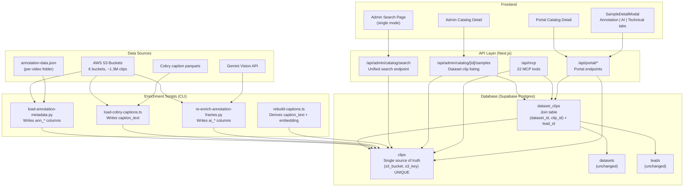
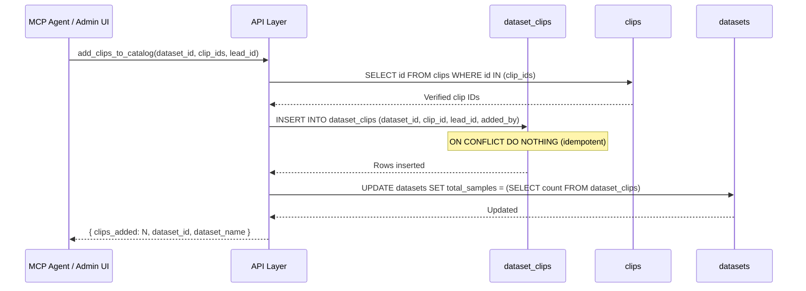
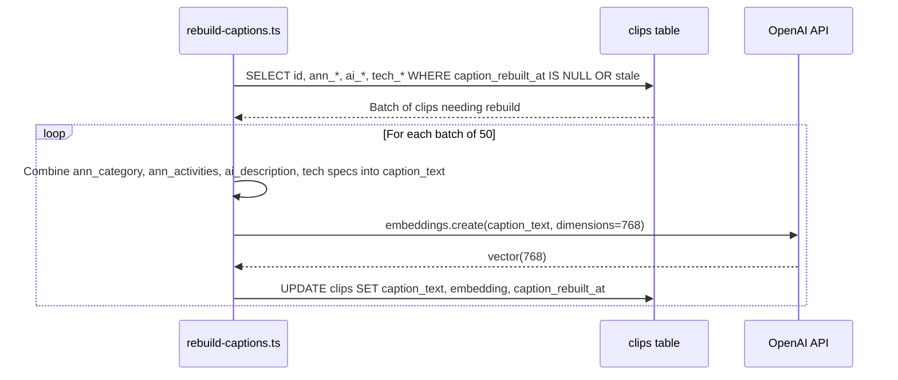
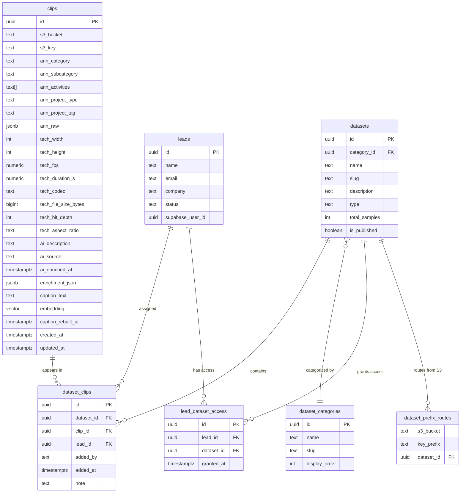

# Design: Unified Clip Architecture

**Status:** Draft
**Last updated:** 2026-03-23

---

## Overview

### Problem Statement

The Claru data catalog currently maintains two separate tables for video/image assets:

1. **`dataset_samples`** -- tied to specific datasets, stores enrichment data (agent_context, enrichment_json), uses 1536-dim embeddings, and duplicates S3 references when clips are added to multiple catalogs or assigned to leads.
2. **`video_index`** -- a flat corpus index keyed by (s3_bucket, s3_key), stores captions and 768-dim embeddings, has no annotation metadata columns, and has no relationship to datasets.

This split creates several concrete problems:

- **Data duplication**: When an MCP agent or admin adds a clip from video_index to a lead's catalog, the system copies S3 keys, captions, and metadata into a new `dataset_samples` row. The same physical clip can exist as dozens of rows.
- **Split search**: The admin search page exposes three confusing modes (Catalog / Full Corpus / Both) with different embedding dimensions (1536 vs 768), different result shapes, and different capabilities.
- **Inconsistent metadata**: Enrichment scripts write to different tables with different column schemas. A clip enriched in video_index has a caption; the same clip in dataset_samples has agent_context. There is no single source of truth.
- **Expensive maintenance**: Every enrichment pipeline, search endpoint, MCP tool, and portal component must handle both table schemas, leading to code duplication and divergent behavior.

### Solution

Replace both tables with a single **`clips`** table that serves as the canonical record for every media asset in the platform. Introduce a lightweight **`dataset_clips`** join table that links clips to datasets (replacing data-copy operations with simple row inserts). Unify search to a single 768-dim embedding column and one search mode.

### Business Value

- **Simpler curation workflow**: "Add to catalog" becomes a single join-table INSERT instead of a multi-field copy.
- **Unified search**: One search bar, one result type, one embedding dimension. No more mode toggles.
- **Richer metadata**: Every clip has annotation metadata, AI descriptions, and technical specs in named columns -- all queryable and filterable.
- **Lower maintenance**: One table schema for all enrichment scripts, API routes, MCP tools, and portal components.

---

## Architecture

### High-Level System Diagram



### Data Flow: Adding a Clip to a Catalog



### Data Flow: Caption Rebuild



---

## Components and Interfaces

### 1. Database Schema

#### 1.1 `clips` Table

This is the single source of truth for every media asset. Each S3 object appears exactly once. Columns are organized by data source to prevent overwriting.

```sql
-- Migration: 009_unified_clip_architecture.sql

CREATE TABLE clips (
    -- Identity
    id              uuid PRIMARY KEY DEFAULT gen_random_uuid(),
    s3_bucket       text NOT NULL,
    s3_key          text NOT NULL,

    -- Annotation metadata (source: annotation-data.json via load-annotation-metadata.py)
    ann_category        text,           -- generalData.mainCategory or top-level category
    ann_subcategory     text,           -- generalData.subcategory or top-level subcategory
    ann_activities      text[],         -- generalData.activities[]
    ann_project_type    text,           -- project.type (e.g. "egocentric_capture")
    ann_project_tag     text,           -- project.tag (e.g. "henri_africa")
    ann_raw             jsonb,          -- Full annotation-data.json for portal detail view

    -- Technical metadata (source: annotation-data.json MediaInfo tracks, or Cobry parquet)
    tech_width          integer,
    tech_height         integer,
    tech_fps            numeric,
    tech_duration_s     numeric,
    tech_codec          text,
    tech_file_size_bytes bigint,
    tech_bit_depth      integer,
    tech_aspect_ratio   text,           -- Computed: "16:9", "4:3", etc.

    -- AI scene description (source: Gemini Vision via re-enrich-annotation-frames.py)
    ai_description      text,           -- Free-form scene description
    ai_source           text,           -- "gemini-2.0-flash", "cobry", etc.
    ai_enriched_at      timestamptz,

    -- Platform enrichment (legacy/misc structured data)
    enrichment_json     jsonb DEFAULT '{}',

    -- Derived search fields (rebuilt by rebuild-captions.ts, NOT written by source scripts)
    caption_text        text,           -- Concatenation of ann_* + ai_* + tech_* for embedding
    embedding           extensions.vector(768),
    caption_rebuilt_at  timestamptz,    -- NULL = needs rebuild

    -- Legacy compatibility (deprecated, will be removed after full migration)
    enrichment_source   text,

    -- Timestamps
    created_at          timestamptz NOT NULL DEFAULT now(),
    updated_at          timestamptz NOT NULL DEFAULT now(),

    -- Uniqueness constraint: one row per physical S3 object
    UNIQUE (s3_bucket, s3_key)
);

-- Indexes
CREATE INDEX idx_clips_bucket       ON clips (s3_bucket);
CREATE INDEX idx_clips_category     ON clips (ann_category) WHERE ann_category IS NOT NULL;
CREATE INDEX idx_clips_project_tag  ON clips (ann_project_tag) WHERE ann_project_tag IS NOT NULL;
CREATE INDEX idx_clips_needs_rebuild ON clips (id) WHERE caption_rebuilt_at IS NULL AND (ann_category IS NOT NULL OR ai_description IS NOT NULL);
CREATE INDEX idx_clips_embedding    ON clips USING ivfflat (embedding extensions.vector_cosine_ops) WITH (lists = 300);
-- Note: IVFFlat index requires ~100k+ rows to be effective. Build after migration.

-- Updated_at trigger
CREATE TRIGGER set_clips_updated_at
    BEFORE UPDATE ON clips
    FOR EACH ROW EXECUTE FUNCTION update_updated_at_column();
```

**Design decisions:**

- **Column prefixes (ann_, tech_, ai_)**: Prevents name collisions and makes it immediately clear which enrichment source owns each column. Each source script writes only to its own prefix.
- **`caption_text` + `embedding` are DERIVED**: No enrichment script writes to these directly. A separate `rebuild-captions.ts` script reads all source columns, builds a combined caption string, embeds it, and writes both. This prevents stale embeddings and ensures consistency.
- **768-dim embedding**: Matches the existing `video_index` dimension. The current `dataset_samples` uses 1536-dim, but text-embedding-3-small supports dimension truncation, so 768 is sufficient and more storage-efficient. All existing video_index embeddings transfer directly.
- **`ann_raw` JSONB**: Stores the full annotation-data.json so the portal detail modal can render it without a live S3 fetch. This eliminates the current `/api/portal/s3-annotation` call for every detail view open.
- **IVFFlat over HNSW**: IVFFlat is simpler, uses less memory, and is adequate for our corpus size (~1.3M rows). Can upgrade to HNSW later if query latency becomes an issue.

#### 1.2 `dataset_clips` Join Table

Replaces the current pattern of copying `dataset_samples` rows when adding clips to catalogs.

```sql
CREATE TABLE dataset_clips (
    id          uuid PRIMARY KEY DEFAULT gen_random_uuid(),
    dataset_id  uuid NOT NULL REFERENCES datasets(id) ON DELETE CASCADE,
    clip_id     uuid NOT NULL REFERENCES clips(id) ON DELETE CASCADE,
    lead_id     uuid REFERENCES leads(id) ON DELETE SET NULL,  -- NULL = base catalog, set = lead-specific
    added_by    text,           -- "mcp_agent", "admin", "migration"
    added_at    timestamptz NOT NULL DEFAULT now(),
    note        text,           -- Optional curation note

    -- Prevent duplicate assignments
    UNIQUE (dataset_id, clip_id, lead_id)
);

-- Indexes
CREATE INDEX idx_dc_dataset  ON dataset_clips (dataset_id);
CREATE INDEX idx_dc_clip     ON dataset_clips (clip_id);
CREATE INDEX idx_dc_lead     ON dataset_clips (lead_id) WHERE lead_id IS NOT NULL;
CREATE INDEX idx_dc_dataset_lead ON dataset_clips (dataset_id, lead_id);
```

**Design decisions:**

- **Three-column unique constraint (dataset_id, clip_id, lead_id)**: A clip can appear once as a "base" entry (lead_id IS NULL, visible to everyone with dataset access) and once per lead (lead_id set, visible only to that lead). This preserves the current behavior where admins can add lead-specific clips to a catalog.
- **`ON DELETE CASCADE` from datasets**: If a dataset is deleted, all its clip associations are cleaned up. The clips themselves remain (they may be in other datasets).
- **`ON DELETE CASCADE` from clips**: If a clip is removed from the system, its associations are cleaned up automatically.
- **`ON DELETE SET NULL` from leads**: If a lead is deleted, their clip associations become "orphaned" (lead_id = NULL), effectively promoting them to base catalog entries rather than losing the curation work.
- **No `ON CONFLICT` on insert by default**: The `UNIQUE (dataset_id, clip_id, lead_id)` constraint means application code should use `ON CONFLICT DO NOTHING` for idempotent adds.

#### 1.3 Semantic Search RPC

Replaces both `match_samples` (1536-dim) and `match_video_index` (768-dim) with a single function.

```sql
CREATE OR REPLACE FUNCTION match_clips(
    query_embedding     extensions.vector(768),
    match_count         integer DEFAULT 20,
    filter_bucket       text DEFAULT NULL,
    filter_dataset_id   uuid DEFAULT NULL,
    filter_category     text DEFAULT NULL,
    match_threshold     double precision DEFAULT 0.35
)
RETURNS TABLE (
    clip_id             uuid,
    s3_bucket           text,
    s3_key              text,
    caption_text        text,
    similarity          double precision,
    ann_category        text,
    ann_subcategory     text,
    ann_activities      text[],
    ai_description      text,
    tech_width          integer,
    tech_height         integer,
    tech_duration_s     numeric,
    dataset_ids         uuid[]
)
LANGUAGE plpgsql
SECURITY DEFINER
SET search_path = public
AS $$
BEGIN
    RETURN QUERY
    SELECT
        c.id AS clip_id,
        c.s3_bucket,
        c.s3_key,
        c.caption_text,
        1 - (c.embedding <=> query_embedding) AS similarity,
        c.ann_category,
        c.ann_subcategory,
        c.ann_activities,
        c.ai_description,
        c.tech_width,
        c.tech_height,
        c.tech_duration_s,
        ARRAY(
            SELECT DISTINCT dc.dataset_id
            FROM dataset_clips dc
            WHERE dc.clip_id = c.id AND dc.lead_id IS NULL
        ) AS dataset_ids
    FROM clips c
    WHERE
        c.embedding IS NOT NULL
        AND (filter_bucket IS NULL OR c.s3_bucket = filter_bucket)
        AND (filter_category IS NULL OR c.ann_category ILIKE '%' || filter_category || '%')
        AND (filter_dataset_id IS NULL OR EXISTS (
            SELECT 1 FROM dataset_clips dc
            WHERE dc.clip_id = c.id AND dc.dataset_id = filter_dataset_id
        ))
        AND 1 - (c.embedding <=> query_embedding) >= match_threshold
    ORDER BY c.embedding <=> query_embedding
    LIMIT match_count;
END;
$$;
```

**Design decisions:**

- **`dataset_ids` array in results**: Tells the caller which datasets already contain this clip, enabling "already in catalog" badges in the UI without a separate query.
- **`filter_dataset_id` with EXISTS subquery**: Scopes search to clips within a specific dataset via the join table, replacing the current `dataset_samples.dataset_id` filter.
- **`filter_category` with ILIKE**: Simple text matching on annotation category for faceted filtering.
- **Lower default threshold (0.35)**: Slightly more permissive than current video_index (0.40) to account for the richer combined caption text having more terms.

#### 1.4 RLS Policies

```sql
-- clips: No direct portal access. Portal reads clips through dataset_clips join.
ALTER TABLE clips ENABLE ROW LEVEL SECURITY;

-- Admin (service role) bypasses RLS. No authenticated user policy needed on clips directly.

-- dataset_clips: Authenticated users can read associations for datasets they have access to.
ALTER TABLE dataset_clips ENABLE ROW LEVEL SECURITY;

CREATE POLICY "Leads can read clip associations for granted datasets"
    ON dataset_clips FOR SELECT TO authenticated
    USING (
        EXISTS (
            SELECT 1
            FROM lead_dataset_access lda
            JOIN leads l ON l.id = lda.lead_id
            WHERE lda.dataset_id = dataset_clips.dataset_id
                AND l.supabase_user_id = auth.uid()
        )
        AND (
            dataset_clips.lead_id IS NULL
            OR dataset_clips.lead_id = (
                SELECT l2.id FROM leads l2 WHERE l2.supabase_user_id = auth.uid()
            )
        )
    );

-- Portal users read clips through a server-side join (admin client), not direct RLS.
-- This keeps the clips table RLS simple and avoids performance issues with
-- complex cross-table policies on a large table.
```

**Design decision -- Server-side joins for portal**: Rather than creating complex RLS policies on the clips table that join through dataset_clips and lead_dataset_access (which would be slow on 1.3M rows), portal pages use the admin Supabase client (service role) and enforce access control in application code. This matches the existing pattern where the portal dataset detail page already uses admin client for admin preview mode.

### 2. API Changes

#### 2.1 Unified Search Endpoint

**File:** `src/app/api/admin/catalog/search/route.ts`

The current endpoint supports three modes (catalog/full_corpus/both) with different embedding dimensions and result shapes. This is replaced by a single search path.

**Before:**
```
POST /api/admin/catalog/search
Body: { query, mode: "catalog"|"full_corpus"|"both", dataset_id?, s3_bucket?, limit?, offset? }
Returns: { results: Array<{ source: "catalog"|"full_corpus", ... different shapes }> }
```

**After:**
```
POST /api/admin/catalog/search
Body: { query, dataset_id?, s3_bucket?, category?, limit?, offset? }
Returns: { results: Array<ClipSearchResult>, total_count? }
```

**`ClipSearchResult` shape:**
```typescript
interface ClipSearchResult {
    clip_id: string;
    similarity: number;
    s3_bucket: string;
    s3_key: string;
    signed_url: string | null;
    caption_text: string | null;
    ann_category: string | null;
    ann_subcategory: string | null;
    ann_activities: string[];
    ai_description: string | null;
    tech_width: number | null;
    tech_height: number | null;
    tech_duration_s: number | null;
    dataset_ids: string[];          // Which datasets contain this clip
    dataset_names: string[];        // Resolved names for display
    assigned_leads: Array<{         // Which leads have this clip
        lead_id: string;
        lead_name: string;
        lead_company: string;
    }>;
}
```

**Key changes:**
- No more `mode` parameter or `source` discriminator
- Single `generateEmbedding(query, 768)` call
- Single `supabase.rpc("match_clips", ...)` call
- Browse mode (no query): `SELECT ... FROM clips c JOIN dataset_clips dc ON dc.clip_id = c.id WHERE dc.dataset_id = ?` with pagination
- Lead assignment lookup: `SELECT ... FROM dataset_clips WHERE clip_id IN (...) AND lead_id IS NOT NULL`

#### 2.2 Dataset Samples Endpoint

**File:** `src/app/api/admin/catalog/[id]/samples/route.ts`

**Before:** Queries `dataset_samples` directly by `dataset_id`.

**After:** Queries `dataset_clips dc JOIN clips c ON c.id = dc.clip_id WHERE dc.dataset_id = ?`.

The response shape stays the same (the frontend expects `samples` array with `media_url` signed URLs), but the data comes from the join. The `GET` handler changes from:

```typescript
// Before
supabase.from("dataset_samples").select("*").eq("dataset_id", id)

// After
supabase
    .from("dataset_clips")
    .select("clip_id, lead_id, added_by, added_at, note, clips(*)")
    .eq("dataset_id", id)
```

The response mapper transforms clip fields into the legacy `DatasetSample`-compatible shape during the transition period, so existing frontend components work without changes.

#### 2.3 Custom Catalog / Add to Catalog Endpoints

**File:** `src/app/api/admin/catalog/custom/route.ts`

**Before:** Copies fields from video_index or dataset_samples into a new dataset_samples row.

**After:** Inserts a row into `dataset_clips`:

```typescript
// Before (43 lines of copy logic per clip)
const { data: vi } = await supabase.from("video_index").select(...).eq("id", viId).single();
await supabase.from("dataset_samples").insert({
    dataset_id, lead_id, s3_object_key: vi.s3_key, s3_bucket: vi.s3_bucket,
    filename: ..., mime_type: ..., file_size_bytes: 0, metadata_json: {...}, ...
});

// After (3 lines)
await supabase.from("dataset_clips").insert({
    dataset_id, clip_id: clipId, lead_id, added_by: "admin", note
}).onConflict("dataset_id,clip_id,lead_id").ignore();
```

#### 2.4 Portal Dataset Detail Page

**File:** `src/app/portal/catalog/[id]/page.tsx`

**Before:** Fetches `dataset_samples` filtered by `dataset_id` and optionally `lead_id`.

**After:** Fetches via join:

```typescript
const { data: associations } = await supabase
    .from("dataset_clips")
    .select("clip_id, lead_id, note, clips(*)")
    .eq("dataset_id", id)
    .or(leadId ? `lead_id.is.null,lead_id.eq.${leadId}` : "lead_id.is.null")
    .order("added_at", { ascending: true });
```

The `SampleGallery` and `SampleDetailModal` components receive clip data mapped to the existing `DatasetSample` interface shape during the transition. After all frontend components are updated to use the new `Clip` type, the mapping layer can be removed.

#### 2.5 Portal Detail Modal Changes

**File:** `src/app/portal/catalog/[id]/SampleDetailModal.tsx`

The detail modal currently has a `DataPanelTabs` system with Annotation and Game Specs panels. Under the unified architecture, it gains structured data from the clips table:

**Tab 1 -- Annotation**: Renders `ann_category`, `ann_subcategory`, `ann_activities[]`, `ann_project_type`, `ann_project_tag` as styled cards. If `ann_raw` is populated, renders expandable "Raw Annotation" section (replaces live S3 fetch).

**Tab 2 -- AI Enrichment**: Renders `ai_description`, `ai_source`, `ai_enriched_at`. If `enrichment_json` has additional fields, renders them as key-value pairs.

**Tab 3 -- Technical**: Renders `tech_width x tech_height`, `tech_fps`, `tech_duration_s`, `tech_codec`, `tech_file_size_bytes`, `tech_bit_depth`, `tech_aspect_ratio` as a specs table.

**Fallback for `ann_raw`**: If `ann_raw` is NULL (clip was indexed from a non-annotation source like Cobry), the Annotation tab fetches from S3 on demand via the existing `/api/portal/s3-annotation` endpoint. This handles the long tail of clips that were not loaded from annotation-data.json.

### 3. MCP Tool Changes

All 22 MCP tools are registered in `src/lib/mcp/server.ts`. Seven tools require changes:

| Tool | Current Behavior | New Behavior |
|------|-----------------|-------------|
| `search_catalog` | Queries `dataset_samples` via `match_samples` (1536-dim) | Queries `clips` via `match_clips` (768-dim) |
| `search_full_catalog` | Queries `video_index` via `match_video_index` (768-dim) | **Merged into `search_catalog`**. Becomes an alias or is removed. |
| `create_custom_catalog` | Copies data from video_index/dataset_samples into new dataset_samples rows | Creates dataset, inserts `dataset_clips` rows referencing existing clip IDs |
| `add_clips_to_catalog` | Copies data into dataset_samples | Inserts `dataset_clips` rows |
| `download_clips` | Queries both dataset_samples and video_index | Queries `clips` only |
| `get_corpus_stats` | Aggregates video_index and dataset_samples separately | Aggregates `clips` and `dataset_clips` |
| `list_lead_catalogs` | Counts dataset_samples with lead_id filter | Counts `dataset_clips` with lead_id filter |
| `remove_clips_from_catalog` | Deletes from dataset_samples | Deletes from `dataset_clips` |

**Tools unchanged:** `get_dataset_overview`, `build_lead_brief`, `list_leads`, `create_lead`, `get_lead`, `update_lead`, `approve_lead`, `list_datasets`, `list_case_studies`, `get_case_study`, `update_dataset`, `grant_lead_access`, `revoke_lead_access`, `create_lead_auth_user`

**`search_full_catalog` deprecation strategy:**
- Phase 1: Keep the tool but redirect it to `match_clips` internally (same result shape)
- Phase 2: After MCP clients are updated, mark as deprecated in the tool description
- Phase 3: Remove in a future release

**`search_catalog` parameter change:**
```typescript
// Before
{
    query: z.string(),
    limit: z.number(),
    dataset_id: z.string().uuid().optional(),
}

// After
{
    query: z.string(),
    limit: z.number(),
    dataset_id: z.string().uuid().optional(),
    s3_bucket: z.string().optional(),       // Absorbed from search_full_catalog
    category: z.string().optional(),        // New: filter by ann_category
    match_threshold: z.number().optional(), // Absorbed from search_full_catalog
}
```

**`create_custom_catalog` and `add_clips_to_catalog` parameter change:**

Both tools currently accept `dataset_sample_ids` and `video_index_ids` as separate parameters. After migration, they accept a unified `clip_ids` parameter:

```typescript
// Before
{
    dataset_sample_ids: z.array(z.string().uuid()).optional(),
    video_index_ids: z.array(z.string().uuid()).optional(),
}

// After
{
    clip_ids: z.array(z.string().uuid()).min(1),
    // Legacy aliases (deprecated, resolved to clip_ids internally)
    dataset_sample_ids: z.array(z.string().uuid()).optional(),
    video_index_ids: z.array(z.string().uuid()).optional(),
}
```

During the transition, if `dataset_sample_ids` or `video_index_ids` are provided, the tool resolves them to `clip_ids` via a mapping table or direct lookup.

### 4. Enrichment Script Changes

#### 4.1 `load-annotation-metadata.py`

**Before:** Reads annotation-data.json, builds caption, embeds at 768-dim, upserts to `video_index`.

**After:** Reads annotation-data.json, writes structured fields to `clips`:

```python
# Before: single caption + embedding upsert
rows.append({
    "s3_bucket": BUCKET,
    "s3_key": video_key,
    "caption_text": caption,
    "embedding": json.dumps(emb),
    "enrichment_source": "annotation_json_structured",
})
upsert_rows(rows)  # → video_index

# After: structured column upsert (no embedding — that's rebuild's job)
rows.append({
    "s3_bucket": BUCKET,
    "s3_key": video_key,
    "ann_category": fields.get("main_category") or fields.get("category"),
    "ann_subcategory": fields.get("subcategory_action") or fields.get("subcategory"),
    "ann_activities": fields.get("activities", []),
    "ann_project_type": fields.get("project_type"),
    "ann_project_tag": fields.get("project_tag"),
    "ann_raw": json.dumps(annotation),
    "tech_width": fields.get("width"),
    "tech_height": fields.get("height"),
    "tech_fps": fields.get("fps"),
    "tech_duration_s": fields.get("duration"),
    "tech_codec": fields.get("codec"),
    "tech_file_size_bytes": fields.get("file_size"),
    "tech_bit_depth": fields.get("bit_depth"),
    "caption_rebuilt_at": None,  # Signal that caption needs rebuild
})
upsert_rows(rows)  # → clips
```

The script no longer calls OpenAI for embeddings. It writes source data only. The `rebuild-captions.ts` script handles caption + embedding generation.

#### 4.2 `load_cobry_captions.py`

**Before:** Reads parquet, builds caption from cobry data, embeds at 768-dim, upserts to `video_index`.

**After:** Reads parquet, writes caption as `ai_description` with `ai_source = "cobry"` to `clips`. Sets `caption_rebuilt_at = NULL` to trigger rebuild.

#### 4.3 `re-enrich-annotation-frames.py`

**Before:** Extracts frame, sends to Gemini, writes to `video_index.caption_text`.

**After:** Extracts frame, sends to Gemini, writes to `clips.ai_description`, `clips.ai_source = "gemini-2.0-flash"`, `clips.ai_enriched_at = now()`. Sets `caption_rebuilt_at = NULL`.

#### 4.4 `rebuild-captions.ts` (NEW)

New script that derives `caption_text` + `embedding` from all source columns.

```typescript
// Pseudocode
const BATCH_SIZE = 50;

// Find clips needing rebuild
const { data: clips } = await supabase
    .from("clips")
    .select("id, ann_category, ann_subcategory, ann_activities, ann_project_type, ai_description, tech_width, tech_height, tech_fps, tech_duration_s, tech_codec")
    .is("caption_rebuilt_at", null)
    .or("ann_category.not.is.null,ai_description.not.is.null")
    .limit(BATCH_SIZE);

for (const clip of clips) {
    const caption = buildCaption(clip);  // Combine all fields into searchable text
    const embedding = await generateEmbedding(caption, 768);

    await supabase.from("clips").update({
        caption_text: caption,
        embedding: JSON.stringify(embedding),
        caption_rebuilt_at: new Date().toISOString(),
    }).eq("id", clip.id);
}
```

**`buildCaption` function** (equivalent to the existing `build_caption` in load-annotation-metadata.py):

```typescript
function buildCaption(clip: ClipRow): string {
    const parts: string[] = [];

    if (clip.ann_category) parts.push(`Category: ${clip.ann_category}.`);
    if (clip.ann_subcategory) parts.push(`Action: ${clip.ann_subcategory}.`);
    if (clip.ann_activities?.length) parts.push(`Activities: ${clip.ann_activities.join(", ")}.`);
    if (clip.ann_project_type) parts.push(`Capture type: ${clip.ann_project_type.replace(/_/g, " ")}.`);

    // Technical specs
    const specs: string[] = [];
    if (clip.tech_width && clip.tech_height) {
        specs.push(`${clip.tech_width}x${clip.tech_height}`);
        if (clip.tech_height >= 2160) specs.push("4K UHD");
        else if (clip.tech_height >= 1080) specs.push("1080p Full HD");
        else if (clip.tech_height >= 720) specs.push("720p HD");
    }
    if (clip.tech_fps) specs.push(`${clip.tech_fps}fps`);
    if (clip.tech_codec) specs.push(clip.tech_codec);
    if (clip.tech_duration_s) {
        const d = Number(clip.tech_duration_s);
        specs.push(d >= 60 ? `${(d / 60).toFixed(1)}min` : `${d.toFixed(0)}s`);
    }
    if (specs.length) parts.push(`Technical: ${specs.join(", ")}.`);

    // AI scene description
    if (clip.ai_description) parts.push(`Scene: ${clip.ai_description}`);

    return parts.join(" ");
}
```

#### 4.5 `backfill-embeddings.ts`

**Before:** Polls `dataset_samples` for rows with `agent_context IS NOT NULL AND embedding IS NULL`, generates 1536-dim embeddings.

**After:** Replaced by `rebuild-captions.ts`. The cron endpoint (`/api/cron/embed-samples`) is updated to call rebuild logic on the clips table with 768-dim embeddings.

### 5. TypeScript Type Changes

**File:** `src/types/data-catalog.ts`

```typescript
// New types
export interface Clip {
    id: string;
    s3_bucket: string;
    s3_key: string;

    ann_category: string | null;
    ann_subcategory: string | null;
    ann_activities: string[];
    ann_project_type: string | null;
    ann_project_tag: string | null;
    ann_raw: Record<string, unknown> | null;

    tech_width: number | null;
    tech_height: number | null;
    tech_fps: number | null;
    tech_duration_s: number | null;
    tech_codec: string | null;
    tech_file_size_bytes: number | null;
    tech_bit_depth: number | null;
    tech_aspect_ratio: string | null;

    ai_description: string | null;
    ai_source: string | null;
    ai_enriched_at: string | null;

    enrichment_json: Record<string, unknown>;
    caption_text: string | null;
    embedding: number[] | null;
    caption_rebuilt_at: string | null;
    enrichment_source: string | null;  // Deprecated

    created_at: string;
    updated_at: string;
}

export interface DatasetClip {
    id: string;
    dataset_id: string;
    clip_id: string;
    lead_id: string | null;
    added_by: string | null;
    added_at: string;
    note: string | null;
}

// DatasetSample is preserved during transition but deprecated
// export interface DatasetSample { ... }

// VideoIndexRecord is removed
// export interface VideoIndexRecord { ... }

// Updated search result type (replaces CatalogSearchResult + FullCorpusSearchResult)
export interface ClipSearchResult {
    clip_id: string;
    similarity: number;
    s3_bucket: string;
    s3_key: string;
    signed_url: string | null;
    caption_text: string | null;
    ann_category: string | null;
    ann_subcategory: string | null;
    ann_activities: string[];
    ai_description: string | null;
    tech_width: number | null;
    tech_height: number | null;
    tech_duration_s: number | null;
    dataset_ids: string[];
    dataset_names: string[];
    assigned_leads: Array<{
        lead_id: string;
        lead_name: string;
        lead_company: string;
    }>;
}
```

### 6. Embedding Dimension Strategy

**Current state:**
- `dataset_samples.embedding`: vector(1536) -- text-embedding-3-small default
- `video_index.embedding`: vector(768) -- text-embedding-3-small with dimensions=768

**Target state:**
- `clips.embedding`: vector(768)

**Rationale:**
- text-embedding-3-small supports Matryoshka dimension reduction. The first 768 dimensions contain the most important information.
- 768-dim vectors use 50% less storage and index memory (~6KB vs 12KB per vector for 1.3M rows = ~3.8GB savings).
- Search quality difference between 768 and 1536 is minimal for our use case (natural language queries against video descriptions).
- All ~90K existing video_index embeddings transfer directly without re-embedding.
- The ~4K existing dataset_samples embeddings will be re-generated at 768-dim during migration (small batch, ~$0.02 in API costs).

---

## Data Models

### Entity Relationship Diagram



### Data Volume Estimates

| Table | Current Rows | Post-Migration Rows | Notes |
|-------|-------------|-------------------|-------|
| `video_index` | ~90,000 | 0 (dropped) | Migrated to clips |
| `dataset_samples` | ~4,000 | 0 (dropped) | Split into clips + dataset_clips |
| `clips` | N/A | ~90,000 (initial) | Grows as new clips are indexed |
| `dataset_clips` | N/A | ~4,500 | One row per dataset-clip-lead combo |
| `datasets` | ~22 | ~22 | Unchanged |

---

## Error Handling

### Migration Errors

| Error | Handling |
|-------|---------|
| Duplicate (s3_bucket, s3_key) during video_index migration | `ON CONFLICT (s3_bucket, s3_key) DO UPDATE` -- merge fields |
| dataset_samples row has no matching clip | Create clip from s3_object_key if available; skip if no S3 reference |
| dataset_samples row has s3_object_key but no s3_bucket | Default to `moonvalley-annotation-platform` (current assumption in codebase) |
| Embedding dimension mismatch (1536 vs 768) | Re-embed during migration. Set `caption_rebuilt_at = NULL` for batch re-embedding. |
| NULL s3_object_key in dataset_samples | These are legacy Supabase Storage samples. Create clip with `s3_key = storage_path`, `s3_bucket = "supabase-storage"` sentinel. |

### Runtime Errors

| Error | Handling |
|-------|---------|
| Clip not found during add_to_catalog | Return 404 with specific clip IDs that were not found |
| Duplicate dataset_clips insert | `ON CONFLICT DO NOTHING` -- idempotent |
| Embedding generation failure in rebuild | Skip clip, leave `caption_rebuilt_at = NULL` for retry on next run |
| S3 signed URL generation failure | Return result with `signed_url: null`, frontend shows placeholder |
| Portal annotation tab with no ann_raw | Fall back to live S3 fetch via existing `/api/portal/s3-annotation` |
| Search with no results | Return empty array with helpful message (same as current behavior) |

### Backward Compatibility Errors

During the transition period, some code paths may reference old table names. The migration creates **views** as shims:

```sql
-- Compatibility views (dropped after all code is migrated)
CREATE VIEW dataset_samples_compat AS
SELECT
    dc.id,
    dc.dataset_id,
    c.s3_key AS filename,
    NULL::text AS media_url,
    NULL::text AS storage_path,
    c.tech_file_size_bytes AS file_size_bytes,
    CASE
        WHEN c.s3_key LIKE '%.mp4' THEN 'video/mp4'
        WHEN c.s3_key LIKE '%.mov' THEN 'video/quicktime'
        WHEN c.s3_key LIKE '%.jpg' OR c.s3_key LIKE '%.jpeg' THEN 'image/jpeg'
        ELSE 'application/octet-stream'
    END AS mime_type,
    c.tech_duration_s AS duration_seconds,
    c.tech_width AS resolution_width,
    c.tech_height AS resolution_height,
    c.tech_fps AS fps,
    c.enrichment_json AS metadata_json,
    c.s3_key AS s3_object_key,
    c.s3_bucket,
    NULL::text AS s3_annotation_key,
    NULL::text AS s3_specs_key,
    c.enrichment_json,
    NULL::jsonb AS agent_context,
    c.embedding,
    dc.lead_id,
    dc.added_by,
    NULL::uuid AS source_video_index_id,
    dc.added_at AS created_at
FROM dataset_clips dc
JOIN clips c ON c.id = dc.clip_id;
```

This view is a safety net, not a long-term solution. Code should be migrated to use `clips` and `dataset_clips` directly.

---

## Testing Strategy

### 1. Migration Validation

Before dropping old tables, run validation queries:

```sql
-- Verify all video_index rows migrated
SELECT count(*) FROM video_index vi
WHERE NOT EXISTS (
    SELECT 1 FROM clips c
    WHERE c.s3_bucket = vi.s3_bucket AND c.s3_key = vi.s3_key
);
-- Expected: 0

-- Verify all dataset_samples have corresponding clips + dataset_clips
SELECT count(*) FROM dataset_samples ds
WHERE ds.s3_object_key IS NOT NULL
AND NOT EXISTS (
    SELECT 1 FROM dataset_clips dc
    JOIN clips c ON c.id = dc.clip_id
    WHERE c.s3_key = ds.s3_object_key
    AND dc.dataset_id = ds.dataset_id
);
-- Expected: 0

-- Verify embedding counts preserved
SELECT count(*) FROM clips WHERE embedding IS NOT NULL;
-- Should equal: count from video_index WHERE embedding IS NOT NULL

-- Verify search returns results
SELECT * FROM match_clips(
    (SELECT embedding FROM clips WHERE embedding IS NOT NULL LIMIT 1),
    10
);
-- Should return 10 rows
```

### 2. API Integration Tests

Test each changed endpoint against the staging database:

| Test | Endpoint | Assertion |
|------|----------|-----------|
| Semantic search returns clips | `POST /api/admin/catalog/search` | Results have `clip_id`, `ann_category`, `signed_url` |
| Browse mode with dataset filter | `POST /api/admin/catalog/search` (no query, with dataset_id) | Returns clips in that dataset via join |
| Add clip to catalog | `POST /api/admin/catalog/custom` | dataset_clips row created, no dataset_samples row |
| Remove clip from catalog | MCP `remove_clips_from_catalog` | dataset_clips row deleted, clips row preserved |
| Portal dataset detail | `GET /portal/catalog/[id]` | Renders clips via dataset_clips join |
| Portal detail modal annotation tab | Opens modal | Shows ann_category, ann_activities from DB |
| Corpus stats | MCP `get_corpus_stats` | Counts from clips table match expected |

### 3. MCP Tool Tests

Run each affected MCP tool via the test harness (`scripts/test-video-search.ts` adapted):

```bash
# search_catalog -- should use match_clips
curl -X POST /api/mcp -H "Authorization: Bearer $TOKEN" \
  -d '{"method":"tools/call","params":{"name":"search_catalog","arguments":{"query":"person cooking","limit":5}}}'

# create_custom_catalog -- should insert dataset_clips, not dataset_samples
curl -X POST /api/mcp -H "Authorization: Bearer $TOKEN" \
  -d '{"method":"tools/call","params":{"name":"create_custom_catalog","arguments":{"name":"Test","lead_id":"...","clip_ids":["..."]}}}'

# get_corpus_stats -- should aggregate from clips
curl -X POST /api/mcp -H "Authorization: Bearer $TOKEN" \
  -d '{"method":"tools/call","params":{"name":"get_corpus_stats","arguments":{}}}'
```

### 4. Enrichment Script Tests

| Script | Test |
|--------|------|
| `load-annotation-metadata.py` | `--dry-run --limit 5` should show ann_* fields being extracted |
| `rebuild-captions.ts` | Run on 10 clips with `caption_rebuilt_at IS NULL`, verify caption_text and embedding are populated |
| `load_cobry_captions.py` | `--dry-run --limit 5` should show ai_description being written to clips |

### 5. Performance Benchmarks

Run before/after on staging:

| Query | Target Latency |
|-------|---------------|
| Semantic search (top 20) | < 200ms (current: ~150ms for video_index, ~300ms for dataset_samples) |
| Browse mode (page of 48) | < 100ms |
| Dataset detail page load (100 samples) | < 500ms including signed URL generation |
| Corpus stats aggregation | < 2s |

### 6. Regression Checklist

- [ ] Admin search: returns results, pagination works, category filter works
- [ ] Admin search: "Add to catalog" button creates dataset_clips row
- [ ] Admin catalog detail: shows clips, edit/delete work
- [ ] Portal catalog browse: shows correct datasets
- [ ] Portal dataset detail: shows correct clips for the lead
- [ ] Portal detail modal: all three tabs render (Annotation, AI, Technical)
- [ ] MCP: all 22 tools respond without errors
- [ ] MCP: search_catalog returns clips with signed URLs
- [ ] MCP: create_custom_catalog creates working portal link
- [ ] Enrichment: load-annotation-metadata.py writes to clips table
- [ ] Enrichment: rebuild-captions.ts generates captions and embeddings
- [ ] Cron: embed-samples endpoint works with clips table

---

## Migration Plan

### Phase 1: Schema Creation (staging only)

1. Run `009_unified_clip_architecture.sql` to create `clips` and `dataset_clips` tables
2. Create `match_clips` RPC function
3. Create compatibility views
4. Create RLS policies

### Phase 2: Data Migration (staging only)

**Step 2a: Migrate video_index -> clips**

```sql
INSERT INTO clips (id, s3_bucket, s3_key, caption_text, embedding, enrichment_source, created_at)
SELECT id, s3_bucket, s3_key, caption_text, embedding, enrichment_source, indexed_at
FROM video_index
ON CONFLICT (s3_bucket, s3_key) DO NOTHING;
```

**Step 2b: Merge dataset_samples -> clips**

```sql
-- For dataset_samples with s3_object_key: upsert into clips, merging metadata
INSERT INTO clips (
    s3_bucket, s3_key,
    tech_width, tech_height, tech_fps, tech_duration_s,
    tech_file_size_bytes, enrichment_json
)
SELECT
    COALESCE(ds.s3_bucket, 'moonvalley-annotation-platform'),
    ds.s3_object_key,
    ds.resolution_width, ds.resolution_height, ds.fps, ds.duration_seconds,
    ds.file_size_bytes, ds.enrichment_json
FROM dataset_samples ds
WHERE ds.s3_object_key IS NOT NULL
ON CONFLICT (s3_bucket, s3_key) DO UPDATE SET
    tech_width = COALESCE(clips.tech_width, EXCLUDED.tech_width),
    tech_height = COALESCE(clips.tech_height, EXCLUDED.tech_height),
    tech_fps = COALESCE(clips.tech_fps, EXCLUDED.tech_fps),
    tech_duration_s = COALESCE(clips.tech_duration_s, EXCLUDED.tech_duration_s),
    tech_file_size_bytes = COALESCE(clips.tech_file_size_bytes, EXCLUDED.tech_file_size_bytes),
    enrichment_json = COALESCE(clips.enrichment_json, EXCLUDED.enrichment_json);
```

**Step 2c: Create dataset_clips associations**

```sql
INSERT INTO dataset_clips (dataset_id, clip_id, lead_id, added_by, added_at)
SELECT
    ds.dataset_id,
    c.id,
    ds.lead_id,
    COALESCE(ds.added_by, 'migration'),
    ds.created_at
FROM dataset_samples ds
JOIN clips c ON c.s3_key = ds.s3_object_key
    AND c.s3_bucket = COALESCE(ds.s3_bucket, 'moonvalley-annotation-platform')
WHERE ds.s3_object_key IS NOT NULL
ON CONFLICT (dataset_id, clip_id, lead_id) DO NOTHING;
```

**Step 2d: Handle dataset_samples without s3_object_key**

These are legacy samples using Supabase Storage. Create clips with a sentinel bucket:

```sql
INSERT INTO clips (s3_bucket, s3_key, tech_file_size_bytes, enrichment_json, created_at)
SELECT
    'supabase-storage',
    COALESCE(ds.storage_path, ds.media_url, 'legacy/' || ds.id::text),
    ds.file_size_bytes,
    ds.enrichment_json,
    ds.created_at
FROM dataset_samples ds
WHERE ds.s3_object_key IS NULL
ON CONFLICT (s3_bucket, s3_key) DO NOTHING;

-- Then create the dataset_clips associations
INSERT INTO dataset_clips (dataset_id, clip_id, lead_id, added_by, added_at)
SELECT
    ds.dataset_id,
    c.id,
    ds.lead_id,
    COALESCE(ds.added_by, 'migration'),
    ds.created_at
FROM dataset_samples ds
JOIN clips c ON c.s3_key = COALESCE(ds.storage_path, ds.media_url, 'legacy/' || ds.id::text)
    AND c.s3_bucket = 'supabase-storage'
WHERE ds.s3_object_key IS NULL
ON CONFLICT (dataset_id, clip_id, lead_id) DO NOTHING;
```

### Phase 3: Code Migration

Update all application code to read from clips + dataset_clips instead of dataset_samples + video_index. This is the largest phase and should be done incrementally:

1. **TypeScript types** -- Add `Clip` and `DatasetClip` interfaces
2. **Unified search API** -- Switch to `match_clips`
3. **MCP tools** -- Update all 7 affected tools
4. **Portal dataset detail** -- Switch from dataset_samples to dataset_clips join
5. **Admin catalog detail** -- Switch from dataset_samples to dataset_clips join
6. **Enrichment scripts** -- Update target table
7. **Embedding cron** -- Update to use clips table

### Phase 4: Validation

Run the full test suite from the Testing Strategy section.

### Phase 5: Old Table Cleanup (only after validation)

```sql
-- Drop old tables (staging first, then prod after validation)
DROP TABLE IF EXISTS dataset_samples CASCADE;
DROP TABLE IF EXISTS video_index CASCADE;

-- Drop compatibility views
DROP VIEW IF EXISTS dataset_samples_compat;

-- Drop old RPC functions
DROP FUNCTION IF EXISTS match_samples(vector, integer, uuid, double precision);
DROP FUNCTION IF EXISTS match_video_index(vector, integer, text, double precision);

-- Clean up old indexes
-- (automatically dropped with tables)
```

### Phase 6: Production Deployment

1. Run Phase 1-2 on production during a low-traffic window
2. Deploy Phase 3 code (new code reads from clips; old tables still exist as fallback)
3. Run Phase 4 validation on production
4. Run Phase 5 cleanup after 48-hour observation period

---

## Risk Assessment

### Technical Risks

| Risk | Likelihood | Impact | Mitigation |
|------|-----------|--------|------------|
| Data loss during migration | Low | Critical | Run on staging first. Keep old tables until validated. All migration queries use ON CONFLICT DO NOTHING. |
| Performance regression on large table | Medium | High | IVFFlat index on embedding column. Benchmark before/after on staging. |
| RLS policy complexity | Medium | Medium | Use server-side access control (admin client) for portal, simple RLS on dataset_clips only. |
| Enrichment script downtime | Low | Low | Scripts can be updated incrementally. Old scripts still work against old tables during transition. |
| MCP client breakage | Medium | Medium | Keep `search_full_catalog` as alias. Accept both old and new parameter names. |
| Frontend component breakage | Medium | Medium | Compatibility mapping layer translates clip data to DatasetSample shape during transition. |

### Dependencies

| Dependency | Status | Risk |
|-----------|--------|------|
| Supabase pgvector extension | Already enabled | None |
| text-embedding-3-small 768-dim support | Already in use (video_index) | None |
| IVFFlat index build on 90K+ rows | New | Low -- standard Postgres operation, ~30s build time |
| S3 bucket access | Already configured | None |
| OpenAI API for rebuild | Already configured | Low -- only needed for batch rebuild |

### Performance Concerns

- **IVFFlat index accuracy**: At 90K rows with `lists = 300`, recall should be >95%. If corpus grows past 500K, consider increasing lists or switching to HNSW.
- **dataset_clips join overhead**: Adding a join to every sample listing query adds ~1-2ms per query. Acceptable given current page load times of 200-500ms.
- **Signed URL generation**: Still the main bottleneck (sequential S3 API calls). Consider batch presigning in a future optimization.

### Rollback Strategy

If critical issues are discovered after Phase 3 deployment:

1. Old tables still exist (not dropped until Phase 5)
2. Deploy previous code version (reads from old tables)
3. No data loss -- clips table is additive, old tables are untouched
4. Phase 5 cleanup is deliberately delayed to allow rollback

The key safety property: **old tables are never modified during migration**. They are only read from (to populate new tables) and eventually dropped.
